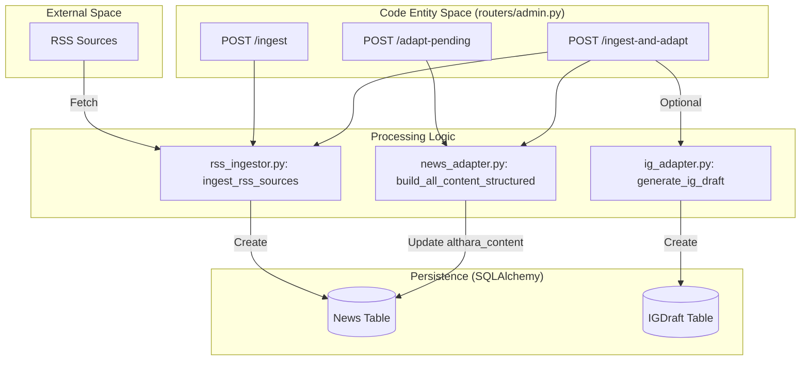
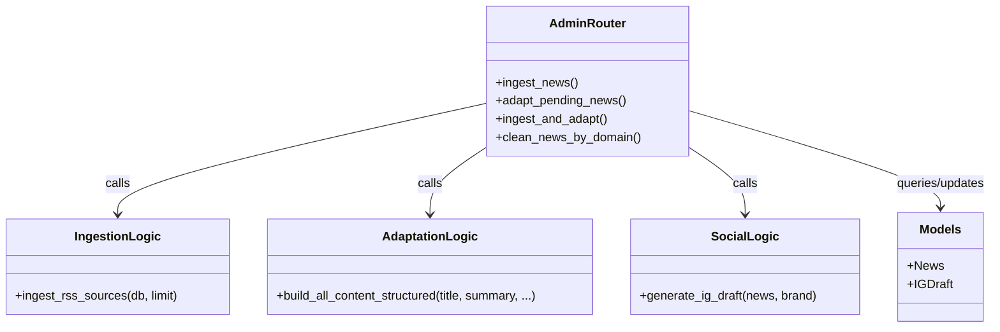

# Admin API (Real Estate)

The Admin API provides a set of protected endpoints designed to manage the news lifecycle for the Real Estate domain (Althara). These endpoints handle bulk operations including multi-source RSS ingestion, content adaptation via LLM-driven transformations, and database maintenance.

## Overview of Admin Endpoints

The admin logic is centralized in `routers/admin.py`. These routes are typically invoked by automated cron jobs or via the News Studio UI to keep the Althara portal updated with fresh, brand-aligned content.

### Ingestion and Adaptation Pipeline

The pipeline follows a multi-stage flow:
1.  **Ingest**: Fetch raw data from external RSS feeds.
2.  **Adapt**: Transform raw HTML and summaries into structured JSON and brand-specific narratives.
3.  **Generate**: Create social media drafts (Instagram) based on the adapted content.

#### Data Flow: Ingest to Adapt
The following diagram illustrates the transition from raw external data to structured internal models within the Admin API context.

**Diagram: Pipeline Data Flow**

Sources: [app/routers/admin.py:22-182](), [app/ingestion/rss_ingestor.py:1-20](), [app/adapters/news_adapter.py:1-30]()

---

## Core Endpoints

### 1. Ingestion Endpoints
*   **`POST /api/admin/ingest`**: Triggers the ingestion of real estate news. It retrieves the maximum items allowed per source from `settings.REAL_ESTATE_RSS_LIMIT_PER_SOURCE` [app/routers/admin.py:33-34]().
*   **`POST /api/admin/ingest/rss`**: An alias for the `/ingest` endpoint [app/routers/admin.py:38-46]().

### 2. Adaptation Endpoints
*   **`POST /api/admin/adapt-pending`**: Scans the `News` table for records where `althara_summary`, `instagram_post`, or `althara_content` are `None` [app/routers/admin.py:60-64](). It then calls `build_all_content_structured` to populate these fields using the Althara brand voice [app/routers/admin.py:72-79]().

### 3. Integrated Pipeline
*   **`POST /api/admin/ingest-and-adapt`**: A high-level orchestration endpoint designed for remote cron jobs. It performs ingestion first, then adaptation, and optionally generates Instagram drafts if the `generate_ig` query parameter is `True` and `AUTO_GENERATE_IG_AFTER_INGEST` is enabled in configuration [app/routers/admin.py:102-153]().

### 4. Maintenance Endpoints
*   **`DELETE /api/admin/clean`**: Removes news items filtered by domain. It supports `real_estate`, `tech`, or `all` [app/routers/admin.py:185-199]().
*   **`DELETE /api/admin/clean-all`**: A shortcut to delete every record in the `News` table. Due to foreign key constraints with `ondelete="CASCADE"`, this also wipes all associated `IGDraft` records [app/routers/admin.py:215-221]().
*   **`DELETE /api/admin/news/{id}`**: Deletes a specific news item by its UUID [app/routers/admin.py:231-245]().

Sources: [app/routers/admin.py:22-245](), [app/config.py:29-32]()

---

## Configuration Flags

The behavior of these endpoints is governed by the `Settings` class in `app/config.py`.

| Flag | Type | Description |
| :--- | :--- | :--- |
| `REAL_ESTATE_RSS_LIMIT_PER_SOURCE` | `int` | Max items to fetch from each RSS feed during `/ingest` (Default: 10). |
| `AUTO_GENERATE_IG_AFTER_INGEST` | `bool` | Global toggle for automatic Instagram draft creation during full pipeline runs. |
| `INGEST_TOKEN` | `str` | Security token required in headers for authenticated admin requests. |

Sources: [app/config.py:25-32](), [app/routers/admin.py:116-153]()

---

## Technical Implementation Details

### Dependency Injection
All admin routes utilize the `get_db` dependency to acquire an `AsyncSession` for database interactions [app/routers/admin.py:11]().

### Logic Entity Mapping
The following diagram maps the API routes to the specific functions and models they manipulate.

**Diagram: Route to Entity Mapping**

Sources: [app/routers/admin.py:1-17](), [app/database.py:1-20]()

### Error Handling
The endpoints implement `try-except` blocks within loops (e.g., during adaptation or IG generation) to ensure that a failure in processing one news item does not halt the entire batch process [app/routers/admin.py:70-91](), [app/routers/admin.py:165-171]().

### Transaction Management
For bulk operations like `adapt-pending`, the `db.commit()` is only called if the `adapted_count` is greater than zero, optimizing database writes [app/routers/admin.py:93-94]().

Sources: [app/routers/admin.py:93-99](), [app/routers/admin.py:173-175]()

---
