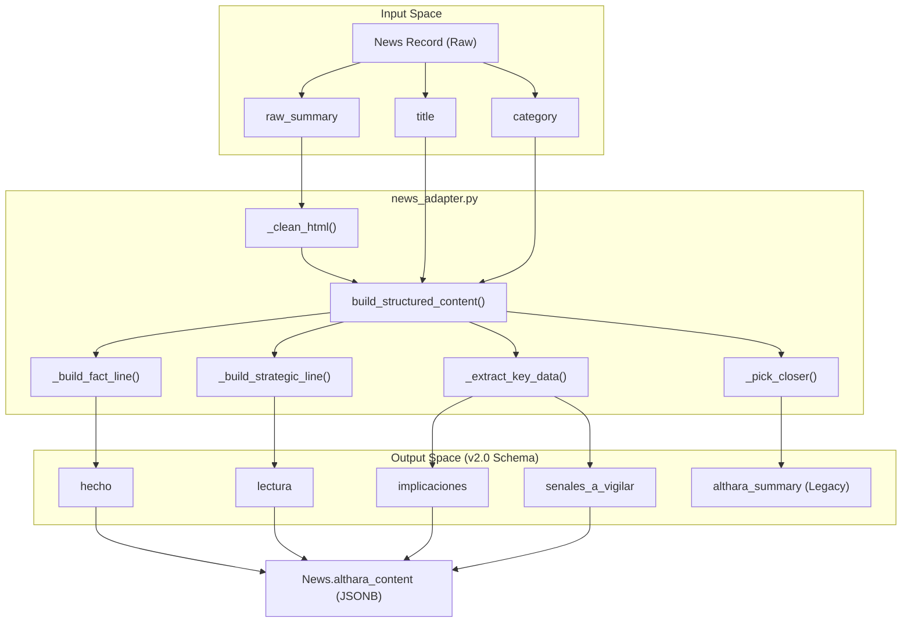
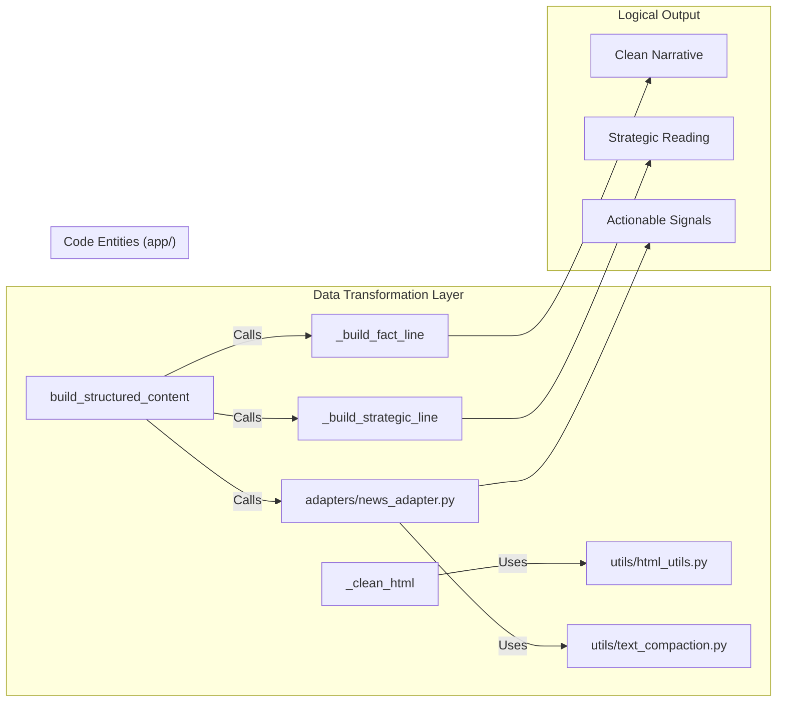

# Althara News Adapter

The **Althara News Adapter** is the core transformation engine responsible for converting raw, scraped news data into a structured, brand-aligned format. It specializes in the "Althara" brand voice—characterized by an analytical, professional, and strategic tone—and prepares content for both the web portal and automated social media distribution.

## Purpose and Scope

The adapter acts as a bridge between the raw ingestion layer and the presentation layer. It performs three primary functions:
1.  **Normalization**: Cleaning noisy HTML and metadata from RSS feeds.
2.  **Narrative Reconstruction**: Transforming headlines into a three-part narrative (Fact, Strategy, Closer).
3.  **Structured Extraction**: Identifying key data points (facts, implications, signals) to populate the `althara_content` JSONB field, supporting the v2.0 schema used by the UI and the Instagram generator.

## Implementation Details

The logic is centralized in `app/adapters/news_adapter.py`. It follows a deterministic pipeline to ensure consistency across different news items within the same category.

### Data Flow: Raw to Structured

The transformation process follows a linear path from raw input to a rich JSON object.


**Sources:** [app/adapters/news_adapter.py:7-21](), [app/adapters/news_adapter.py:215-263]()

### HTML Cleaning and Normalization
Raw RSS content often contains tracking pixels, social sharing prompts, and encoding artifacts (mojibake). The `_clean_html` function applies a multi-pass cleaning strategy:
*   **Tag Stripping**: Uses `strip_html_tags` from `html_utils.py` [app/adapters/news_adapter.py:29]().
*   **Metadata Removal**: Regex patterns target common newsroom signatures like "Compartir en Facebook" or "DREAMSTIME" [app/adapters/news_adapter.py:33-46]().
*   **Orthographic Fixes**: Hardcoded mappings fix common Spanish accentuation errors found in automated scraping (e.g., "psicologa" → "psicóloga") [app/adapters/news_adapter.py:59-90]().

**Sources:** [app/adapters/news_adapter.py:24-95](), [app/utils/html_utils.py:18-40]()

---

## Core Entrypoints

The adapter provides several high-level functions used by the `admin` and `ig_drafts` routers.

| Function | Role | Output |
| :--- | :--- | :--- |
| `build_all_content_structured` | Main pipeline entrypoint | Updates `althara_summary`, `instagram_post`, and `althara_content` |
| `build_structured_content` | Schema v2.0 generator | Returns a Dict with `hecho`, `lectura`, `implicaciones`, `senales_a_vigilar` |
| `build_althara_summary` | Narrative generator | A single string combining Fact + Strategy + Closer |
| `build_instagram_post` | Legacy IG formatter | A pre-formatted caption for social media |

**Sources:** [app/adapters/news_adapter.py:215-263](), [app/adapters/news_adapter.py:266-288]()

---

## Narrative Construction Logic

Althara's voice is built using a "Strategic Line Mapping" technique. The system interprets the `category` of the news to provide context that goes beyond the headline.

### 1. The Fact Line (`hecho`)
Builds a cold, objective description. If the text doesn't start with an article (El, La, En), it prepends a formal introduction: *"Los últimos datos apuntan a lo siguiente..."* [app/adapters/news_adapter.py:98-118]().

### 2. The Strategic Line (`lectura`)
The adapter uses a mapping of `AltharaCategoryV2` values to specific analytical insights.
*   **PRECIOS_VIVIENDA**: Focuses on the gap between supply and demand [app/adapters/news_adapter.py:130-133]().
*   **FONDOS_INVERSION**: Interprets moves as "silent rotations of capital" [app/adapters/news_adapter.py:135-138]().
*   **HIPOTECAS_Y_CREDITO**: Discusses the redefinition of credit advantage [app/adapters/news_adapter.py:140-143]().

### 3. The Closer
A selection from `ALTHARA_CLOSERS` is chosen using a deterministic seed (usually the news ID) to ensure that the same news item always generates the same summary unless the seed changes [app/adapters/news_adapter.py:180-192]().

**Sources:** [app/adapters/news_adapter.py:16-21](), [app/adapters/news_adapter.py:121-177]()

---

## JSON Schema v2.0 (althara_content)

The modern UI and the `ig_adapter.py` rely on the `althara_content` JSONB field. This field decomposes the news into actionable intelligence:

```json
{
  "hecho": "Descripción técnica y fría del suceso...",
  "lectura": "Análisis estratégico de por qué esto importa...",
  "implicaciones": [
    "Punto de impacto 1",
    "Punto de impacto 2"
  ],
  "senales_a_vigilar": [
    "Métrica o evento futuro a observar"
  ]
}
```

The extraction of `implicaciones` and `senales_a_vigilar` utilizes `extract_key_sentences` from `text_compaction.py`, which prioritizes sentences containing numerical data or specific market keywords [app/adapters/news_adapter.py:195-212]().

**Sources:** [app/adapters/news_adapter.py:236-241](), [app/utils/text_compaction.py:47-85]()

---

## System Mapping: Code to Concept

This diagram maps the logical transformation steps to the specific Python functions and utilities that execute them.



**Sources:** [app/adapters/news_adapter.py:24-95](), [app/adapters/news_adapter.py:231-255](), [app/utils/text_compaction.py:47-52]()

## QA and Validation
The adapter includes basic guardrails during content generation:
*   **Length Constraints**: Fact lines are truncated at 220 characters using `shorten` [app/adapters/news_adapter.py:107]().
*   **Sentence Integrity**: Uses `truncate_at_sentence` to ensure that summaries never end mid-word or mid-thought [app/utils/text_compaction.py:20-44]().
*   **Empty States**: If a `raw_summary` is missing, the adapter falls back to using the `title` as the base for all structured fields [app/adapters/news_adapter.py:108-109]().

**Sources:** [app/adapters/news_adapter.py:100-110](), [app/utils/text_compaction.py:20-44]()

---
