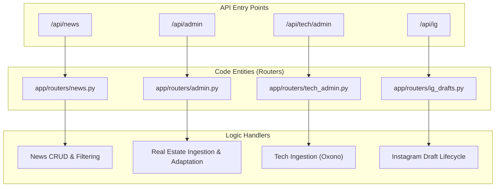
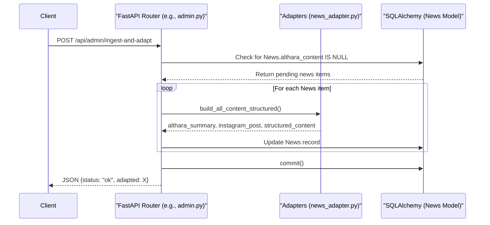

# API Reference

The Althara News Service exposes a RESTful API built with FastAPI. The API is divided into several functional groups (routers) that handle public news consumption, administrative ingestion tasks, brand-specific transformations, and social media draft management.

### API Router Organization

The service uses a modular routing structure to separate concerns between general news access, administrative operations, and specific brand workflows (Althara for real estate and Oxono for tech).

**Natural Language to Code Entity Mapping: Router Structure**

**Sources:** [app/routers/news.py:19-20](), [app/routers/admin.py:19-20](), [app/routers/tech_admin.py:20-21](), [app/routers/ig_drafts.py:24-25]()

---

### News API
The `/api/news` router provides public-facing endpoints for consuming news content. It supports complex filtering by category, date, and domain, as well as keyword searching.

*   **Core Endpoints**:
    *   `GET /health`: Basic service status check.
    *   `POST /news`: Manually create a news item (protected by guardrails).
    *   `GET /news`: List news items with pagination and filters (category, domain, relevance).
    *   `GET /news/{id}`: Retrieve full details for a specific news item.
*   **Key Schemas**: Uses `NewsRead` for output and `PaginatedResponse` for list results.

For details, see [News API](#5.1).

**Sources:** [app/routers/news.py:21-146](), [app/schemas/news.py:1-13]()

---

### Admin API (Real Estate)
The `/api/admin` router manages the ingestion and adaptation pipeline for the **Althara** (Real Estate) brand. It allows administrators to trigger RSS scraping and content transformation into the Althara brand voice.

*   **Core Endpoints**:
    *   `POST /ingest`: Triggers RSS ingestion based on `REAL_ESTATE_RSS_LIMIT_PER_SOURCE`.
    *   `POST /adapt-pending`: Processes news missing summaries or structured content.
    *   `POST /ingest-and-adapt`: A full-pipeline endpoint for automated cron jobs.
    *   `DELETE /clean`: Domain-specific cleanup of news records.
*   **Automation**: Supports `AUTO_GENERATE_IG_AFTER_INGEST` flags to streamline social media workflows.

For details, see [Admin API (Real Estate)](#5.2).

**Sources:** [app/routers/admin.py:22-182](), [app/config.py:33-45]()

---

### Tech Admin API (Oxono)
The `/api/tech/admin` router mirrors the administrative capabilities of the real estate side but is specialized for the **Oxono** (Tech) brand. It uses distinct RSS sources and tech-specific guardrails.

*   **Core Endpoints**:
    *   `POST /ingest`: Fetches news from tech-specific sources (e.g., Wired, Genbeta).
    *   `POST /ingest-and-generate`: Executes ingestion and immediately generates tech-focused Instagram drafts.

For details, see [Tech Admin API (Oxono)](#5.3).

**Sources:** [app/routers/tech_admin.py:23-85]()

---

### Instagram Drafts API
The `/api/ig` router manages the lifecycle of social media content. It handles the generation of carousel slides, captions, and the transition of drafts through various approval states.

*   **Draft Lifecycle**: `DRAFT` → `NEEDS_REVIEW` → `APPROVED` → `PUBLISHED`.
*   **Core Endpoints**:
    *   `POST /news/{id}/generate`: Creates a new draft from a news item.
    *   `POST /{id}/approve`: Moves a draft to the approved state.
    *   `POST /{id}/publish`: Marks a draft as published and updates the parent news item.
*   **Security**: Requires `X-INGEST-TOKEN` for sensitive operations.

For details, see [Instagram Drafts API](#5.4).

**Sources:** [app/routers/ig_drafts.py:27-250](), [app/models/ig_draft.py:10-25]()

---

### Request Flow and Data Transformation

The following diagram illustrates how a request flows through the API routers to interact with the underlying data models and adaptation logic.

**Code Entity Space: API Request Pipeline**

**Sources:** [app/routers/admin.py:102-182](), [app/adapters/news_adapter.py:20-50](), [app/models/news.py:15-50]()

---
