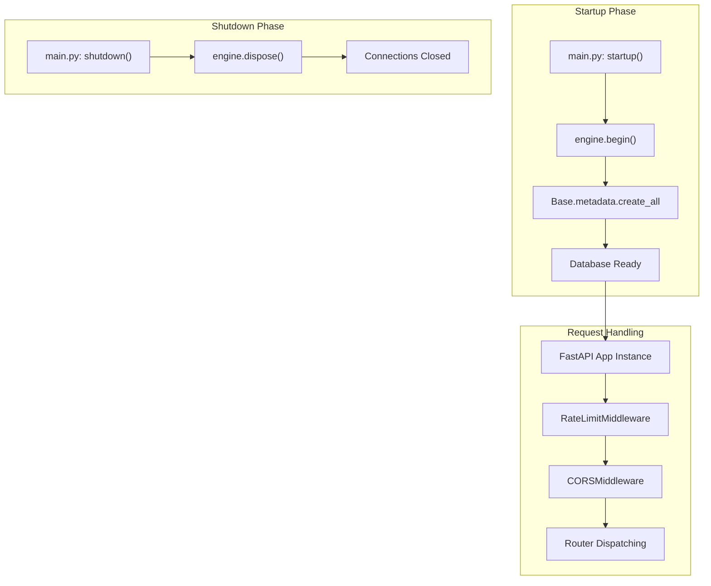
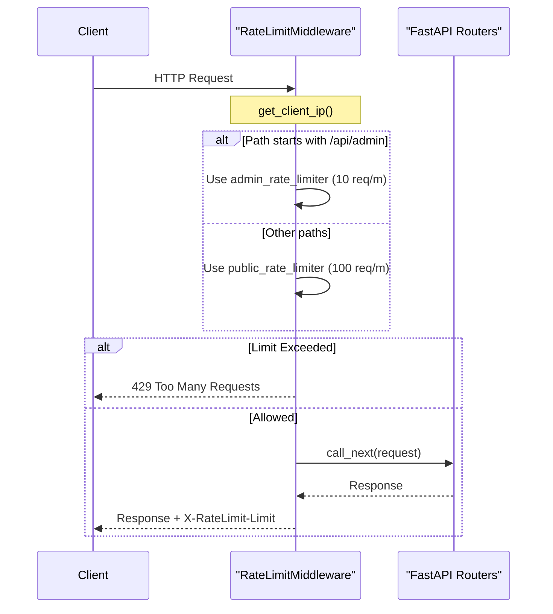

# Application Bootstrap and Configuration

This section details the initialization and configuration lifecycle of the Althara News Service. It covers how the FastAPI application is instantiated, how settings are managed via Pydantic, the integration of specialized middleware for security and performance, and the lifecycle hooks that manage database connectivity.

## Overview of Bootstrap Process

The application entry point is `app/main.py`, which orchestrates the assembly of the FastAPI instance, middleware stack, and routing table. The service follows a modular approach where specific domain logic (Real Estate vs. Tech) is isolated into separate routers but unified under a single application instance.

### Application Lifecycle and Database Wiring

The service utilizes FastAPI's lifecycle events to manage the SQLAlchemy async engine. Upon startup, it attempts to synchronize the database schema (primarily for development/CI environments), and upon shutdown, it ensures all connections are gracefully terminated.

Title: Application Lifecycle Flow

Sources: [app/main.py:11-46](), [app/database.py:6-6]()

## Configuration Management

Configuration is handled by the `Settings` class in `app/config.py`, which leverages `pydantic-settings`. This model provides a type-safe way to load environment variables from a `.env` file or the system environment.

### Key Configuration Parameters

| Parameter | Type | Description |
| :--- | :--- | :--- |
| `DATABASE_URL` | `str` | Connection string for PostgreSQL (asyncpg). |
| `INGEST_TOKEN` | `Optional[str]` | Secret token required for admin ingestion endpoints. |
| `UI_USER` / `UI_PASS` | `Optional[str]` | Credentials for BasicAuth protection of the News Studio. |
| `TECH_RSS_LIMIT_PER_SOURCE` | `int` | Max items to fetch per tech source (Default: 5). |
| `REAL_ESTATE_RSS_LIMIT` | `int` | Max items to fetch per real estate source (Default: 10). |
| `AUTO_GENERATE_IG_AFTER_INGEST` | `bool` | If true, triggers the IG adapter immediately after news insertion. |

Sources: [app/config.py:10-45]()

## Middleware Stack

The application implements a layered middleware stack to handle cross-cutting concerns before requests reach the route handlers.

### 1. CORS Middleware
Configured to allow broad access (`allow_origins=["*"]`) to facilitate frontend requests from various domains, though this is typically restricted in production environments.
Sources: [app/main.py:14-20]()

### 2. Rate Limiting Middleware
The `RateLimitMiddleware` (defined in `app/middleware.py`) implements an in-memory sliding window algorithm to protect the API from abuse. It distinguishes between public and administrative traffic.

*   **Public Rate Limiter**: 100 requests per minute.
*   **Admin Rate Limiter**: 10 requests per minute.

The middleware extracts the client IP via `get_client_ip`, checking `X-Forwarded-For` and `X-Real-IP` headers to support deployments behind proxies like Render or Nginx.
Sources: [app/middleware.py:62-131]()

Title: Middleware Data Flow

Sources: [app/middleware.py:87-131](), [app/main.py:23-23]()

## Router Registration and Static Assets

The application mounts several functional routers and a static file directory for the News Studio UI.

*   **API Routers**:
    *   `/api`: General news access via `news.router`.
    *   `admin.router`: Real estate ingestion and maintenance.
    *   `tech_admin.router`: Tech-specific ingestion (Oxono brand).
    *   `ig_drafts.router`: Instagram draft management and publishing.
*   **UI Router**: The `ui.router` serves the Jinja2 templates for the News Studio.
*   **Static Files**: Mounted at `/static`, serving CSS and JS assets for the frontend.

Sources: [app/main.py:25-34]()

## Brand and Domain Mapping

The system supports a multi-brand architecture (Althara and Oxono) through `app/brands.py`. This configuration maps internal `domain` strings (`real_estate`, `tech`) to UI display names and CSS themes.

*   **Althara**: Domain `real_estate`, Theme `althara`.
*   **Oxono**: Domain `tech`, Theme `oxono`.

This mapping is critical for the `ui.py` router to render the correct brand context based on the URL path.
Sources: [app/brands.py:14-25]()

---
