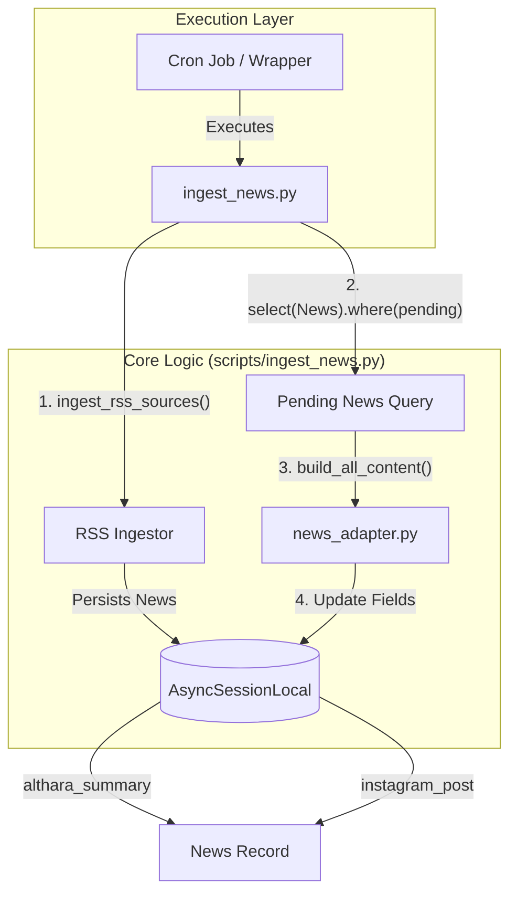
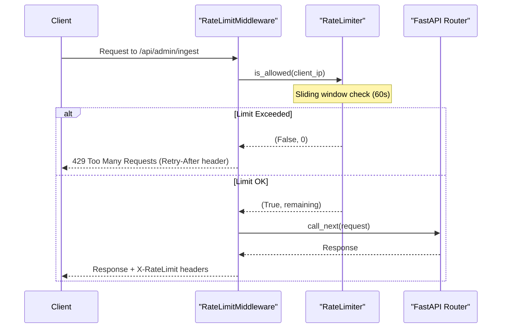

# Automation and Scheduling

This page details the mechanisms for automating the news ingestion and adaptation pipeline. The system supports both remote scheduling via HTTP triggers and local scheduling via shell scripts, protected by authentication and rate-limiting layers.

## Scheduling Options

The ingestion pipeline, which fetches news from RSS sources and adapts them into brand-specific content, can be triggered through two primary methods:

### 1. Remote Scheduling (cron-job.org)
The most common production method is using an external service like `cron-job.org` to call the service's Admin API. The recommended endpoint for a full pipeline execution is `POST /api/admin/ingest-and-adapt`. This endpoint triggers the sequence of fetching raw news, filtering through guardrails, and generating structured content for both web and Instagram [scripts/check_structured_content.py:97-100]().

### 2. Local Scheduling (Local Cron)
For environments where the service is accessible via the local filesystem, a shell wrapper is provided to execute the pipeline as a background process.

- **`ingest_wrapper.sh`**: A shell script that sets up the environment by navigating to the project directory, activating the Python virtual environment, and executing the ingestion script [scripts/ingest_wrapper.sh:5-7]().
- **`ingest_news.py`**: The underlying Python script that initializes a database session, calls `ingest_rss_sources`, and then iterates through pending news to run `build_all_content` [scripts/ingest_news.py:24-52]().

### Pipeline Data Flow (Automated)

The following diagram illustrates the flow of data when the ingestion script is triggered automatically.

**Automated Ingestion Logic**

Sources: [scripts/ingest_news.py:22-67](), [scripts/ingest_wrapper.sh:1-7]()

## Authentication and Security

Protected endpoints, specifically those under `/api/admin` and `/api/ig`, require authentication to prevent unauthorized pipeline triggers.

### INGEST_TOKEN Header
The system uses a simple token-based authentication for automation. The `INGEST_TOKEN` is defined in the environment variables and loaded via the `Settings` class [app/config.py:25-25](). Requests to protected endpoints must include this token in the headers to bypass security gates.

### Rate Limiting
To ensure system stability and prevent abuse, the `RateLimitMiddleware` applies different constraints based on the endpoint type. It uses an in-memory `RateLimiter` that tracks requests per IP address using a sliding window [app/middleware.py:15-24]().

| Endpoint Type | Limit | Implementation |
| :--- | :--- | :--- |
| **Public** (`/api/news`, etc.) | 100 req/min | `public_rate_limiter` [app/middleware.py:64-64]() |
| **Admin** (`/api/admin/`, `/api/tech/admin/`) | 10 req/min | `admin_rate_limiter` [app/middleware.py:65-65]() |
| **Health** (`/api/health`) | Unlimited | Skipped in `dispatch` [app/middleware.py:94-95]() |

**Rate Limiting Sequence**

Sources: [app/middleware.py:87-131](), [app/middleware.py:26-49]()

## Automation Configuration

Behavior during automated runs is governed by several flags in `app/config.py`:

- **`REAL_ESTATE_RSS_LIMIT_PER_SOURCE`**: Controls the maximum number of items fetched per source during a single ingestion run (default: 10) [app/config.py:29-29]().
- **`AUTO_GENERATE_IG_AFTER_INGEST`**: When set to `True`, the pipeline automatically triggers the generation of Instagram drafts immediately after news ingestion [app/config.py:32-32]().
- **`DATABASE_URL`**: Essential for the scripts to connect to the database (e.g., Neon PostgreSQL in production) [app/config.py:13-13]().

## Maintenance and Auditing

The `scripts/` directory contains utilities to audit the results of automated tasks:

- **`check_structured_content.py`**: Provides a summary of how many news items have successfully been processed into the `althara_content` JSONB field [scripts/check_structured_content.py:19-43]().
- **Logging**: The `ingest_wrapper.sh` redirects all output to `/tmp/althara_ingest.log`, allowing developers to review the history of cron executions [scripts/ingest_wrapper.sh:7-7]().

Sources: [app/config.py:10-45](), [scripts/check_structured_content.py:1-106](), [scripts/ingest_wrapper.sh:1-7]()

---
