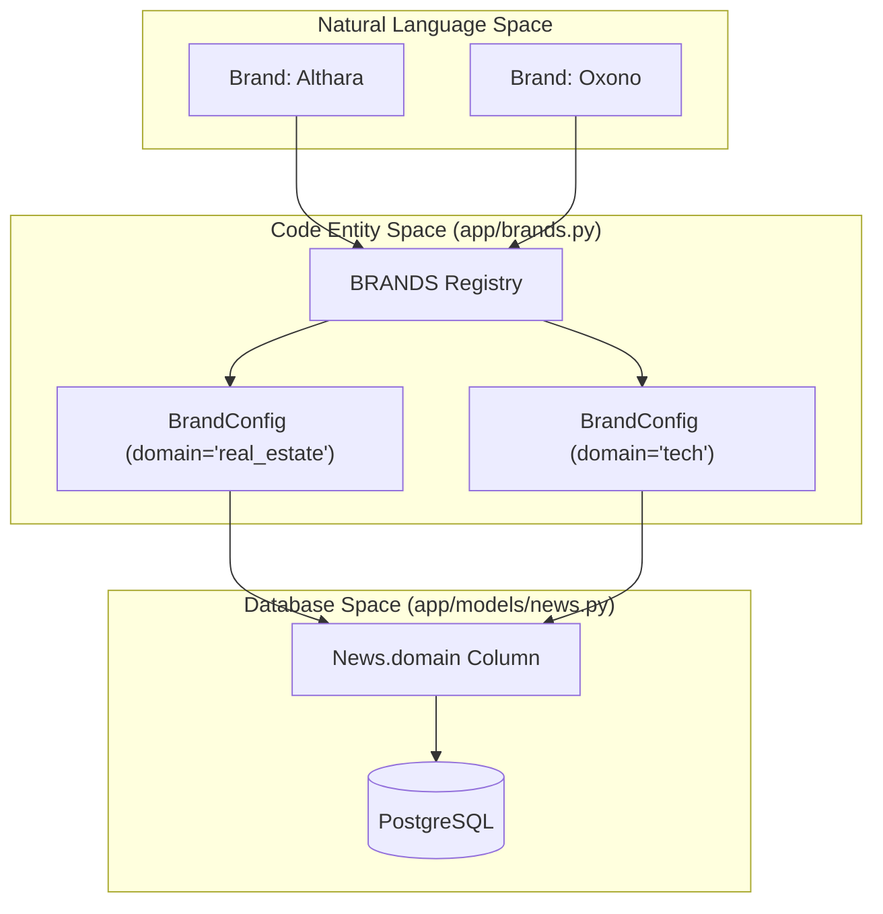
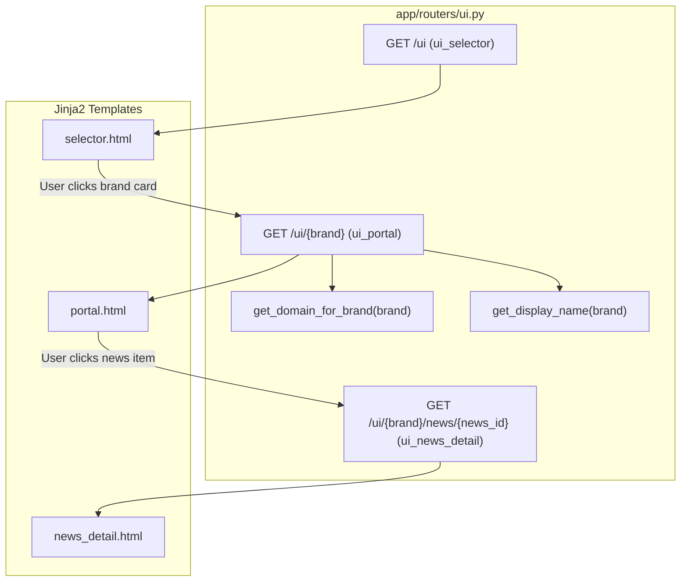

# Brand and Domain Model

The Althara News Service operates as a multi-tenant content engine supporting two distinct brands: **Althara** (Real Estate) and **Oxono** (Technology). This page describes the technical implementation of the brand registry, how logical domains map to physical database records, and how the API and UI layers use this model to provide partitioned experiences.

## The Brand Registry

The system centralizes brand definitions in a single registry to ensure consistency across the ingestion pipeline, adaptation logic, and the News Studio UI.

### Configuration Structure
Each brand is defined by a `BrandConfig` [app/brands.py:8-12](), which includes:
- `domain`: The internal identifier used in the `news.domain` database column.
- `display`: The human-readable name shown in the UI.
- `theme`: A CSS/theme identifier used to switch visual styles in the frontend.

### Brand Definitions
The `BRANDS` dictionary [app/brands.py:14-25]() serves as the source of truth:

| Brand Key | Domain | Display Name | Theme | Primary Focus |
| :--- | :--- | :--- | :--- | :--- |
| `althara` | `real_estate` | Althara | althara | Real Estate market, laws, and trends. |
| `oxono` | `tech` | Oxono | oxono | AI, Dev tools, Security, and Infrastructure. |

### Helper Functions
The module provides utility functions to resolve mappings between brand keys and domains:
- `get_domain_for_brand(brand)`: Maps a URL parameter (e.g., `oxono`) to a DB domain (e.g., `tech`) [app/brands.py:28-31]().
- `get_brand_for_domain(domain)`: The inverse lookup used when processing news objects [app/brands.py:46-51]().

**Sources:** [app/brands.py:1-52]()

---

## Domain Filtering Flow

The `domain` field in the `News` model acts as the primary partition for all data. This allows a single database to store disparate content types while ensuring that an Althara user never sees Oxono technical updates.

### Natural Language to Code Entity Space: Data Partitioning
The following diagram illustrates how the concept of "Brands" in the business domain maps to specific code structures and database fields.

**Sources:** [app/brands.py:14-25](), [app/models/news.py:16-100]() (inferred from News model structure)

### API and UI Integration
1.  **UI Portal**: The `ui_portal` route [app/routers/ui.py:43-44]() takes a `{brand}` path parameter. It uses `get_domain_for_brand` [app/routers/ui.py:59]() to fetch the corresponding domain and filters the SQLAlchemy query [app/routers/ui.py:66]() so only relevant news is displayed.
2.  **Category Mapping**: Depending on the domain, the UI dynamically switches the category labels displayed in filters. It uses `TECH_CATEGORY_LABELS` [app/constants_tech.py:21-31]() for the `tech` domain and `CATEGORY_LABELS` for `real_estate` [app/routers/ui.py:97-101]().
3.  **Admin Operations**: Separate routers handle ingestion for different brands. For instance, `tech_admin.py` specifically targets the `tech` domain [app/main.py:27]().

**Sources:** [app/routers/ui.py:43-118](), [app/main.py:25-28]()

---

## Brand-Specific Logic

While the database schema is shared, the logic applied to each domain differs significantly based on the brand's target audience.

### Oxono (Tech Domain)
The tech domain uses a specialized set of categories and guardrails defined in `constants_tech.py`.
- **Categories**: Includes `AI_ML`, `SECURITY`, `TOOL_DISCOVERY`, etc. [app/constants_tech.py:9-18]().
- **Guardrails**: Uses a strict "Allow List" approach. For a news item to be ingested, it must contain at least one `ALLOW_KEYWORDS` (e.g., "llm", "kubernetes", "vulnerability") [app/constants_tech.py:89-103]().
- **Sources**: Ingests from technical feeds like WIRED ES, Microsiervos, and developer newsletters [app/constants_tech.py:41-75]().

### Althara (Real Estate Domain)
The real estate domain focuses on property market dynamics and regional news.
- **Categories**: Uses the `AltharaCategoryV2` taxonomy (e.g., `MERCADO_RESIDENCIAL`, `LEGISLACION`) [app/routers/ui.py:101]().
- **Data Enrichment**: Includes specific fields like `provincia` and `poblacion` which are often null for tech news but critical for real estate [app/routers/ui.py:101]().

### Code Entity Space: UI Brand Routing
This diagram shows how the `ui.py` router handles the transition from the Brand Selector to brand-specific content views.

**Sources:** [app/routers/ui.py:35-40](), [app/routers/ui.py:43-118](), [app/routers/ui.py:121-146](), [app/brands.py:28-38]()

## Summary of Brand Assets

| Asset | Althara (real_estate) | Oxono (tech) |
| :--- | :--- | :--- |
| **Config File** | `app/constants.py` | `app/constants_tech.py` |
| **Admin Router** | `app/routers/admin.py` | `app/routers/tech_admin.py` |
| **UI Theme** | `althara` | `oxono` |
| **Primary Categories** | Residential, Logistics, Macro | AI/ML, Security, DevTools |

**Sources:** [app/brands.py:14-25](), [app/main.py:26-27](), [app/routers/ui.py:97-101]()

---
