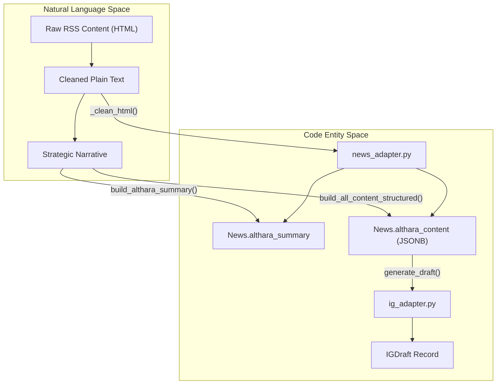
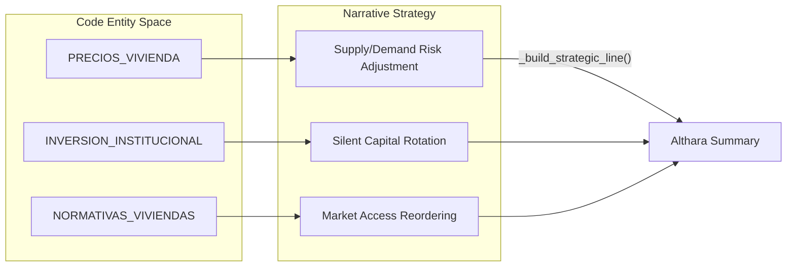

# Content Adaptation and Transformation

The **Content Adaptation and Transformation** layer is responsible for converting raw, ingested news data into high-value, brand-aligned content. This process moves beyond simple data storage, applying sophisticated text processing and strategic narrative reconstruction to ensure all output matches the professional and analytical voice of the **Althara** (Real Estate) or **Oxono** (Tech) brands.

This layer acts as the bridge between the **Ingestion Pipeline** (which fetches raw data) and the **API/UI** (which serves the final content to users and social media managers).

### High-Level Transformation Flow

The transformation process follows a structured pipeline that cleans raw input, extracts key entities, and generates multi-format outputs including professional summaries, structured JSON for web components, and multi-slide Instagram drafts.

Sources: [app/adapters/news_adapter.py:24-95](), [app/adapters/news_adapter.py:214-233](), [app/adapters/news_adapter.py:330-363]()

---

### Core Components

#### 1. Althara News Adapter
The primary engine for the Real Estate domain. It transforms raw summaries into a three-tier narrative: a cold factual description, a strategic category-based reading, and a brand-specific "closer." It also produces a complex JSON structure (`althara_content`) used for advanced UI rendering.

*   **Key Functions**: `build_althara_summary`, `build_all_content_structured`.
*   **Key Logic**: Mapping news categories (e.g., `PRECIOS_VIVIENDA`) to specific strategic insights.
*   **Details**: For a deep dive into HTML cleaning and the v2.0 JSON schema, see [Althara News Adapter](#4.1).

#### 2. Instagram Draft Generator
A specialized adapter that takes adapted news content and composes it into social-media-ready formats. It handles the creation of multi-slide carousels (Hecho/Contexto/Cierre) and generates optimized captions with hashtags.

*   **Key Functions**: `generate_variants`, `compose_instagram_post`.
*   **Key Logic**: Deterministic seed-based generation to ensure consistent variants for the same news item.
*   **Details**: For details on slide composition and brand-specific logic, see [Instagram Draft Generator](#4.2).

#### 3. Text Utilities
A collection of low-level modules providing the "mechanical" text processing required by the adapters. This includes regex-based HTML stripping, sentence-level text compaction, and date parsing.

*   **Modules**: `html_utils.py`, `text_compaction.py`, `rss_utils.py`.
*   **Details**: For utility function signatures and logic, see [Text Utilities](#4.3).

---

### Data Evolution Table

The following table illustrates how a single news item evolves through the adaptation layer:

| Stage | Field/Entity | Description |
| :--- | :--- | :--- |
| **Ingested** | `News.raw_summary` | Raw HTML content directly from the RSS feed. |
| **Adapted** | `News.althara_summary` | Plain text summary following the Fact -> Strategy -> Closer pattern. |
| **Structured** | `News.althara_content` | JSONB field containing `hecho`, `lectura`, `implicaciones`, and `senales_a_vigilar`. |
| **Social** | `IGDraft` | A separate table record containing `carousel_slides`, `caption`, and `hashtags`. |

Sources: [app/adapters/news_adapter.py:214-233](), [app/adapters/news_adapter.py:330-363]()

### Adaptation Logic Mapping

The system maps internal code identifiers to specific narrative strategies used during transformation.

Sources: [app/adapters/news_adapter.py:121-178]()

---

## Child Pages
- [Althara News Adapter](#4.1) — Deep dive into `news_adapter.py`: entrypoints, HTML cleaning, and strategic line mapping.
- [Instagram Draft Generator](#4.2) — How `ig_adapter.py` generates `IGDraft` records and carousel slides.
- [Text Utilities](#4.3) — Supporting modules for text compaction, HTML stripping, and date normalization.

---
