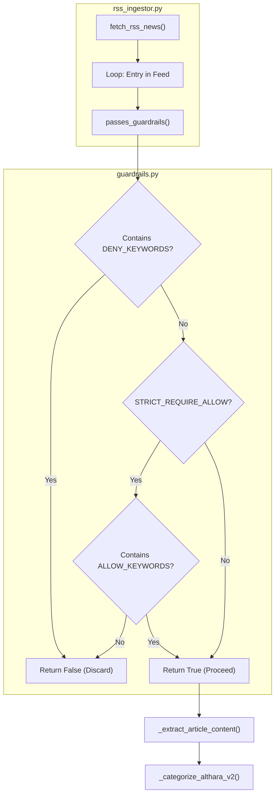
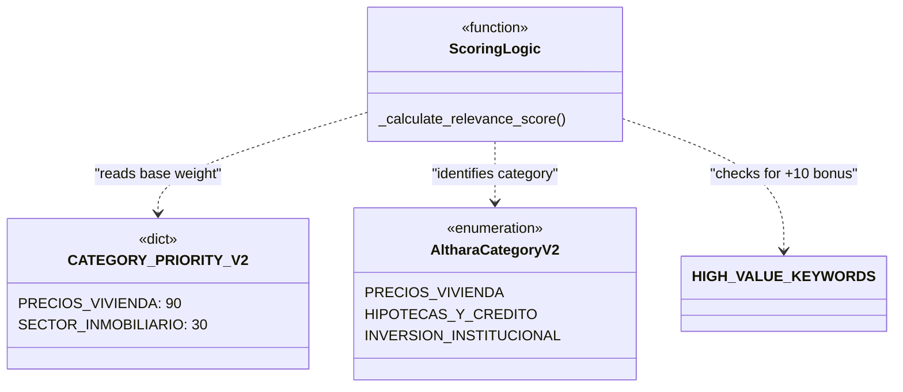

# Content Guardrails and Classification

This section details the logic used to filter, categorize, and score ingested news content. The system employs a multi-layered approach using keyword-based guardrails to prevent "noise" (e.g., lifestyle or decor content) and a heuristic classification engine to map articles to the **AltharaCategoryV2** taxonomy.

## Content Guardrails

The guardrail system ensures that only relevant news enters the pipeline. This is primarily handled by the `passes_guardrails()` utility function.

### Guardrail Logic
The function `passes_guardrails()` evaluates the `title`, `summary`, and `url` of an article against predefined lists of allowed and denied keywords [app/utils/guardrails.py:10-17]().

1.  **Normalization**: All text and keywords are converted to lowercase for case-insensitive matching [app/utils/guardrails.py:24]().
2.  **Deny List**: If any keyword from the `deny_keywords` list is found, the article is immediately rejected [app/utils/guardrails.py:25-27]().
3.  **Strict Requirement**: If `strict_require_allow` is enabled, the article must contain at least one keyword from the `allow_keywords` list to pass [app/utils/guardrails.py:28-30]().

### Keyword Configuration
For the Althara (Real Estate) brand, these lists are defined in `app/constants.py`:
*   **DENY_KEYWORDS**: Includes terms related to interior design, lifestyle, and non-professional content (e.g., "decoración", "sofá", "plantas", "limpiar") [app/constants.py:180-200]().
*   **ALLOW_KEYWORDS**: Focuses on professional market indicators (e.g., "vivienda", "hipoteca", "alquiler", "euribor", "cnmv") [app/constants.py:202-220]().
*   **STRICT_REQUIRE_ALLOW**: Set to `True` for Althara to ensure high signal-to-noise ratio [app/constants.py:222]().

### Data Flow: Guardrail Validation
The following diagram illustrates how the `rss_ingestor.py` uses the guardrails during the ingestion loop.

**Guardrail Execution Flow**

Sources: [app/utils/guardrails.py:10-31](), [app/ingestion/rss_ingestor.py:18-26](), [app/constants.py:180-222]()

---

## Classification Taxonomy (AltharaCategoryV2)

The service uses a "Pro" taxonomy for real estate, designed to minimize ambiguity and focus on macro-economic topics.

### Category Groups
The `AltharaCategoryV2` class defines the stable macro-topics [app/constants.py:22-59]():

| Group | Categories |
| :--- | :--- |
| **Market** | `MERCADO_COMPRAVENTA`, `PRECIOS_VIVIENDA`, `ALQUILER_RESIDENCIAL`, `OFERTA_Y_STOCK` |
| **Financing** | `HIPOTECAS_Y_CREDITO`, `TIPOS_Y_MACRO` |
| **Investment** | `INVERSION_INSTITUCIONAL`, `OPERACIONES_CORPORATIVAS`, `GRANDES_TENEDORES` |
| **Regulation** | `REGULACION_VIVIENDA`, `URBANISMO_Y_PLANEAMIENTO`, `BOE_SUBASTAS` |
| **Construction** | `CONSTRUCCION_Y_COSTES`, `INDUSTRIALIZACION_MODULAR` |

### Heuristic Classification
Classification is performed by `_categorize_althara_v2()` in `rss_ingestor.py`. It uses `CATEGORY_HINTS` (a mapping of categories to specific keyword lists) to score the article [app/ingestion/rss_ingestor.py:125-135]().

1.  The function combines the title and summary into a single text block.
2.  It iterates through `CATEGORY_HINTS`.
3.  The category with the highest number of keyword matches is selected.
4.  If no hints match, it defaults to `SECTOR_INMOBILIARIO` [app/ingestion/rss_ingestor.py:128]().

Sources: [app/constants.py:22-59](), [app/ingestion/rss_ingestor.py:125-135]()

---

## Relevance Scoring

To prioritize news in the UI and for social media selection, the system computes a `relevance_score` (0-100).

### Scoring Components
The score is calculated in `_calculate_relevance_score()` using two main factors [app/ingestion/rss_ingestor.py:155-175]():

1.  **Category Priority**: Each category has a base weight defined in `CATEGORY_PRIORITY_V2`. For example, `PRECIOS_VIVIENDA` (90) is ranked higher than `BOE_SUBASTAS` (55) [app/constants.py:124-147]().
2.  **Keyword Boost**: Specific high-value keywords (e.g., "récord", "cae", "burbuja") add a fixed bonus (typically +10) to the score, capped at 100 [app/ingestion/rss_ingestor.py:165-173]().

**Scoring Entity Map**

Sources: [app/constants.py:124-147](), [app/ingestion/rss_ingestor.py:138-175]()

---

## Migration: V1 to V2

The system maintains backward compatibility and supports legacy data through the `V1_TO_V2_MAP`.

### Migration Logic
When processing older records or integrating with systems that still use the V1 taxonomy, the `V1_TO_V2_MAP` translates legacy strings to the new `AltharaCategoryV2` values [app/constants.py:157-175]().

**Mapping Examples:**
*   `FONDOS_INVERSION_INMOBILIARIA` → `INVERSION_INSTITUCIONAL` [app/constants.py:159]()
*   `NOTICIAS_HIPOTECAS` → `HIPOTECAS_Y_CREDITO` [app/constants.py:171]()
*   `BURBUJA_INMOBILIARIA` → `PRECIOS_VIVIENDA` [app/constants.py:168]()

This map is used by scripts like `recategorize_news.py` to update the database schema without losing historical context.

Sources: [app/constants.py:151-175]()

---
