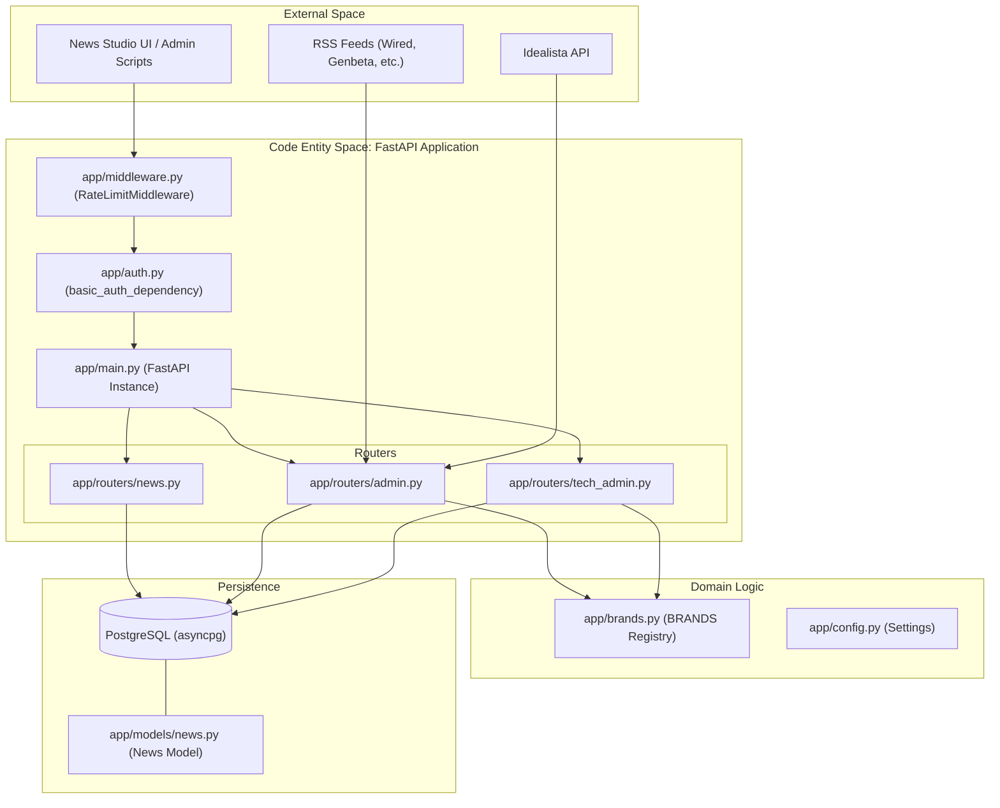
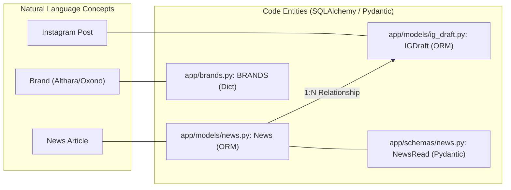

# Core Architecture

The Althara News Service is built on a layered architecture designed to ingest, process, and distribute news across two distinct domains: Real Estate (**Althara**) and Technology (**Oxono**). The system utilizes FastAPI for its web layer, SQLAlchemy for asynchronous database interactions, and a custom brand/domain model to drive the News Studio UI and content adaptation pipelines.

## Application Bootstrap and Configuration

The application entry point is `app/main.py`, where the `FastAPI` instance is initialized [app/main.py:11](). The bootstrap process involves registering middleware, mounting static assets for the UI, and including various API routers that handle news management, administrative tasks, and Instagram draft generation.

Configuration is managed via a centralized `Settings` class using Pydantic, which loads environment variables for database connections, API keys (e.g., Idealista), and operational limits [app/config.py:10-45]().

**Key Components:**
*   **Router Registration:** Routes are grouped into logical domains: `/api` for news [app/main.py:25](), `/api/admin` and `/api/tech/admin` for ingestion [app/main.py:26-27](), and `/api/ig` for social media drafts [app/main.py:28]().
*   **Lifecycle Hooks:** The application uses `@app.on_event("startup")` to initialize the database schema and `@app.on_event("shutdown")` to gracefully dispose of the database engine [app/main.py:36-45]().

For details, see [Application Bootstrap and Configuration](#2.1).

**Sources:** [app/main.py:1-46](), [app/config.py:1-47]()

## Middleware and Security

The service implements a multi-layered middleware stack to ensure performance and security:
1.  **CORS:** Configured to allow cross-origin requests, facilitating the News Studio UI's interaction with the backend [app/main.py:14-20]().
2.  **Rate Limiting:** A custom `RateLimitMiddleware` differentiates between public and administrative traffic. Public endpoints are limited to 100 requests/minute, while admin endpoints are restricted to 10 requests/minute [app/middleware.py:64-65, 98-101]().
3.  **Authentication:** Administrative and UI routes are protected. The UI utilizes a `basic_auth_dependency` that checks for `UI_USER` and `UI_PASS` environment variables [app/auth.py:26-37]().

**Sources:** [app/middleware.py:1-131](), [app/main.py:13-23](), [app/auth.py:1-37]()

## Database Layer

The persistence layer is built on PostgreSQL using SQLAlchemy's asynchronous extension.
*   **Engine & Session:** An `AsyncSessionLocal` factory provides scoped sessions for API requests [app/database.py]().
*   **Schema Management:** Alembic handles migrations, such as adding the `althara_content` JSONB field used for storing structured news data [alembic/versions/43db6c86d1d4_add_althara_content_field.py:20-21]().
*   **Data Validation:** Scripts like `check_structured_content.py` allow developers to audit the database state, verifying the presence of structured fields across the `News` table [scripts/check_structured_content.py:19-32]().

For details, see [Database Layer](#2.2).

**Sources:** [app/database.py](), [alembic/versions/43db6c86d1d4_add_althara_content_field.py:1-26](), [scripts/check_structured_content.py:1-106]()

## Brand and Domain Model

The system operates under a dual-brand strategy defined in `app/brands.py`. This configuration drives the logic for content filtering and UI themes.

| Brand Key | Domain Name | Display Name | Target Industry |
| :--- | :--- | :--- | :--- |
| `althara` | `real_estate` | Althara | Real Estate / Market Trends |
| `oxono` | `tech` | Oxono | AI / Dev Tools / Security |

The `BRANDS` registry [app/brands.py:14-25]() is the source of truth for the `get_domain_for_brand` and `get_brand_for_domain` utilities, which ensure that ingested news is correctly partitioned by its `domain` column in the database [app/brands.py:28-51]().

For details, see [Brand and Domain Model](#2.3).

**Sources:** [app/brands.py:1-52](), [app/constants_tech.py:1-107]()

## System Architecture Overview

The following diagram illustrates the flow from external sources through the FastAPI bootstrap and into the domain-specific logic.

### Request and Ingestion Flow

**Sources:** [app/main.py:11-35](), [app/middleware.py:87-131](), [app/brands.py:14-25](), [app/config.py:10-45]()

### Data Entity Mapping

**Sources:** [app/models/news.py](), [app/brands.py:14-25](), [alembic/versions/43db6c86d1d4_add_althara_content_field.py:21]()

---
