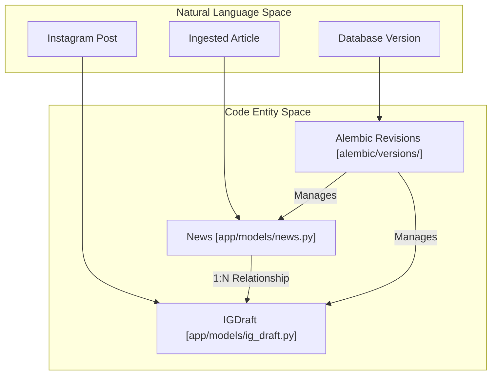
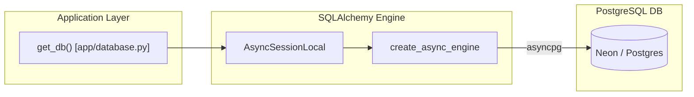

# Data Models and Database Schema

This section provides a high-level overview of the Althara News Service data layer. The system utilizes **SQLAlchemy** as its Object-Relational Mapper (ORM) and **Alembic** for schema versioning, targeting a **PostgreSQL** database with async capabilities.

The schema is centered around two primary entities: the raw news ingested from various sources and the generated social media drafts derived from that news.

## Code Entity Space to Database Mapping

The following diagram bridges the conceptual "Natural Language" space of the news pipeline to the specific code entities defined in the persistence layer.

### System Entity Mapping

**Sources:** [app/models/news.py:9-31](), [app/models/ig_draft.py:9-30]()

## Core ORM Models

The system defines two main models that inherit from a shared `Base` class [app/database.py:9]().

### 1. News Model
The `News` model is the primary entry point for all data in the system. It stores the raw data fetched from RSS feeds or the Idealista API, as well as the structured, brand-aligned content generated by the AI adapters.

*   **Key Fields**: `title`, `url`, `category`, `althara_content` (JSONB), and `domain` (used to distinguish between Althara and Oxono).
*   **Relationship**: It maintains a one-to-many relationship with `IGDraft`, configured with `cascade="all, delete-orphan"` [app/models/news.py:31]().

For details, see [News Model (#7.1)](#).

### 2. IGDraft Model
The `IGDraft` model represents a social media asset generated from a specific news item. It supports versioning through a self-referential foreign key.

*   **Key Fields**: `carousel_slides` (JSONB), `caption`, `status` (DRAFT, APPROVED, etc.), and `variant_of_id`.
*   **Relationship**: Linked to `News` via `news_id` with a `CASCADE` delete constraint [app/models/ig_draft.py:13]().

For details, see [IGDraft Model (#7.2)](#).

## Database Connectivity

The service uses an asynchronous engine powered by `asyncpg`. A critical utility function, `normalize_database_url`, ensures that standard PostgreSQL connection strings are converted to the `postgresql+asyncpg://` format required by the driver [app/database.py:12-49]().

### Connection Flow

**Sources:** [app/database.py:59-95]()

## Migration History and Alembic

Database schema changes are managed via Alembic. The migration environment [alembic/env.py:1-128]() is configured to handle the same async connection logic as the main application to ensure consistency during deployment.

The migration chain has evolved from a simple news table to a complex schema supporting multi-domain content, relevance scoring, and detailed social media draft metadata.

*   **Initial Setup**: Creation of the `news` table.
*   **Expansion**: Addition of `ig_drafts` and domain-specific fields like `relevance_score`.
*   **Schema Refinement**: Introduction of `JSONB` fields for structured AI content (`althara_content`) and geographical metadata (`provincia`, `poblacion`).

For details, see [Database Migrations (#7.3)](#).

***

**Sources:**
- [app/models/news.py:1-33]()
- [app/models/ig_draft.py:1-31]()
- [app/database.py:1-95]()
- [alembic/env.py:1-128]()

---
