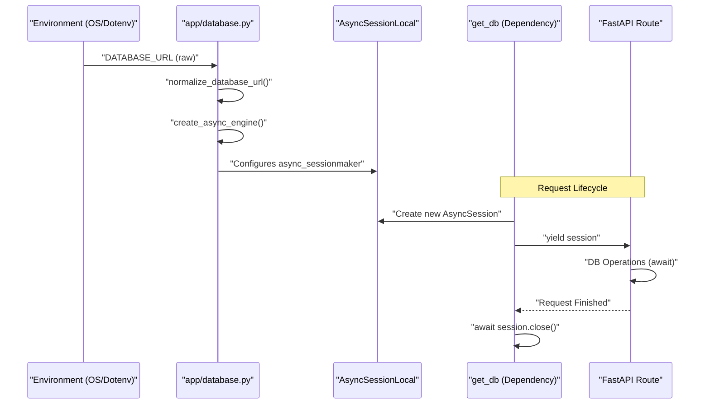
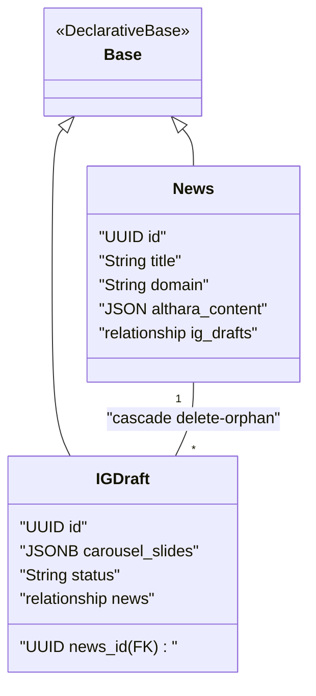

# Database Layer

The Database Layer provides the asynchronous infrastructure required for persisting news entities and Instagram drafts. It leverages **SQLAlchemy 2.0** with the `asyncio` extension and uses `asyncpg` as the database driver to interface with PostgreSQL.

## Core Infrastructure

The database configuration is centralized in `app/database.py`. It handles environment variable loading, URL normalization for asynchronous compatibility, and the creation of the global engine and session factory.

### URL Normalization
Standard PostgreSQL connection strings (e.g., from managed services like Neon or Heroku) often use the `postgresql://` scheme and include parameters like `sslmode`. Because `asyncpg` requires the `postgresql+asyncpg://` dialect and manages SSL automatically, the system implements a normalization routine.

The `normalize_database_url` function performs the following transformations:
1.  Replaces `postgresql://` with `postgresql+asyncpg://` [app/database.py:23-24]().
2.  Parses and removes incompatible query parameters such as `sslmode` and `channel_binding` [app/database.py:32-33]().
3.  Reconstructs the URL for use with `create_async_engine` [app/database.py:40-47]().

### Engine and Session Factory
The `engine` is initialized with specific pooling configurations to optimize performance in a containerized environment:
*   **pool_pre_ping**: Enabled to verify connections before use [app/database.py:72]().
*   **pool_size**: Set to 5 connections [app/database.py:73]().
*   **max_overflow**: Allows up to 10 additional connections during bursts [app/database.py:74]().

The `AsyncSessionLocal` factory produces `AsyncSession` instances with `expire_on_commit=False` to prevent issues when accessing object attributes after a transaction is committed in an async context [app/database.py:77-81]().

### The `get_db` Dependency
To manage session lifecycles within FastAPI routes, the `get_db` generator is used as a dependency. It ensures that a session is opened for every request and properly closed upon completion, even if exceptions occur [app/database.py:87-94]().

**Sources:** [app/database.py:12-49](), [app/database.py:68-81](), [app/database.py:87-95]()

## Data Flow: Connection Lifecycle

The following diagram illustrates how a request interacts with the database layer from normalization to session disposal.

**Database Connection and Session Flow**

**Sources:** [app/database.py:52-58](), [app/database.py:68-81](), [app/database.py:90-94]()

## Declarative Models and Base

All ORM models in the service inherit from a single `Base` class, which is a `declarative_base` instance [app/database.py:9](). This allows SQLAlchemy to collect metadata for all tables, which is critical for Alembic migrations.

### Entity Relationship Mapping
The system defines two primary entities: `News` and `IGDraft`. These are linked via a one-to-many relationship.

*   **News**: The central entity representing ingested content [app/models/news.py:9]().
*   **IGDraft**: Social media content derived from a `News` record [app/models/ig_draft.py:9]().

**Entity Relationship Diagram**

**Sources:** [app/models/news.py:9-31](), [app/models/ig_draft.py:9-31](), [app/database.py:9]()

## Migration Integration

The database layer is tightly integrated with Alembic for schema management. The `alembic/env.py` file mirrors the normalization logic found in `app/database.py` to ensure that migrations run correctly against the same asynchronous drivers.

### Async Migration Execution
Alembic migrations are executed using the `run_async_migrations` function, which:
1.  Retrieves the normalized URL via `get_url()` [alembic/env.py:109]().
2.  Creates an engine using `async_engine_from_config` [alembic/env.py:111]().
3.  Runs the synchronous migration functions within a `connection.run_sync` wrapper [alembic/env.py:118]().

### Metadata Discovery
The `target_metadata` is imported directly from `app.database.Base.metadata` [alembic/env.py:21](). For Alembic to detect the models, the model files (`app/models/news.py` and `app/models/ig_draft.py`) are explicitly imported into the `env.py` script [alembic/env.py:18-19]().

**Sources:** [alembic/env.py:24-61](), [alembic/env.py:101-121](), [alembic/env.py:17-21]()

---
