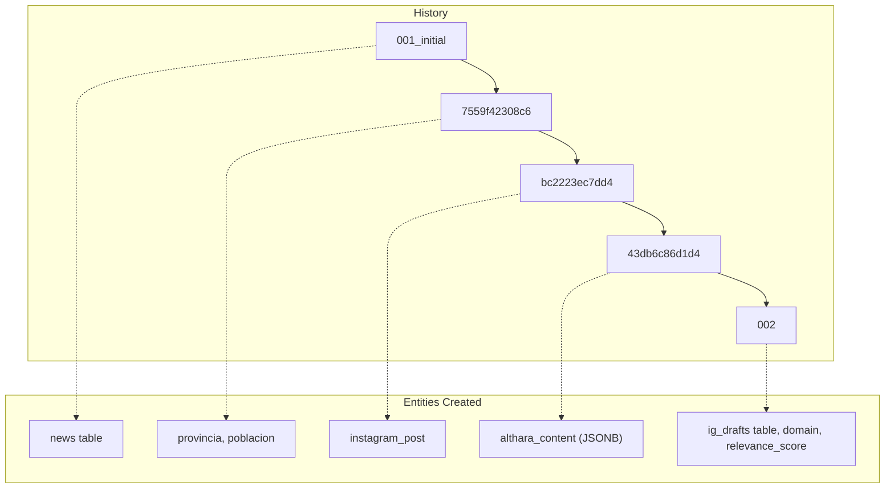

# Database Migrations

This section details the database migration infrastructure used by the Althara News Service. The system utilizes **Alembic** to manage schema evolutions for the PostgreSQL database (Neon), with a specific focus on supporting asynchronous operations and automatic URL normalization for `asyncpg`.

## Alembic Configuration and Async Engine

The migration system is configured to handle asynchronous database connections, which is a requirement for the `sqlalchemy.ext.asyncio` stack used throughout the application.

### Implementation Details
*   **`alembic.ini`**: Defines the migration script location as `alembic/` and sets up logging [alembic.ini:3-104](). It does not store the database URL directly; instead, the URL is injected at runtime via `env.py` [alembic.ini:60]().
*   **`env.py`**: This script bootstraps the migration environment. It imports the `Base.metadata` from the application's database module to enable autogenerate capabilities [alembic/env.py:17-21]().
*   **Async Support**: The `run_async_migrations` function uses `async_engine_from_config` to create a connectable engine and runs the migrations within a synchronous wrapper using `connection.run_sync(do_run_migrations)` [alembic/env.py:101-119]().

### Database URL Normalization
To ensure compatibility with the `asyncpg` driver and the Neon PostgreSQL pooler, the service implements a normalization utility. This logic is shared between the main application and the Alembic environment.

| Feature | Logic |
| :--- | :--- |
| **Driver Conversion** | Replaces `postgresql://` with `postgresql+asyncpg://` [alembic/env.py:35-36](). |
| **Param Stripping** | Removes `sslmode` and `channel_binding` which are incompatible with `asyncpg` [alembic/env.py:43-45](). |
| **SSL Handling** | Relies on `asyncpg` to handle SSL automatically [alembic/env.py:30](). |

Sources: [alembic.ini:1-115](), [alembic/env.py:1-128](), [app/database.py:12-49]()

## Migration Chain

The database schema has evolved through a series of revisions to support new features like multi-brand support (Althara/Oxono) and Instagram draft management.

### Migration Sequence Diagram
The following diagram illustrates the lineage of the database schema from the initial table creation to the latest fields.

"Migration Lineage"

Sources: [alembic/versions/001_initial_migration_create_news_table.py:1-42](), [alembic/versions/7559f42308c6_add_provincia_poblacion_fields.py:1-27](), [alembic/versions/bc2223ec7dd4_add_instagram_post_field.py:1-25](), [alembic/versions/002_add_domain_relevance_ig_drafts.py:1-62]()

### Detailed Revision History

| Revision ID | Name | Key Changes |
| :--- | :--- | :--- |
| `001_initial` | Initial Migration | Creates the `news` table with core fields: `id`, `title`, `source`, `url`, `published_at`, `category`, and timestamps [alembic/versions/001_initial_migration_create_news_table.py:20-34](). |
| `7559f42308c6` | add_provincia_poblacion_fields | Adds `provincia` and `poblacion` columns to the `news` table for localized real estate filtering [alembic/versions/7559f42308c6_add_provincia_poblacion_fields.py:19-21](). |
| `bc2223ec7dd4` | add_instagram_post_field | Adds a `instagram_post` text field to store generated social media copy [alembic/versions/bc2223ec7dd4_add_instagram_post_field.py:19-20](). |
| `43db6c86d1d4` | add_althara_content_field | (Implicit in chain) Adds `althara_content` JSONB field for structured data. |
| `002` | add_domain_relevance_ig_drafts | **Major Update**: Extends `news` with `domain` (real_estate/tech) and `relevance_score`. Creates the `ig_drafts` table with a foreign key to `news.id` [alembic/versions/002_add_domain_relevance_ig_drafts.py:18-50](). |

## Data Flow: Code to Database Entities

The following diagram bridges the Python models defined in the application to the physical tables managed by Alembic.

"Model-to-Schema Mapping"
```mermaid
classDiagram
    class Base {
        <<DeclarativeBase>>
        +metadata
    }
    class News {
        <<SQLAlchemy Model>>
        +UUID id
        +String title
        +String domain
        +Integer relevance_score
        +JSONB althara_content
    }
    class IGDraft {
        <<SQLAlchemy Model>>
        +UUID id
        +UUID news_id
        +JSONB carousel_slides
        +String status
    }

    Base <|-- News
    Base <|-- IGDraft
    News "1" -- "0..*" IGDraft : ig_drafts relationship

    subgraph "Alembic Migrations"
        M1["001_initial"]
        M2["002_add_domain_relevance"]
    end

    M1 --> News : creates
    M2 --> News : alters (domain/relevance)
    M2 --> IGDraft : creates
```
Sources: [alembic/env.py:17-21](), [alembic/versions/002_add_domain_relevance_ig_drafts.py:25-50](), [app/database.py:9]()

## Operations

### Running Migrations
Migrations are executed using the standard Alembic CLI. The environment must have a valid `DATABASE_URL` configured.

1.  **Upgrade to Latest**:
    `alembic upgrade head` [README.md:120]()
2.  **Verify Migration Status**:
    Check logs for `INFO [alembic.runtime.migration] Running upgrade -> ...` [README.md:191-195]()

### Rolling Back Migrations
Rollbacks are handled by the `downgrade` functions defined in each revision script.

*   **Revert One Version**:
    `alembic downgrade -1`
*   **Implementation Example**:
    In revision `7559f42308c6`, the `downgrade` function calls `op.drop_column('news', 'poblacion')` and `op.drop_column('news', 'provincia')` [alembic/versions/7559f42308c6_add_provincia_poblacion_fields.py:24-26]().

### Deployment Integration
On platforms like Render, migrations are typically integrated into the build or pre-deploy command to ensure the schema is updated before the application starts [README.md:181-187]().

Sources: [README.md:105-124](), [alembic/versions/7559f42308c6_add_provincia_poblacion_fields.py:24-26]()

---
