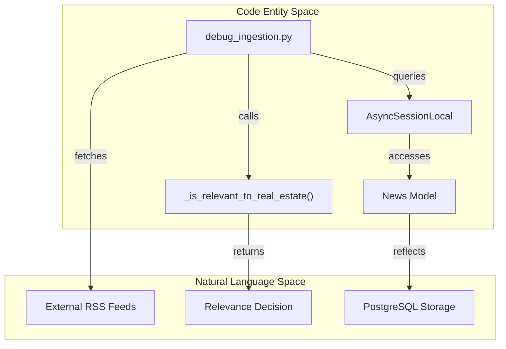
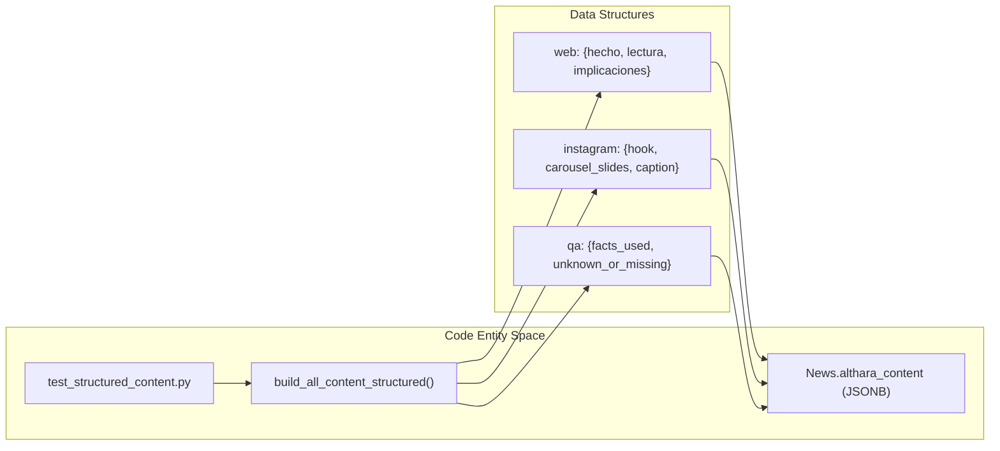

# Debugging and Validation Scripts

This page details the developer-focused scripts used to validate system behavior, test content generation logic, and debug the ingestion pipeline. These scripts operate independently of the FastAPI application but utilize the same core logic and database connections to ensure parity between development tests and production behavior.

## Ingestion and Guardrails Debugging

These scripts focus on the entry point of the news pipeline, specifically the filtering logic that determines if a news item is relevant to the Real Estate domain.

### `debug_ingestion.py`
This script provides a verbose walkthrough of the RSS ingestion process. It connects to the database, counts existing records, and then iterates through the first three sources in `RSS_SOURCES` [app/ingestion/rss_ingestor.py:15-15](). For each source, it:
1. Fetches the raw feed using `httpx`.
2. Checks for URL existence in the `News` table to prevent duplicates [scripts/debug_ingestion.py:72-74]().
3. Runs the first-pass relevance filter `_is_relevant_to_real_estate` [app/ingestion/rss_ingestor.py:9-9]() and reports the specific reason for acceptance or rejection.

**Data Flow: Ingestion Debugging**

Sources: [scripts/debug_ingestion.py:21-133](), [app/ingestion/rss_ingestor.py:9-15]()

### `test_filter.py` and `test_filter_with_summary.py`
These are lightweight unit tests for the guardrails logic.
*   **`test_filter.py`**: Validates the `_is_relevant_to_real_estate` function against a hardcoded list of titles like "Giro inesperado en la okupación" [scripts/test_filter.py:11-19]().
*   **`test_filter_with_summary.py`**: Extends this by passing both a title and a summary string to the filter to simulate the more complex matching that occurs when RSS feeds provide descriptive snippets [scripts/test_filter_with_summary.py:12-25]().

Sources: [scripts/test_filter.py:1-25](), [scripts/test_filter_with_summary.py:1-35]()

---

## Content Adaptation Validation

These scripts validate the transformation of raw news into structured formats for the web and social media.

### `test_instagram_posts.py`
This script tests the generation of Instagram captions and saves them to the database. It retrieves up to 5 news items and passes them through `build_all_content` [app/adapters/news_adapter.py:16-16]().

*   **Logic**: It populates the `instagram_post` column and, if missing, the `althara_summary` column for the selected news records [scripts/test_instagram_posts.py:68-72]().
*   **Output**: Prints the generated text and character length to the console for manual review of the brand voice.

### `test_structured_content.py`
Validates the v2.0 JSON schema generation used for the "News Studio" UI and the mobile-optimized web view.
*   **Functionality**: Calls `build_all_content_structured` [app/adapters/news_adapter.py:15-15]() and inspects the resulting dictionary.
*   **Validation**: It breaks down the output into `web`, `instagram`, and `qa` blocks, verifying fields like `hecho`, `lectura`, and `senales_a_vigilar` [scripts/test_structured_content.py:51-72]().
*   **Persistence**: Saves the resulting JSON into the `althara_content` JSONB column [scripts/test_structured_content.py:75-76]().

**Entity Mapping: Structured Content Generation**

Sources: [scripts/test_structured_content.py:18-84](), [app/adapters/news_adapter.py:15-16]()

---

## System and API Verification

### `check_instagram_posts.py`
A diagnostic utility to audit the state of the database. It provides a summary of:
*   Total news items in the database [scripts/check_instagram_posts.py:22-24]().
*   Percentage of news items that have an `instagram_post` generated [scripts/check_instagram_posts.py:27-29]().
*   A list of IDs for news items that are missing social media content, facilitating targeted regeneration [scripts/check_instagram_posts.py:54-62]().

### `test_api_response.py`
This script simulates the internal behavior of the FastAPI `GET /api/news` endpoint without requiring the server to be running. It is critical for ensuring that SQLAlchemy models are correctly serialized into Pydantic schemas.

*   **Implementation**: It manually executes a query on the `News` table, orders by `published_at.desc()`, and applies a limit [scripts/test_api_response.py:25-32]().
*   **Serialization Test**: It passes the ORM objects through `NewsRead.model_validate(news)` and wraps them in a `PaginatedResponse` [scripts/test_api_response.py:40-49]().
*   **Verification**: Specifically checks if the `instagram_post` field survives the JSON serialization process, which helps debug issues where fields might be excluded by schema configurations [scripts/test_api_response.py:64-65]().

Sources: [scripts/test_api_response.py:21-89](), [scripts/check_instagram_posts.py:18-104](), [app/schemas/news.py:17-17]()

## Summary of Scripts

| Script | Primary Function | Key Code Reference |
| :--- | :--- | :--- |
| `test_filter.py` | Unit test for RE relevance | `_is_relevant_to_real_estate` |
| `debug_ingestion.py` | Trace RSS fetch & filter | `ingest_rss_sources` |
| `test_instagram_posts.py` | Generate/Save IG captions | `build_all_content` |
| `test_structured_content.py` | Validate v2.0 JSON schema | `althara_content` (JSONB) |
| `test_api_response.py` | Mock FastAPI serialization | `NewsRead` & `PaginatedResponse` |
| `check_instagram_posts.py` | Database content audit | `News.instagram_post.is_(None)` |

Sources: [scripts/test_filter.py:9-9](), [scripts/debug_ingestion.py:15-15](), [scripts/test_instagram_posts.py:16-16](), [scripts/test_structured_content.py:15-15](), [scripts/test_api_response.py:17-17](), [scripts/check_instagram_posts.py:54-54]()

---
