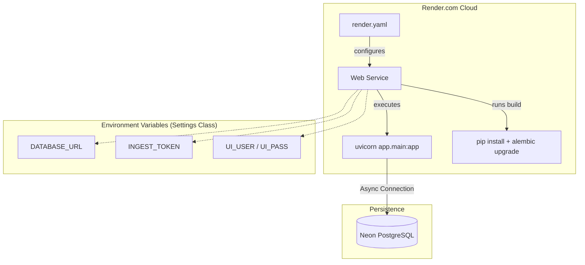
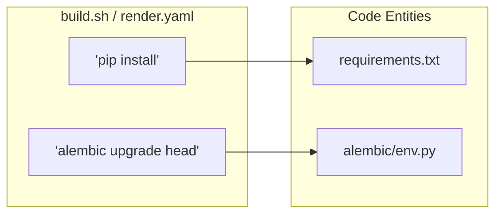

# Deployment and Infrastructure

This section describes the deployment architecture and infrastructure configuration for the Althara News Service. The service is designed to run as a containerized web application, primarily targeting the **Render.com** platform, utilizing a **Python 3.11.9** runtime and a **PostgreSQL** database.

## Infrastructure Overview

The infrastructure follows a standard cloud-native pattern where the application server is decoupled from the persistence layer. The service requires a high-performance asynchronous environment to handle concurrent RSS ingestion and AI-driven content transformation.

### Runtime and Build Process
The service specifies a strict Python version to ensure compatibility across environments [runtime.txt:1-1](). The build process involves installing dependencies from `requirements.txt` and automatically applying database schema changes.

### Core Service Configuration
The application is configured via Pydantic Settings, which validates required environment variables at startup [app/config.py:10-13](). Key configurations include:
*   **Database Connectivity**: Managed via `DATABASE_URL` [app/config.py:13-13]().
*   **Authentication**: Secured via `INGEST_TOKEN` for API automation and `UI_USER`/`UI_PASS` for the News Studio [app/config.py:23-25]().
*   **Pipeline Behavior**: Limits for ingestion and flags for automatic Instagram draft generation [app/config.py:28-32]().

### System Architecture Diagram
The following diagram illustrates the relationship between the deployment configuration, the application entry point, and the external infrastructure.

**Deployment Component Mapping**

Sources: [render.yaml:1-10](), [app/config.py:10-45](), [runtime.txt:1-1]()

## Deployment Lifecycle

The deployment lifecycle is automated through the `render.yaml` blueprint. It ensures that every code push results in a consistent environment where the database schema is always in sync with the application code.

### Build and Start Sequence
1.  **Environment Setup**: Render identifies the Python version from `runtime.txt` [runtime.txt:1-1]().
2.  **Dependency Installation**: The `buildCommand` upgrades `pip` and installs the required packages [render.yaml:5-5]().
3.  **Database Migration**: As part of the build step, `alembic upgrade head` is executed to ensure the PostgreSQL schema matches the ORM models [render.yaml:5-5]().
4.  **Service Execution**: The application starts using `uvicorn`, binding to the port provided by the environment [render.yaml:6-6]().

For a detailed breakdown of the Render configuration and database hosting, see [Render Deployment](#10.1).

**Build Command Mapping**

Sources: [render.yaml:5-6](), [build.sh:1-16]()

## Automation and Operations

Beyond the initial deployment, the service relies on scheduled tasks and protected endpoints to maintain the news pipeline.

*   **Ingestion Scheduling**: Since the service does not include an internal cron engine, ingestion is triggered via external HTTP calls to the Admin API.
*   **Security**: Sensitive operations, such as triggering the ingestion pipeline or accessing the News Studio, are protected by tokens and basic authentication [app/config.py:23-25]().
*   **Scalability**: The service uses asynchronous drivers (`asyncpg`) to handle I/O-bound tasks like fetching multiple RSS feeds simultaneously.

For details on how to set up cron jobs and secure the pipeline, see [Automation and Scheduling](#10.2).

## Child Pages
*   [Render Deployment](#10.1): Service definitions, `render.yaml` specifics, and Neon PostgreSQL integration.
*   [Automation and Scheduling](#10.2): Cron job configuration, `INGEST_TOKEN` authentication, and rate limiting.

Sources: [app/config.py:1-45](), [render.yaml:1-10](), [build.sh:1-16](), [runtime.txt:1-1]()

---
