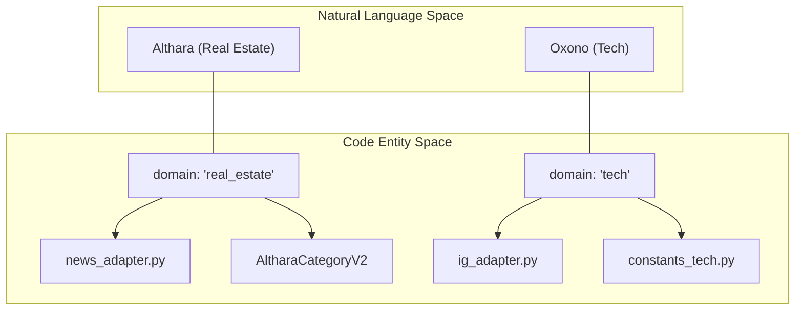
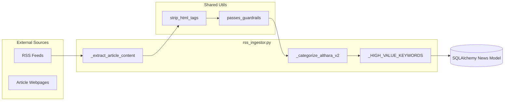
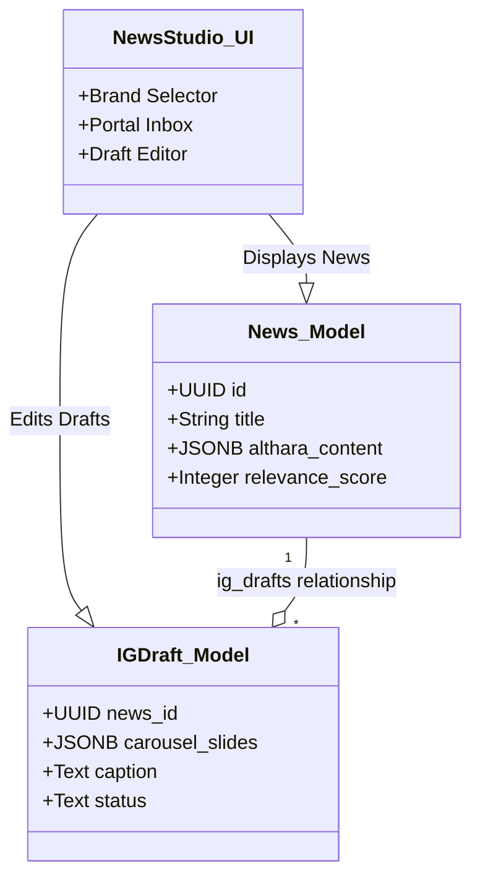

# Glossary

This page provides definitions for codebase-specific terms, domain concepts, and architectural components used in the Althara News Service. It serves as a reference for onboarding engineers to understand the nomenclature and data structures used across the ingestion and transformation pipelines.

## Brand and Domain Concepts

The system is multi-tenant by design, supporting two distinct brands with unique voices and topical domains.

| Term | Definition | Implementation Pointer |
|:---|:---|:---|
| **Althara** | The primary brand focusing on real estate market analysis, institutional investment, and macro-trends. | `app/brands.py` |
| **Oxono** | The secondary brand focusing on technology, systems thinking, and operational efficiency. | `app/brands.py` |
| **Domain** | A database-level discriminator (`real_estate` vs `tech`) used to filter news and apply brand-specific logic. | [app/models/news.py:26-26]() |
| **Tone** | The linguistic style applied during adaptation (e.g., "analytical/professional" for Althara). | [app/adapters/news_adapter.py:4-5]() |

**Brand Relationship Diagram**

This diagram maps the natural language brand names to their respective code identifiers and domain strings.

**Sources:** [app/brands.py:1-20](), [app/models/news.py:26-26](), [app/adapters/news_adapter.py:1-5](), [app/constants.py:22-59]()

---

## News Ingestion Terms

Concepts related to the retrieval and initial processing of external content.

*   **RSS Ingestor**: The component responsible for fetching XML feeds from configured `RSS_SOURCES` and converting them into `News` ORM objects [app/ingestion/rss_ingestor.py:9-51]().
*   **Guardrails**: A filtering mechanism that uses `DENY_KEYWORDS` and `ALLOW_KEYWORDS` to ensure ingested content is relevant to the brand's domain [app/utils/guardrails.py:11-11]().
*   **Scraping**: The process of visiting a news URL using `httpx` and `BeautifulSoup` to extract the full article text when the RSS summary is insufficient [app/ingestion/rss_ingestor.py:56-122]().
*   **Relevance Score**: An integer (0-100) calculated during ingestion based on keyword matches and category priority, used to rank news in the UI [app/ingestion/rss_ingestor.py:138-147]().
*   **Category Hints**: A dictionary of keywords used to automatically classify a news item into a specific `AltharaCategoryV2` [app/ingestion/rss_ingestor.py:130-135]().

**Ingestion Flow Diagram**

**Sources:** [app/ingestion/rss_ingestor.py:56-147](), [app/utils/guardrails.py:11-11](), [app/utils/html_utils.py:9-10]()

---

## Content Adaptation Terms

Terms related to the transformation of raw news into social-media-ready formats.

*   **IG Draft (IGDraft)**: A database record representing a prepared Instagram post, including slides, caption, and hashtags [app/models/ig_draft.py:1-30]().
*   **Carousel Slides**: A JSONB field in the `IGDraft` model containing an array of title/body pairs for Instagram carousels [app/models/ig_draft.py:31-31]().
*   **Althara Content**: A structured JSON object (v2.0 schema) containing "hecho", "lectura", "implicaciones", and "senales_a_vigilar" [app/models/news.py:21-21]().
*   **Strategic Line**: A brand-specific analytical sentence generated based on the news category to provide "expert" context [app/adapters/news_adapter.py:121-178]().
*   **Seed-based Determinism**: The use of a numeric seed (often derived from a timestamp or ID) to select random variations (like "Closers") consistently for a specific record [app/adapters/news_adapter.py:180-186]().

**Data Entity Mapping**

This diagram bridges the visual elements of the "News Studio" UI to the underlying SQLAlchemy models.

**Sources:** [app/models/news.py:9-32](), [app/models/ig_draft.py:1-40](), [app/templates/draft_editor.html:25-138]()

---

## Technical Abbreviations

| Abbreviation | Meaning | Context |
|:---|:---|:---|
| **JSONB** | Binary JSON | PostgreSQL data type used for `althara_content` and `carousel_slides` [app/models/news.py:21-21](). |
| **ORM** | Object-Relational Mapping | SQLAlchemy usage for `News` and `IGDraft` classes [app/database.py](). |
| **CTA** | Call to Action | The closing line of a social post (e.g., "Guárdalo") [app/adapters/ig_adapter.py:83-84](). |
| **BOE** | Boletín Oficial del Estado | Source for auction/legal news (`BOE_SUBASTAS`) [app/constants.py:47-47](). |
| **SOCIMI** | Sociedades Anónimas Cotizadas de Inversión en el Mercado Inmobiliario | Specific real estate investment vehicle referenced in `INVERSION_INSTITUCIONAL` [app/constants.py:40-40](). |

**Sources:** [app/models/news.py:1-32](), [app/constants.py:40-116](), [app/adapters/ig_adapter.py:83-122]()
