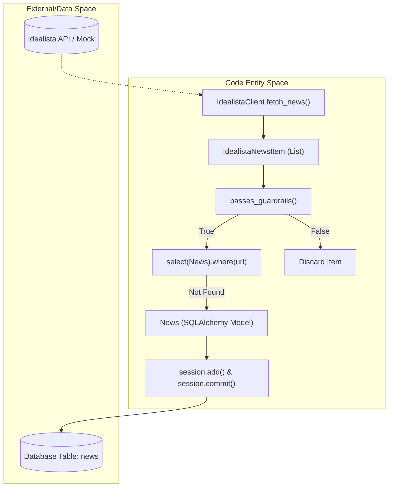
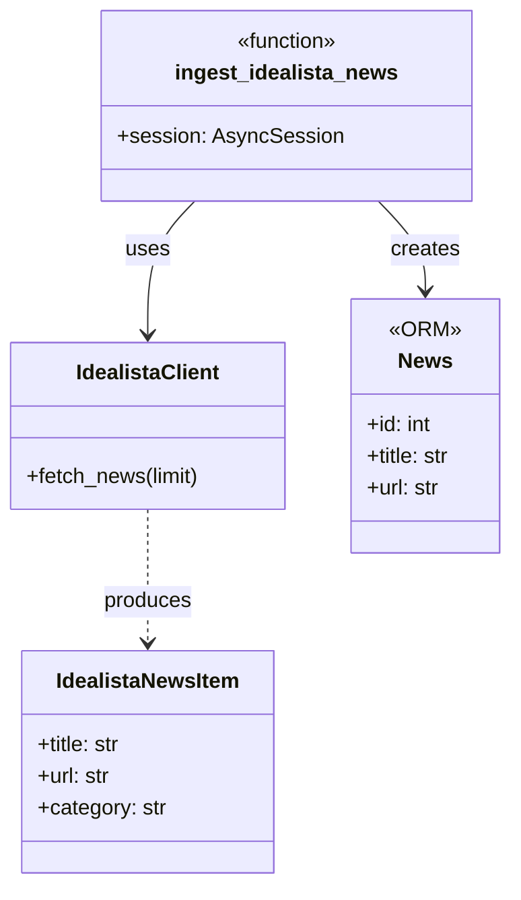

# Idealista Ingestor

The Idealista Ingestor is a specialized component of the News Service designed to fetch real estate market data and news from Idealista. It consists of a client for handling API interactions and an ingestor service that processes the data, applies guardrails, and persists it to the database.

## Overview and Limitations

It is important to note that the official Idealista API primarily focuses on property search and market data rather than a public news endpoint [app/ingestion/idealista_client.py:4-6](). Consequently, the current implementation serves as a structured foundation for future integration, utilizing a mock mechanism for development and testing while maintaining the data structures required for real estate news [app/ingestion/idealista_client.py:7-12]().

### Core Components

| Component | File | Responsibility |
| :--- | :--- | :--- |
| `IdealistaClient` | [app/ingestion/idealista_client.py:32-33]() | Manages API credentials and data retrieval logic. |
| `IdealistaNewsItem` | [app/ingestion/idealista_client.py:21-22]() | Pydantic model defining the schema for ingested Idealista data. |
| `ingest_idealista_news` | [app/ingestion/idealista_ingestor.py:15-15]() | Orchestrates fetching, filtering via guardrails, and DB insertion. |

**Sources:** [app/ingestion/idealista_client.py:4-33](), [app/ingestion/idealista_ingestor.py:15-15]()

---

## Data Flow and Logic

The ingestion process follows a strict pipeline to ensure that only relevant, high-quality real estate news enters the system.

### Ingestion Pipeline Diagram

The following diagram illustrates the flow from the `IdealistaClient` through the guardrails check to the `News` ORM model.

"Idealista Ingestion Pipeline"

**Sources:** [app/ingestion/idealista_ingestor.py:15-61](), [app/ingestion/idealista_client.py:41-53]()

### Implementation Details

1.  **Fetching**: The `ingest_idealista_news` function initializes an `IdealistaClient` and calls `fetch_news(limit=20)` [app/ingestion/idealista_ingestor.py:26-27]().
2.  **Guardrails**: Each item is passed through `passes_guardrails`. This utility checks the title, summary, and URL against `DENY_KEYWORDS`, `ALLOW_KEYWORDS`, and the `STRICT_REQUIRE_ALLOW` flag [app/ingestion/idealista_ingestor.py:33-37]().
3.  **Deduplication**: The ingestor performs a uniqueness check by querying the `News` table for the specific URL using `select(News).where(News.url == item.url)` [app/ingestion/idealista_ingestor.py:39-41]().
4.  **Persistence**: If the news item is new and passes filters, it is mapped to a `News` ORM object and saved with `domain` (implied real estate) and specific fields like `provincia` or `poblacion` if available [app/ingestion/idealista_ingestor.py:43-56]().

**Sources:** [app/ingestion/idealista_ingestor.py:26-61](), [app/utils/guardrails.py:1-11]()

---

## Technical Reference

### IdealistaClient Configuration
The client retrieves its configuration from the global `settings` object, which maps to environment variables:
*   `IDEALISTA_API_BASE_URL` [app/ingestion/idealista_client.py:37]()
*   `IDEALISTA_API_KEY` [app/ingestion/idealista_client.py:38]()
*   `IDEALISTA_API_SECRET` [app/ingestion/idealista_client.py:39]()

### News Item Schema
The `IdealistaNewsItem` Pydantic model ensures data consistency before the ingestor attempts to transform it into a database record.

| Field | Type | Description |
| :--- | :--- | :--- |
| `title` | `str` | Headline of the news item [app/ingestion/idealista_client.py:23]() |
| `source` | `str` | Hardcoded to "Idealista" [app/ingestion/idealista_client.py:24]() |
| `url` | `str` | Unique identifier and link [app/ingestion/idealista_client.py:25]() |
| `published_at` | `datetime` | Publication timestamp [app/ingestion/idealista_client.py:26]() |
| `category` | `str` | Mapped to `NewsCategory` constants [app/ingestion/idealista_client.py:27]() |
| `raw_summary` | `Optional[str]` | Brief excerpt of the content [app/ingestion/idealista_client.py:28]() |

### Code Mapping: Client to Ingestor

"Entity Mapping and Flow"

**Sources:** [app/ingestion/idealista_client.py:21-41](), [app/ingestion/idealista_ingestor.py:15-56](), [app/models/news.py:1-20]()

---
