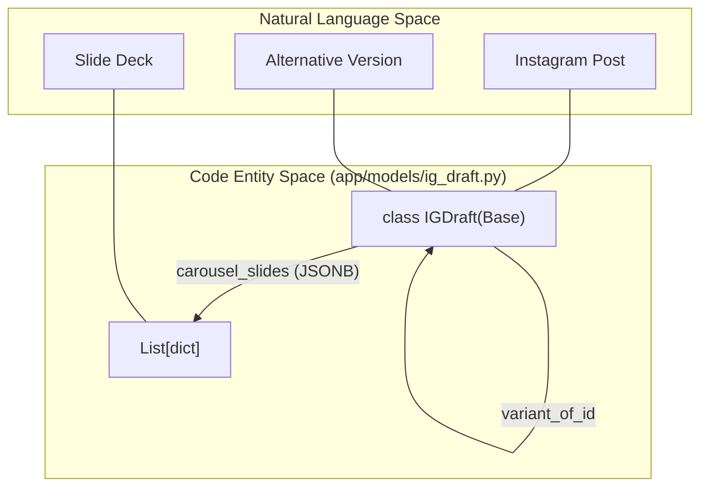
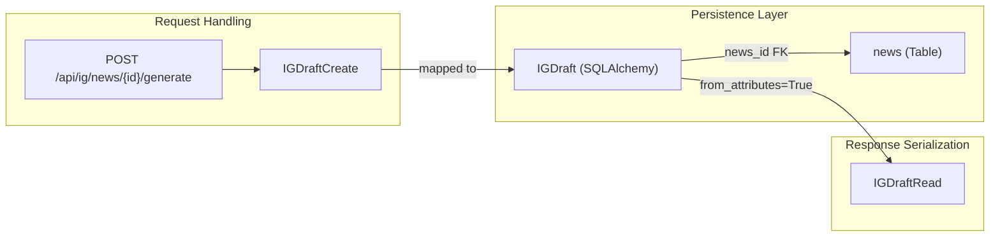

# IGDraft Model

The `IGDraft` model represents a structured Instagram post proposal derived from a News article. It serves as the primary data structure for the social media workflow, capturing carousel content, captions, and metadata required for publication.

## 1. SQLAlchemy Model Definition

The `IGDraft` class is defined in `app/models/ig_draft.py` and inherits from the shared `Base` declarative class. It utilizes PostgreSQL-specific features like `JSONB` for flexible content storage.

### 1.1 Column Specifications
The model includes the following fields:

| Column | Type | Description |
| :--- | :--- | :--- |
| `id` | `UUID` | Primary key, generated via `uuid.uuid4` [app/models/ig_draft.py:12](). |
| `news_id` | `UUID` | Foreign key to the `news` table with `CASCADE` delete [app/models/ig_draft.py:13](). |
| `hook` | `Text` | The opening line or "hook" for the post [app/models/ig_draft.py:14](). |
| `carousel_slides`| `JSONB` | Array of objects containing `{title, body}` for slides [app/models/ig_draft.py:15](). |
| `caption` | `Text` | The main body text of the Instagram post [app/models/ig_draft.py:16](). |
| `hashtags` | `JSONB` | Array of strings representing post hashtags [app/models/ig_draft.py:17](). |
| `cta` | `Text` | Call to Action text [app/models/ig_draft.py:18](). |
| `source_line` | `Text` | Mandatory citation of the news source [app/models/ig_draft.py:19](). |
| `status` | `Text` | Lifecycle state (Default: `DRAFT`) [app/models/ig_draft.py:23](). |
| `variant_of_id` | `UUID` | Self-referencing FK to support multiple versions of one draft [app/models/ig_draft.py:25](). |

### 1.2 Relationships
The model maintains two primary relationships:
*   **News**: A `many-to-one` relationship where multiple drafts can belong to a single news item [app/models/ig_draft.py:29]().
*   **Variants**: A self-referential relationship (`variant_of`) that allows the system to track iterations or alternative versions of a draft [app/models/ig_draft.py:30]().

**Sources:**
* [app/models/ig_draft.py:9-31]()

---

## 2. Status Lifecycle

The `status` column tracks the editorial progress of a draft. Although stored as a `Text` field, it follows a specific state machine logic within the application.

### Status Transitions
*   **`DRAFT`**: Initial state upon generation.
*   **`NEEDS_REVIEW`**: Flagged for manual intervention or refinement.
*   **`APPROVED`**: Validated by an editor and ready for publication.
*   **`PUBLISHED`**: Final state once the content has been posted to social media.

**Sources:**
* [app/models/ig_draft.py:23]()

---

## 3. Pydantic Schemas

Data validation and serialization are handled by Pydantic models in `app/schemas/ig_draft.py`. These schemas ensure type safety between the API and the database.

### Schema Hierarchy
*   **`IGDraftBase`**: Contains common fields shared across all schemas (hook, slides, caption, etc.) [app/schemas/ig_draft.py:12-24]().
*   **`IGDraftCreate`**: Used for initial creation, requiring a `news_id` [app/schemas/ig_draft.py:26-28]().
*   **`IGDraftUpdate`**: All fields are `Optional`, allowing partial updates via `PATCH` requests [app/schemas/ig_draft.py:30-41]().
*   **`IGDraftRead`**: The output schema including database-generated fields like `id`, `created_at`, and `updated_at` [app/schemas/ig_draft.py:44-53]().

### Slide Structure
The `carousel_slides` are validated using the `CarouselSlide` helper class, ensuring every slide has a `title` and a `body` [app/schemas/ig_draft.py:7-9]().

**Sources:**
* [app/schemas/ig_draft.py:7-53]()

---

## 4. Data Flow and Entity Mapping

The following diagrams illustrate how the system maps natural language concepts (like a "Social Post") into specific code entities and how the data relates across tables.

### Entity Relationship Mapping
This diagram bridges the gap between the logical concept of a social media post and the `IGDraft` ORM entity.

**Sources:**
* [app/models/ig_draft.py:9-31]()
* [app/schemas/ig_draft.py:14-15]()

### Schema and Model Interaction
This diagram shows how data flows from a creation request through the Pydantic schemas into the SQLAlchemy model.

**Sources:**
* [app/schemas/ig_draft.py:26-53]()
* [app/models/ig_draft.py:13]()

---
