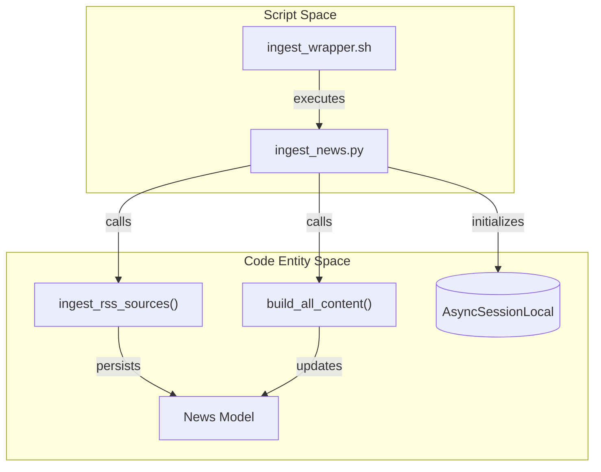
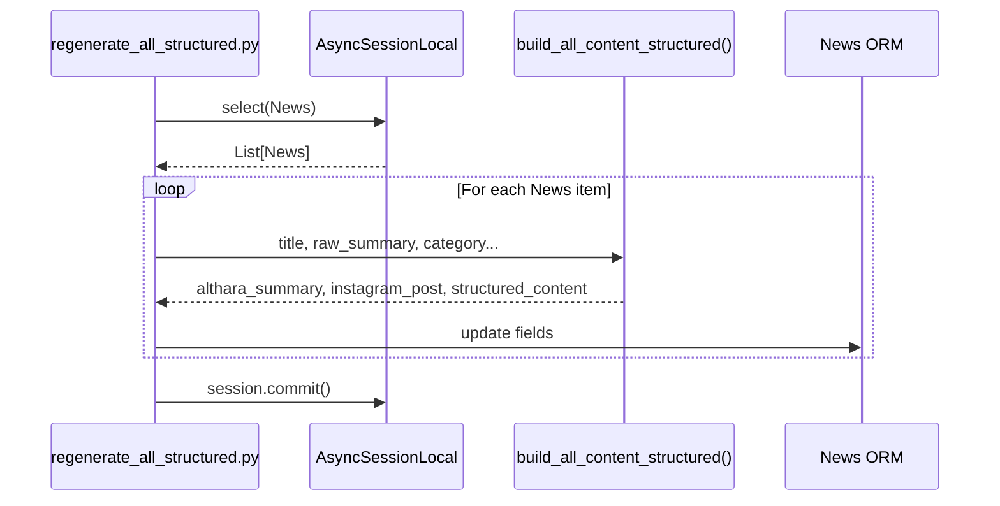

# Ingestion and Regeneration Scripts

This section covers the standalone Python and shell scripts located in the `scripts/` directory. These utilities are designed for automated execution (via cron), maintenance tasks, and bulk data transformation outside of the standard FastAPI request-response lifecycle.

## Primary Ingestion Pipeline

The primary entry point for automated ingestion is `ingest_news.py`, which coordinates the fetching of raw news and its subsequent transformation into brand-aligned content.

### ingest_news.py
This script executes a two-stage pipeline:
1.  **Ingestion**: Calls `ingest_rss_sources` to fetch and persist new items from configured RSS feeds [scripts/ingest_news.py:26-34]().
2.  **Adaptation**: Queries the database for `News` records where `althara_summary` or `instagram_post` are null [scripts/ingest_news.py:37-41](). It then uses `build_all_content` to generate the missing fields [scripts/ingest_news.py:46-52]().

### ingest_wrapper.sh
A shell wrapper used for deployment and cron scheduling. It sets the working directory, activates the virtual environment, and redirects output to a log file [scripts/ingest_wrapper.sh:5-7]().

### Ingestion Logic Flow
The following diagram illustrates the relationship between the ingestion script and the application core:

**Ingestion Script to Core Entity Mapping**

Sources: [scripts/ingest_news.py:15-18](), [scripts/ingest_wrapper.sh:7](), [scripts/ingest_news.py:24-65]()

## Content Regeneration and Migration

These scripts are used when the adaptation logic or the database schema for structured content changes, requiring bulk updates to existing records.

### generate_structured_for_all.py
This script targets `News` records where the `althara_content` field is `None` [scripts/generate_structured_for_all.py:23-25](). It uses `build_all_content_structured` to populate the V2 JSON schema (including `web` and `social` blocks) for pending items [scripts/generate_structured_for_all.py:44-51]().

### regenerate_all_structured.py
Unlike the "pending only" script, this forces an update on **all** records in the database [scripts/regenerate_all_structured.py:23-25](). It is typically used after a major update to the `news_adapter.py` logic to ensure all historical news items reflect the latest formatting and narrative reconstruction [scripts/regenerate_all_structured.py:42-54]().

### Data Flow for Structured Regeneration

Sources: [scripts/regenerate_all_structured.py:15-54](), [scripts/generate_structured_for_all.py:15-59]()

## Maintenance and Cleanup

### clean_and_reingest.py
A high-impact script used to reset the database state. It performs the following:
1.  **Purge**: Executes a `delete(News)` statement to wipe all records [scripts/clean_and_reingest.py:36-38]().
2.  **Re-ingest**: Triggers `ingest_rss_sources` [scripts/clean_and_reingest.py:45]().
3.  **Re-adapt**: Rebuilds summaries using `build_althara_summary` [scripts/clean_and_reingest.py:62-67]().

### recategorize_news.py
Used when the keyword-based classification logic in `rss_ingestor.py` is updated. It iterates through all news items and calls `_categorize_by_keywords` on the existing `title` and `raw_summary` [scripts/recategorize_news.py:42-43](). If the new category differs from the stored one, the record is updated [scripts/recategorize_news.py:45-50]().

## Summary of Script Capabilities

| Script | Target | Primary Function | Core Call |
| :--- | :--- | :--- | :--- |
| `ingest_news.py` | New/Pending | Daily ingestion and adaptation | `ingest_rss_sources` |
| `clean_and_reingest.py` | All | Full DB wipe and fresh fetch | `delete(News)` |
| `recategorize_news.py` | All | Updates `category` field via keywords | `_categorize_by_keywords` |
| `generate_structured_for_all.py` | Missing `althara_content` | Populates V2 structured JSON | `build_all_content_structured` |
| `regenerate_all_structured.py` | All | Overwrites all content fields | `build_all_content_structured` |

Sources: [scripts/ingest_news.py:22-73](), [scripts/clean_and_reingest.py:22-83](), [scripts/recategorize_news.py:22-66](), [scripts/regenerate_all_structured.py:19-75](), [scripts/generate_structured_for_all.py:19-79]()

---
