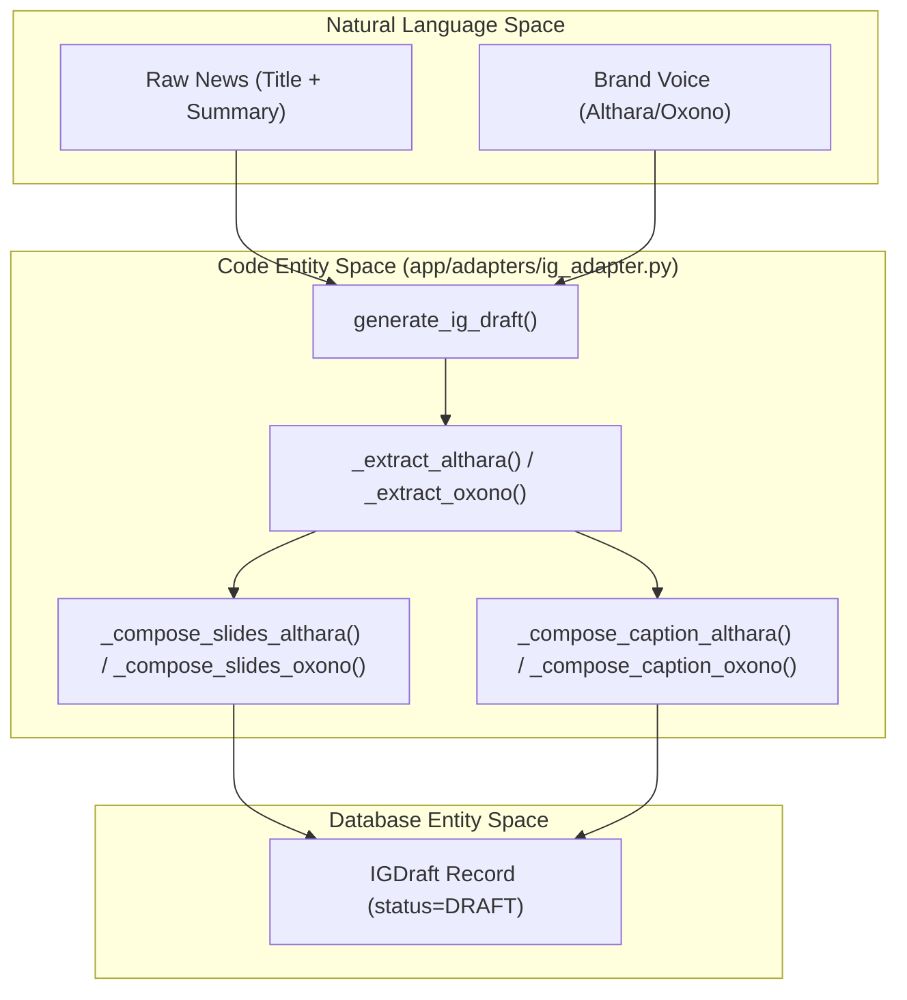
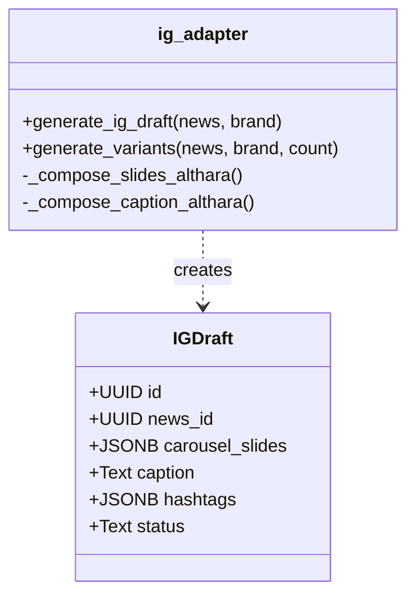

# Instagram Draft Generator

The Instagram Draft Generator is a specialized adaptation pipeline implemented in `ig_adapter.py` that transforms ingested news into structured social media content. It utilizes an **Extract + Compose** strategy to ensure that carousel slides and captions maintain high-quality, brand-aligned messaging without mid-sentence truncation [app/adapters/ig_adapter.py:1-7]().

## Extract + Compose Pipeline

The generator operates by first extracting semantic facts from raw content and then composing them into brand-specific formats. Unlike simple summarization, this pipeline prioritizes complete sentences and "quiet luxury" (Althara) or "systems thinking" (Oxono) tones [app/adapters/ig_adapter.py:5-7]().

### Data Flow Diagram
The following diagram illustrates how raw news data is processed into an `IGDraft` entity.

**IG Draft Generation Flow**

Sources: [app/adapters/ig_adapter.py:218-245](), [app/adapters/ig_adapter.py:53-73](), [app/adapters/ig_adapter.py:149-156]()

## Carousel Slide Composition

The system generates exactly **3 slides** for every carousel, following a specific narrative arc [app/adapters/ig_adapter.py:32-32]().

1.  **Slide 1: Hecho (Fact)** - The primary news event.
2.  **Slide 2: Contexto (Context)** - Supporting details or implications.
3.  **Slide 3: Cierre (Closing)** - A strategic takeaway or Call to Action (CTA).

Each slide body is strictly limited to **110 characters** to ensure readability on mobile devices [app/adapters/ig_adapter.py:31-31](). The function `_to_slide_body` uses `truncate_at_sentence` from text utilities to prevent cutting words in half [app/adapters/ig_adapter.py:44-49]().

| Brand | Slide 1 Title | Slide 2 Title | Slide 3 Title |
| :--- | :--- | :--- | :--- |
| **Althara** | Hecho | Contexto | Cierre |
| **Oxono** | Tesis | Hecho | Cierre |

Sources: [app/adapters/ig_adapter.py:81-103](), [app/adapters/ig_adapter.py:159-176](), [app/utils/text_compaction.py:20-44]()

## Brand-Specific Logic

The generator applies distinct logic based on the target brand, defined by the `domain` of the news item [app/adapters/ig_adapter.py:228-232]().

### Althara (Real Estate)
*   **Tone**: Professional, analytical, "Quiet Luxury".
*   **Extraction**: Uses `_extract_althara` to pull sentences that fit the 110-character limit [app/adapters/ig_adapter.py:53-60]().
*   **Strategic Reading**: Incorporates a "lectura" (strategic line) based on the news category [app/adapters/ig_adapter.py:62-73]().
*   **Caption**: Maximum 900 characters, including a hook, bullet points, and a source line [app/adapters/ig_adapter.py:34-34](), [app/adapters/ig_adapter.py:106-122]().

### Oxono (Tech)
*   **Tone**: Systems thinking, operational, direct.
*   **Extraction**: Focuses on technical impact and execution [app/adapters/ig_adapter.py:149-156]().
*   **Caption**: Range of 500-850 characters with technical takeaways like "Validar supuestos" [app/adapters/ig_adapter.py:38-39](), [app/adapters/ig_adapter.py:179-193]().

Sources: [app/adapters/ig_adapter.py:53-144](), [app/adapters/ig_adapter.py:149-213]()

## Hashtag Generation and Determinism

Hashtags are generated dynamically based on the news category and a provided `seed` [app/adapters/ig_adapter.py:125-144]().

*   **Seed-based Determinism**: The `seed` (often derived from the News ID or timestamp) ensures that the same news item produces consistent hashtags and CTAs across multiple generation calls [app/adapters/ig_adapter.py:180-183]().
*   **Category Mapping**: Specific categories like `PRECIOS_VIVIENDA` or `AI_ML` trigger relevant tags (e.g., `#preciosvivienda`, `#ia`) [app/adapters/ig_adapter.py:127-133](), [app/adapters/ig_adapter.py:198-202]().
*   **Quantity**: Althara targets 8-12 hashtags, while Oxono targets 6-10 [app/adapters/ig_adapter.py:35-41]().

Sources: [app/adapters/ig_adapter.py:125-144](), [app/adapters/ig_adapter.py:196-213]()

## Key Functions and Entities

### `generate_ig_draft()`
The main entry point for the adapter. It takes a `News` object and returns a dictionary structured for the `IGDraft` model [app/adapters/ig_adapter.py:218-245]().

### `generate_variants()`
This function creates multiple versions of a draft for the same news item by varying the `seed`. This allows editors to choose between different hooks or CTA combinations [app/adapters/ig_adapter.py:248-258]().

### `IGDraft` Model
The resulting record is stored in the `ig_drafts` table with the following structure:
*   `news_id`: Foreign key to the parent news item [alembic/versions/002_add_domain_relevance_ig_drafts.py:29-29]().
*   `carousel_slides`: JSONB field containing the title and body for the 3 slides [alembic/versions/002_add_domain_relevance_ig_drafts.py:31-31]().
*   `status`: Lifecycle state (e.g., `DRAFT`, `NEEDS_REVIEW`, `APPROVED`) [alembic/versions/002_add_domain_relevance_ig_drafts.py:39-39]().

**Entity Mapping: IG Adapter to Database**

Sources: [app/adapters/ig_adapter.py:218-258](), [alembic/versions/002_add_domain_relevance_ig_drafts.py:26-46]()

---
