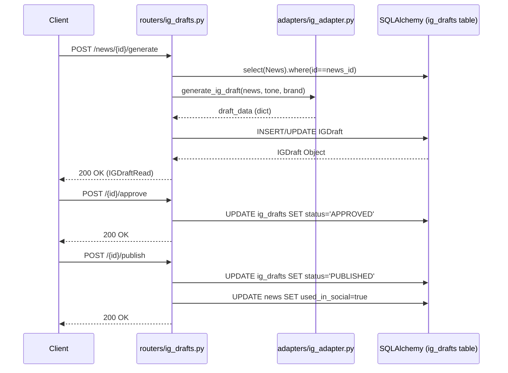
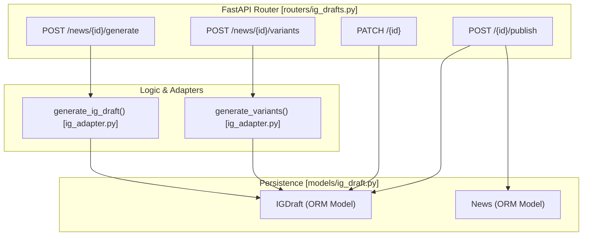

# Instagram Drafts API

The Instagram Drafts API provides a set of endpoints for managing the lifecycle of social media content derived from ingested news. It handles the generation of carousel slides, captions, and hashtags, while maintaining a state machine for editorial review and publication.

## Overview and Lifecycle

The API facilitates the transition of news content into structured Instagram posts. Every `IGDraft` is linked to a parent `News` record and follows a specific status lifecycle to ensure quality control before publication.

### IGDraft Status Lifecycle
The `status` field in the `IGDraft` model tracks the progress of a draft [app/models/ig_draft.py:23]():
1.  **DRAFT**: The initial state upon generation.
2.  **NEEDS_REVIEW**: Set when a draft requires manual intervention.
3.  **APPROVED**: Marked as ready for publication by an editor.
4.  **PUBLISHED**: Final state indicating the content has been posted.

### Authentication
Endpoints that modify data (POST, PATCH) are protected by the `_require_token` dependency [app/routers/ig_drafts.py:20-25](). This check validates the `X-INGEST-TOKEN` HTTP header against the `INGEST_TOKEN` value defined in the system settings [app/config.py]().

**Sources:**
- [app/models/ig_draft.py:9-31]()
- [app/routers/ig_drafts.py:20-25]()

## Data Flow: Generation to Publication

The following diagram illustrates how a `News` entity is transformed into an `IGDraft` and moved through the lifecycle via the `ig_drafts.py` router.

### Content Transformation Flow

**Sources:**
- [app/routers/ig_drafts.py:28-65]()
- [app/routers/ig_drafts.py:155-197]()

## Schema and Models

The system uses Pydantic schemas for data validation and SQLAlchemy models for persistence.

### Database Entity: `IGDraft`
The `IGDraft` model stores the structured content for Instagram. Key fields include `carousel_slides` (stored as JSONB) and `variant_of_id` for supporting multiple versions of the same news item.

| Field | Type | Description |
| :--- | :--- | :--- |
| `id` | UUID | Primary Key [app/models/ig_draft.py:12]() |
| `news_id` | UUID | Foreign Key to `news.id` [app/models/ig_draft.py:13]() |
| `carousel_slides` | JSONB | List of `{title, body}` objects [app/models/ig_draft.py:15]() |
| `hashtags` | JSONB | Array of strings [app/models/ig_draft.py:17]() |
| `status` | Text | DRAFT, NEEDS_REVIEW, APPROVED, or PUBLISHED [app/models/ig_draft.py:23]() |
| `variant_of_id` | UUID | Self-referencing FK for variants [app/models/ig_draft.py:25]() |

### API Entities: Pydantic Schemas
- **`IGDraftCreate`**: Used for internal creation logic [app/schemas/ig_draft.py:26-27]().
- **`IGDraftUpdate`**: Allows partial updates to fields like `hook`, `caption`, or `status` via `PATCH` [app/schemas/ig_draft.py:30-41]().
- **`IGDraftRead`**: The public-facing representation, including timestamps and IDs [app/schemas/ig_draft.py:44-52]().

**Sources:**
- [app/models/ig_draft.py:9-31]()
- [app/schemas/ig_draft.py:1-53]()

## Endpoint Reference

### Generation and Variants
*   **`POST /api/ig/news/{news_id}/generate`**: Triggers the `generate_ig_draft` function. If a primary draft (where `variant_of_id` is null) already exists, it updates it; otherwise, it creates a new one [app/routers/ig_drafts.py:28-65]().
*   **`POST /api/ig/news/{news_id}/variants`**: Generates multiple alternative versions using `generate_variants`. These are linked to the news item but treated as distinct options for the editor [app/routers/ig_drafts.py:68-98]().

### CRUD and Management
*   **`GET /api/ig/`**: Lists drafts with support for `domain` and `status` filtering, including pagination [app/routers/ig_drafts.py:101-119]().
*   **`GET /api/ig/{draft_id}`**: Retrieves a specific draft by its UUID [app/routers/ig_drafts.py:122-130]().
*   **`PATCH /api/ig/{draft_id}`**: Updates specific fields. Commonly used by the News Studio UI to save manual edits to captions or slides [app/routers/ig_drafts.py:133-152]().

### Workflow Transitions
*   **`POST /api/ig/{draft_id}/approve`**: Explicitly sets status to `APPROVED` [app/routers/ig_drafts.py:155-170]().
*   **`POST /api/ig/{draft_id}/publish`**: Sets status to `PUBLISHED`. If the `mark_news_used` query parameter is true (default), it also updates the parent `News` record's `used_in_social` flag to `True` [app/routers/ig_drafts.py:173-197]().

### Code Entity Mapping
This diagram maps the API routes to their corresponding logic and data structures.

**Sources:**
- [app/routers/ig_drafts.py:1-198]()
- [app/models/ig_draft.py:9-31]()
- [app/adapters/ig_adapter.py:1-20]() (implied by imports in router)

---
