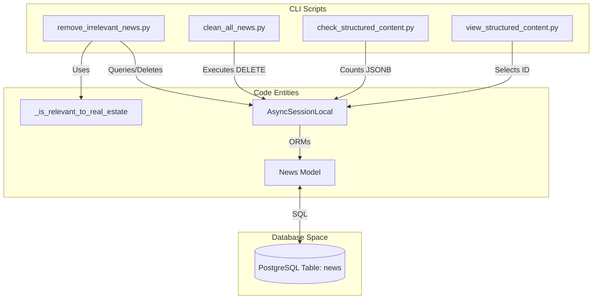
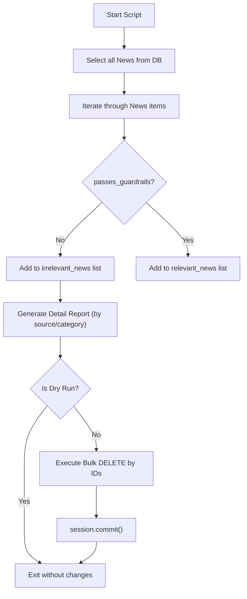

# Maintenance and Cleanup Scripts

This section details the standalone utility scripts designed for database maintenance, data integrity auditing, and bulk pruning. These scripts operate directly on the database using `AsyncSessionLocal` and are intended for administrative use via CLI or automated maintenance windows.

## Overview of Maintenance Utilities

The maintenance suite provides tools for four primary operational tasks:
1.  **Relevance Pruning**: Removing historical data that no longer meets the system's topical guardrails.
2.  **Full Reset**: Completely wiping the news database for re-indexing.
3.  **Content Auditing**: Verifying the state of JSONB structured content fields across the dataset.
4.  **Content Inspection**: Deep-diving into the transformed data for specific records.

### Maintenance Data Flow

The following diagram illustrates how maintenance scripts interact with the `News` model and the underlying PostgreSQL storage.

**Maintenance Script Interaction Map**

Sources: [scripts/remove_irrelevant_news.py:17-21](), [scripts/clean_all_news.py:12-15](), [scripts/check_structured_content.py:13-16](), [scripts/view_structured_content.py:14-17]()

---

## Irrelevant News Removal

The `remove_irrelevant_news.py` script identifies and removes news items that fail the real estate relevance check. This is particularly useful after updating the `DENY_KEYWORDS` or `ALLOW_KEYWORDS` in the system constants to purge legacy "noise" from the database.

### Implementation Details
The script uses the internal `_is_relevant_to_real_estate` logic from the `rss_ingestor` to ensure consistency between ingestion and maintenance [scripts/remove_irrelevant_news.py:20-20]().

*   **Dry Run Mode**: Activated via `--dry-run` or `-d`, it performs the analysis and prints a detailed report without executing the `delete` statement [scripts/remove_irrelevant_news.py:24-33]().
*   **Grouping**: It aggregates candidates for deletion by `source` and `category` to help administrators identify problematic RSS feeds [scripts/remove_irrelevant_news.py:73-80]().
*   **Bulk Deletion**: Uses `delete(News).where(News.id.in_(ids_to_delete))` for efficient batch removal [scripts/remove_irrelevant_news.py:118-120]().

**Removal Logic Flow**

Sources: [scripts/remove_irrelevant_news.py:24-139]()

---

## Database Full Wipe

The `clean_all_news.py` script provides a nuclear option to empty the `news` table. This is typically used in staging environments or when a full re-ingestion with new logic is required.

*   **Safety**: It prints a prominent warning and the total count of news items before proceeding [scripts/clean_all_news.py:30-36]().
*   **Atomic Operation**: It executes a single `delete(News)` statement and commits the transaction [scripts/clean_all_news.py:39-41]().

Sources: [scripts/clean_all_news.py:18-52]()

---

## Structured Content Auditing

With the introduction of the `althara_content` JSONB field (Revision `43db6c86d1d4`), it became necessary to track which records have been processed by the News Adapter.

### Audit Script: `check_structured_content.py`
This script provides a statistical overview of the database's adaptation state:
*   **Metrics**: Calculates total news vs. news where `althara_content` is not null [scripts/check_structured_content.py:23-32]().
*   **Schema Validation**: It inspects the first available structured record and prints the presence of `web` and `instagram` sub-keys to verify they conform to the expected v2.0 schema [scripts/check_structured_content.py:61-76]().

### Inspection Script: `view_structured_content.py`
A developer tool for deep-inspecting the JSON transformation of a specific article.
*   **Lookup**: Supports finding news by UUID or by its index in the database [scripts/view_structured_content.py:23-35]().
*   **Pretty Print**: Parses the `althara_content` JSONB and formats the `web`, `instagram`, and `qa` sections for terminal readability [scripts/view_structured_content.py:63-113]().

**Structured Content Data Structure (althara_content)**
| Field | Source Logic | Purpose |
| :--- | :--- | :--- |
| `web` | `build_structured_content` | Title, Deck, Hecho, Lectura, Implicaciones, Señales. |
| `instagram` | `build_instagram_post` | Hook, Slides, Caption, CTA. |
| `qa` | Adapter Validation | `facts_used` and `unknown_or_missing` lists. |
| `metadata` | Adapter | Generation timestamp, category, and random seed. |

Sources: [scripts/check_structured_content.py:19-102](), [scripts/view_structured_content.py:20-136](), [alembic/versions/43db6c86d1d4_add_althara_content_field.py:20-21]()

---

## Summary of Maintenance Commands

| Script | Command | Purpose |
| :--- | :--- | :--- |
| **Pruning** | `python3 scripts/remove_irrelevant_news.py --dry-run` | Preview news to be deleted based on guardrails. |
| **Wipe** | `python3 scripts/clean_all_news.py` | Delete all news records from the database. |
| **Audit** | `python3 scripts/check_structured_content.py` | Show stats on adapted vs. raw news items. |
| **Inspect** | `python3 scripts/view_structured_content.py <UUID>` | View formatted JSONB content for a specific news ID. |

Sources: [scripts/remove_irrelevant_news.py:142-143](), [scripts/view_structured_content.py:139-140]()

---
