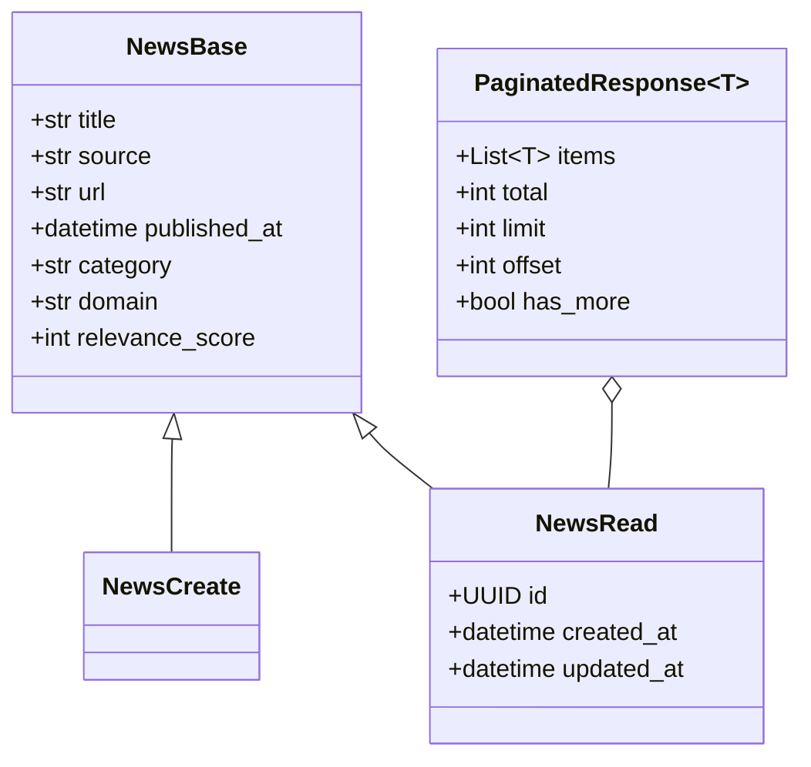
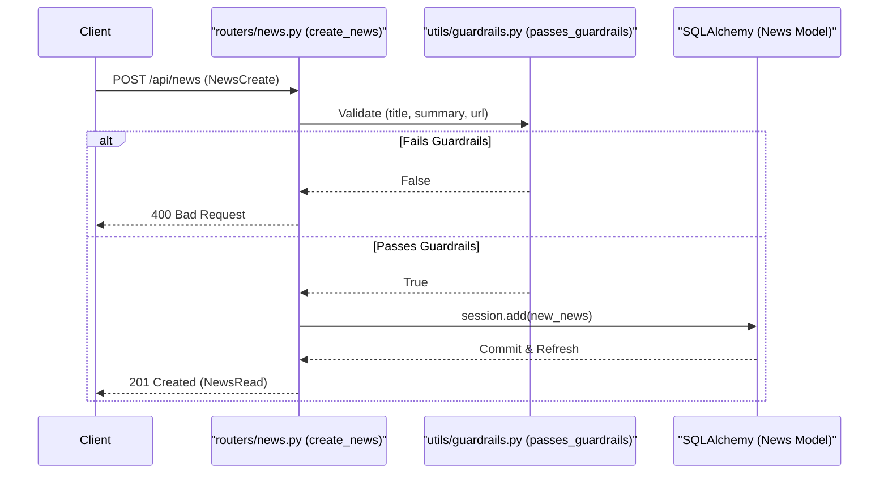

# News API

The **News API** provides the primary interface for managing and retrieving news articles within the Althara News Service. It handles the lifecycle of news records, from manual creation with guardrail validation to complex filtered queries for both the Althara (real estate) and Oxono (tech) brands.

## Overview of Endpoints

The endpoints are defined in `app/routers/news.py` and interact with the `News` SQLAlchemy model.

| Method | Endpoint | Description |
|:---|:---|:---|
| `GET` | `/health` | Simple health check to verify service availability. |
| `POST` | `/news` | Manually create a news item with sector-specific relevance validation. |
| `GET` | `/news` | List news items with extensive filtering, search, and pagination. |
| `GET` | `/news/{id}` | Retrieve full details of a specific news article by its UUID. |

Sources: [app/routers/news.py:21-146]()

## Data Models and Schemas

The API uses Pydantic schemas defined in `app/schemas/news.py` to enforce data integrity and provide automatic documentation.

### News Schemas
- **`NewsCreate`**: Used for `POST` requests. It inherits from `NewsBase` and includes fields like `title`, `source`, `url`, `category`, and `domain`. [app/schemas/news.py:23-25]()
- **`NewsRead`**: Used for response serialization. It extends the base model with system-generated fields: `id` (UUID), `created_at`, and `updated_at`. [app/schemas/news.py:27-34]()

### Pagination Schema
All list responses are wrapped in a `PaginatedResponse` generic class, ensuring a consistent structure for frontend consumers. [app/schemas/news.py:39-48]()

Sources: [app/schemas/news.py:6-49]()

## News Creation and Guardrails

When a news item is created via `POST /news`, the system executes a validation step using the `passes_guardrails` utility. This ensures that only relevant content (e.g., housing, mortgages, construction) is persisted to the database.

- **Validation Logic**: It checks the `title` and `raw_summary` against `DENY_KEYWORDS` and `ALLOW_KEYWORDS`. [app/routers/news.py:32-35]()
- **Failure State**: If the content fails validation, the API returns a `400 Bad Request` with a detail message explaining the sector relevance requirements. [app/routers/news.py:36-39]()

### Data Flow: Manual Ingestion

Sources: [app/routers/news.py:25-45](), [app/utils/guardrails.py:15-15]()

## Filtering and Pagination

The `GET /news` endpoint supports a wide array of query parameters to serve different parts of the application, such as the News Studio UI or the Althara web portal.

### Query Parameters
- **Domain Filtering**: The `domain` parameter defaults to `real_estate` for backward compatibility but can be set to `tech` or `all`. [app/routers/news.py:89-94]()
- **Draft Status**: The `only_with_draft` flag uses an `exists()` subquery to filter news that has associated Instagram drafts in the `ig_drafts` table. [app/routers/news.py:96-98]()
- **Search and Dates**: Supports case-insensitive title search (`q`) via SQLAlchemy `ilike` and date range filtering on `published_at`. [app/routers/news.py:76-83]()
- **Ordering**: Users can sort by `published_at` (default) or `relevance_score`. Sorting by relevance uses `.nullslast()` to ensure unrated news appears at the end. [app/routers/news.py:104]()

### Implementation Detail: Pagination Logic
The router calculates `has_more` by comparing `offset + limit` against the total count of items matching the criteria. [app/routers/news.py:114]()

Sources: [app/routers/news.py:48-122]()

## Error Handling

The API implements structured error handling to prevent leaking database internals while providing useful logs for developers.
- **SQLAlchemyError**: Caught and logged with `exc_info=True`. Returns a `500 Internal Server Error` with a generic "Error accessing database" message. [app/routers/news.py:123-128]()
- **404 Not Found**: Specifically raised in `get_news` if a UUID does not match any record. [app/routers/news.py:143-144]()

Sources: [app/routers/news.py:123-134]()

---
