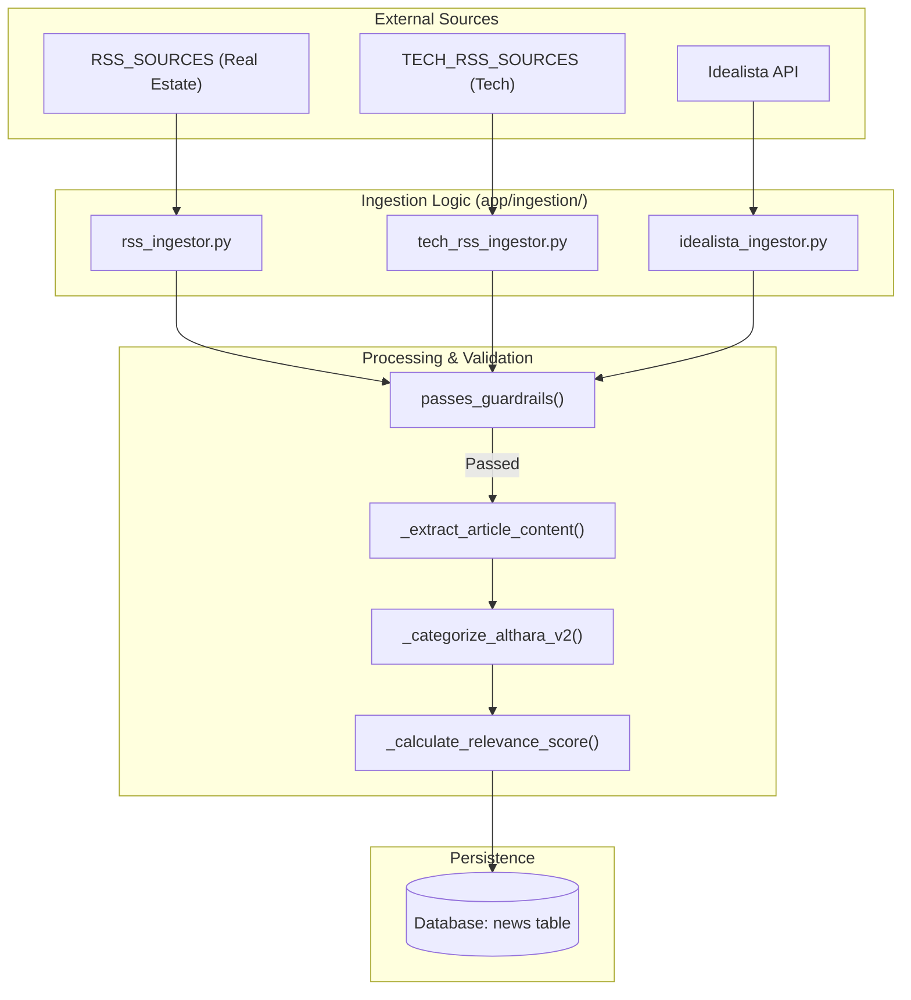
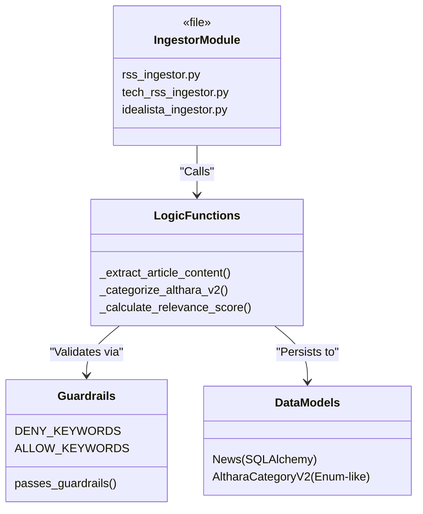

# News Ingestion Pipeline

The News Ingestion Pipeline is the entry point for all content in the Althara News Service. It is responsible for monitoring external sources, extracting relevant information, and transforming raw data into structured `News` entities. The pipeline supports two distinct brand domains: **Althara** (Real Estate) and **Oxono** (Tech).

## Ingestion Architecture

The pipeline follows a multi-stage process: **Fetch → Extract → Filter → Classify → Score → Persist**. This ensures that only high-quality, relevant news reaches the database, while noise (like lifestyle or decoration articles) is discarded.

### High-Level Data Flow

The following diagram illustrates the path from an external RSS feed or API to the `News` table in the database.

**News Ingestion Data Flow**

**Sources:** [app/ingestion/rss_ingestor.py:29-51](), [app/utils/guardrails.py:1-50]()

---

## Real Estate Ingestion (Althara)

The Althara path focuses on the Spanish property market. It monitors professional economic press (Expansión, Cinco Días), real estate portals (Idealista, Fotocasa), and official government sources (BOE Subastas).

- **RSS Fetching:** Uses `feedparser` to read XML feeds and `httpx` for asynchronous requests.
- **Content Scraping:** Unlike simple RSS readers, the `_extract_article_content` function [app/ingestion/rss_ingestor.py:56-122]() uses `BeautifulSoup` to scrape the full article body, bypassing the limited snippets often found in RSS feeds.
- **Classification:** News is mapped to the `AltharaCategoryV2` taxonomy using keyword-based hints defined in `CATEGORY_HINTS`.

For details, see [Real Estate RSS Ingestor](#3.1).

**Sources:** [app/ingestion/rss_ingestor.py:1-51](), [app/constants.py:22-59]()

---

## Tech Ingestion (Oxono)

The Oxono path ingests technology and innovation news. It utilizes a separate set of sources and guardrails to maintain a distinct brand voice.

- **Sources:** Targeted feeds like WIRED España, Genbeta, and Xataka.
- **Tech Guardrails:** Uses `constants_tech.py` to filter for high-signal tech news, excluding general lifestyle or consumer electronics reviews that don't fit the professional profile.
- **Domain Tagging:** Every record is saved with `domain='tech'` to separate it from real estate content in the UI and API.

For details, see [Tech RSS Ingestor (Oxono)](#3.2).

---

## Idealista Ingestor

The `idealista_ingestor.py` provides a specialized path for property data. Since Idealista does not offer a public "news" API, this module interacts with their property search API via `idealista_client.py`.

- **Functionality:** It fetches specific property listings or market reports and converts them into `News` records.
- **Guardrails:** Applies standard real estate guardrails to ensure property descriptions meet the service's quality standards.

For details, see [Idealista Ingestor](#3.3).

---

## Guardrails and Classification

The "Intelligence" of the pipeline resides in the `app/utils/guardrails.py` and `app/constants.py` modules. This layer acts as a gatekeeper.

- **Keyword Filtering:** The `passes_guardrails()` function [app/utils/guardrails.py:12-45]() checks for `DENY_KEYWORDS` (e.g., "decoración", "interiorismo") and enforces `STRICT_REQUIRE_ALLOW` logic.
- **Relevance Scoring:** A `relevance_score` (0-100) is calculated based on category priority and the presence of high-value keywords like "precio", "récord", or "inversión" [app/ingestion/rss_ingestor.py:142-160]().
- **Taxonomy:** The system uses `AltharaCategoryV2`, a pro-level taxonomy designed to reduce ambiguity compared to the original V1 categories.

For details, see [Content Guardrails and Classification](#3.4).

**Sources:** [app/constants.py:124-147](), [app/utils/guardrails.py:1-50]()

---

## Code Entity Mapping

The following diagram bridges the logical ingestion steps to the specific classes and functions in the codebase.

**Code Entity Mapping: Ingestion Pipeline**

**Sources:** [app/ingestion/rss_ingestor.py:56-135](), [app/models/news.py:1-50](), [app/utils/guardrails.py:12-20]()

---
