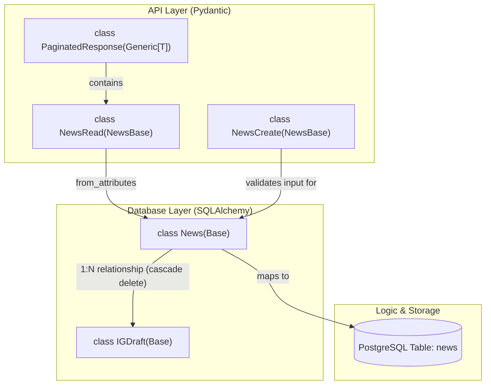
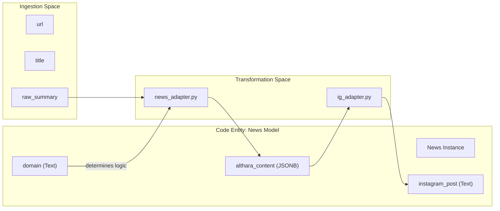

# News Model

The `News` model is the central entity of the Althara News Service. It represents a single news article ingested from external sources (RSS feeds, Idealista, etc.) and contains both the raw metadata and the transformed content used for brand-specific publishing. The model supports multi-domain logic (Real Estate vs. Tech) and serves as the parent for Instagram drafts.

### 1. SQLAlchemy ORM Model

The `News` class is defined in `app/models/news.py` and inherits from the `Base` declarative class. It maps to the `news` table in PostgreSQL.

#### Database Schema Details
The table includes fields for original source metadata, geographic data, and multiple versions of processed content (summaries and structured JSON).

| Column Name | Type | Description |
| :--- | :--- | :--- |
| `id` | `UUID` | Primary key, automatically generated using `uuid.uuid4`. |
| `title` | `String` | The title of the news article. |
| `source` | `String` | The name of the source (e.g., "El País", "Idealista"). |
| `url` | `String` | Unique URL of the article. |
| `published_at` | `DateTime` | Original publication timestamp (with timezone). |
| `category` | `String` | Classified category (e.g., "Mercado", "Vivienda"). |
| `raw_summary` | `Text` | The initial summary extracted during ingestion. |
| `althara_summary` | `Text` | Narrative summary adapted to the Althara brand voice. |
| `instagram_post` | `Text` | Legacy field for single-block Instagram text content. |
| `althara_content` | `JSON` | Structured content (v2.0) containing specific keys: hecho, lectura, etc. |
| `tags` | `Text` | Comma-separated or space-separated keywords. |
| `used_in_social` | `Boolean` | Flag indicating if the news has been used in a social post. |
| `provincia` | `String` | Geographic province associated with the news (if applicable). |
| `poblacion` | `String` | Geographic town/city associated with the news. |
| `domain` | `Text` | Brand domain: `real_estate` (Althara) or `tech` (Oxono). |
| `relevance_score`| `Integer` | Computed score (0-100) based on category and keywords. |
| `created_at` | `DateTime` | Record creation timestamp. |
| `updated_at` | `DateTime` | Last update timestamp, managed by `onupdate=func.now()`. |

#### Relationships and Cascades
The model maintains a one-to-many relationship with the `IGDraft` model.
*   **`ig_drafts`**: Defined with `cascade="all, delete-orphan"`. If a `News` record is deleted, all associated Instagram drafts are automatically removed from the database to maintain referential integrity [app/models/news.py:31-31]().

**Sources:**
*   [app/models/news.py:9-31]()
*   [app/database.py:5-5]() (for `Base` inheritance)

### 2. Pydantic Schemas

The system uses Pydantic models in `app/schemas/news.py` for data validation, API request parsing, and serialization.

#### Class Hierarchy
1.  **`NewsBase`**: Contains common fields shared across creation and reading operations [app/schemas/news.py:6-21]().
2.  **`NewsCreate`**: Used for `POST` requests. It inherits from `NewsBase` but does not include system-generated fields like `id` or `created_at` [app/schemas/news.py:23-25]().
3.  **`NewsRead`**: Used for API responses. It includes the `id` and timestamps. It enables `from_attributes = True` to allow seamless conversion from SQLAlchemy ORM objects [app/schemas/news.py:27-34]().

#### Paginated Responses
To handle large datasets in the UI and API, the `PaginatedResponse` generic model is used. It wraps a list of items with metadata [app/schemas/news.py:39-48]().

**Sources:**
*   [app/schemas/news.py:6-48]()

### 3. Data Flow and Entity Mapping

The following diagrams illustrate how the system maps the "Natural Language" concepts of news articles into the "Code Entity Space" of the SQLAlchemy and Pydantic models.

#### Diagram: Entity Mapping and Relationships
This diagram shows how the `News` entity relates to its child drafts and the database layer.

**Sources:**
*   [app/models/news.py:9-31]()
*   [app/schemas/news.py:23-48]()

#### Diagram: Content Transformation Mapping
This diagram shows how specific news attributes map to the functional areas of the codebase.

**Sources:**
*   [app/models/news.py:12-29]()
*   [app/schemas/news.py:6-21]()

### 4. Implementation Details

*   **JSONB Storage**: The `althara_content` field uses the `JSON` type (mapping to `JSONB` in PostgreSQL) to store structured adaptation data. This allows the system to store version 2.0 adaptation results (keys: `hecho`, `lectura`, `implicaciones`, `senales_a_vigilar`) without requiring a rigid table schema [app/models/news.py:21-21]().
*   **Domain Filtering**: The `domain` column [app/models/news.py:26-26]() defaults to `real_estate` but is used extensively by routers to filter news for the Althara (real estate) vs. Oxono (tech) portals.
*   **Relevance Scoring**: The `relevance_score` [app/models/news.py:27-27]() is an integer field that allows the API to sort news by "importance" rather than just by date.

**Sources:**
*   [app/models/news.py:21-27]()
*   [app/schemas/news.py:15-21]()

---
