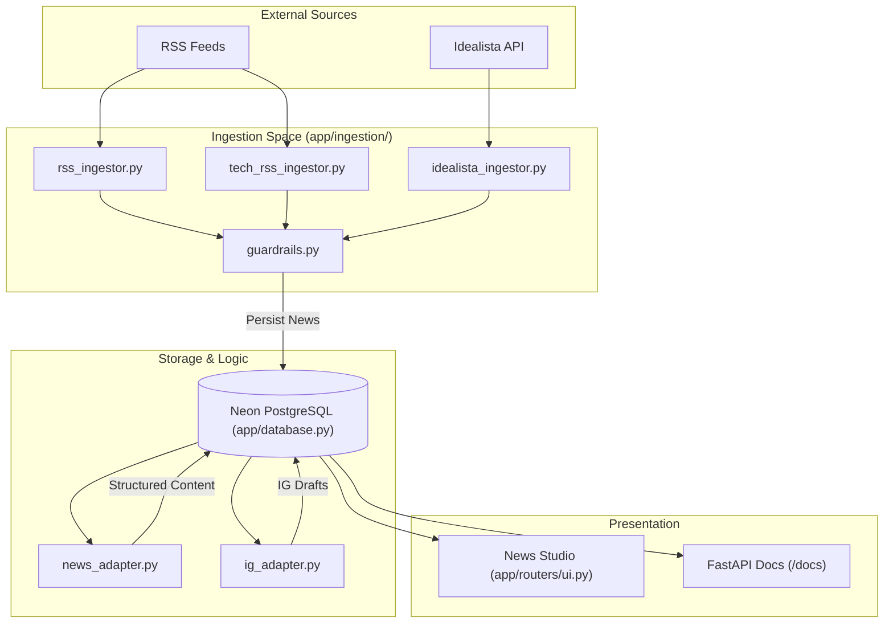
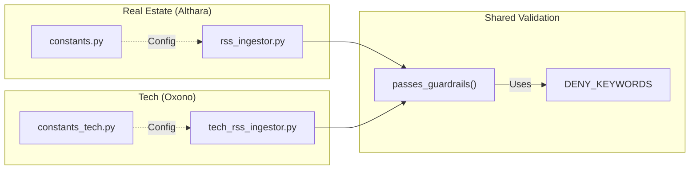
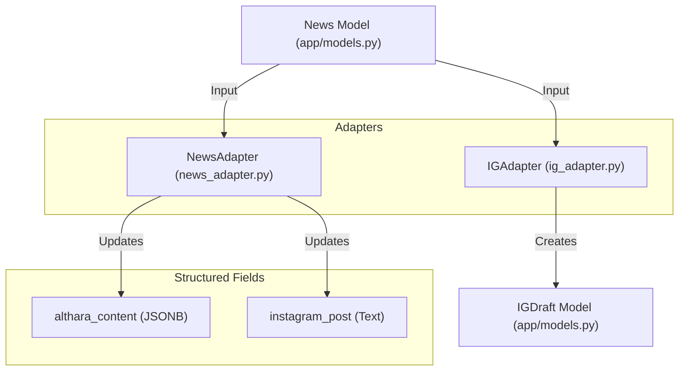

# Overview

The **Althara News Service** is a specialized news microservice designed to automate the ingestion, processing, and distribution of industry-specific content for two distinct brands: **Althara** (Real Estate) and **Oxono** (Tech/AI). Built with [FastAPI](https://fastapi.tiangolo.com/), it provides a full pipeline from raw RSS feeds to structured social media drafts, managed through an internal "News Studio" interface.

[README.md:1-4](), [app/main.py:11-11]()

## System Purpose and Brands

The service operates on a dual-brand architecture, segregating content by domain while sharing a unified core for ingestion and transformation.

*   **Althara (Real Estate):** Focuses on Spanish and international real estate markets, economy, and urban development.
*   **Oxono (Tech/AI):** Focuses on technology trends, artificial intelligence, and digital innovation.

[app/brands.py:1-15](), [README.md:32-35]()

## The News Pipeline

The system follows a linear progression from external data sources to actionable social media content.

### High-Level Pipeline Flow
The following diagram illustrates the data flow from ingestion to the News Studio UI.

**Sources:** [app/ingestion/rss_ingestor.py:1-20](), [app/adapters/news_adapter.py:1-15](), [app/routers/ui.py:1-20]()

## Code Entity Mapping

To bridge the gap between functional requirements and the codebase, the following diagrams map logical concepts to specific classes and files.

### Ingestion and Guardrails Entity Map
This diagram shows how ingestion logic is partitioned between brands and the shared validation logic.

**Sources:** [app/ingestion/rss_ingestor.py:345-360](), [app/ingestion/tech_rss_ingestor.py:200-215](), [app/ingestion/guardrails.py:10-30]()

### Content Transformation Entity Map
This diagram maps the transformation from a raw `News` record to a brand-aligned `IGDraft`.

**Sources:** [app/models.py:12-65](), [app/adapters/news_adapter.py:40-60](), [app/adapters/ig_adapter.py:15-40]()

## Key Subsections

### Getting Started
Detailed instructions on setting up the local environment, including Python 3.11 requirements, environment variables for the Neon PostgreSQL connection, and running Alembic migrations.
For details, see [Getting Started](#1.1).

### Project Structure
A walkthrough of the directory layout, explaining the separation between the FastAPI application (`app/`), database migrations (`alembic/`), and maintenance utilities (`scripts/`).
For details, see [Project Structure](#1.2).

### Core Architecture
Deep dive into the system's foundation: the FastAPI bootstrap, the async SQLAlchemy database layer, and the brand/domain models that drive the multi-tenant logic.
For details, see [Core Architecture](#2).

### News Ingestion Pipeline
Explains how content is pulled from RSS feeds and APIs, filtered through keyword-based guardrails, and categorized using priority-based scoring.
For details, see [News Ingestion Pipeline](#3).

### Content Adaptation
Details the "Althara Adapter" and "Instagram Draft Generator" logic, which uses structured JSON schemas to turn news articles into professional summaries and social media carousels.
For details, see [Content Adaptation and Transformation](#4).

### API and News Studio
Reference for the REST API endpoints and the Jinja2-based News Studio UI used for reviewing and publishing content.
For details, see [API Reference](#5) and [News Studio UI](#6).

### Data Models
Documentation of the SQLAlchemy ORM models (`News`, `IGDraft`) and the evolution of the database schema via Alembic.
For details, see [Data Models and Database Schema](#7).

---
