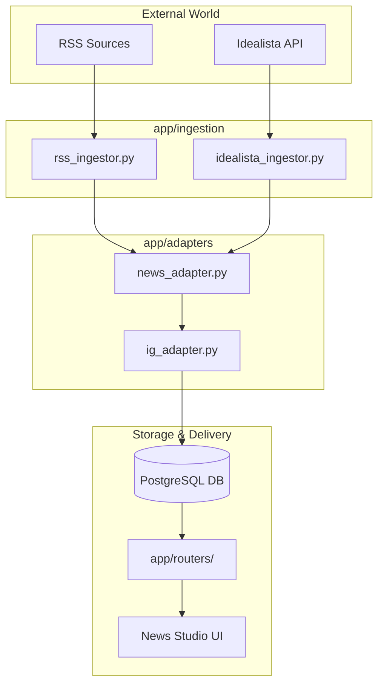
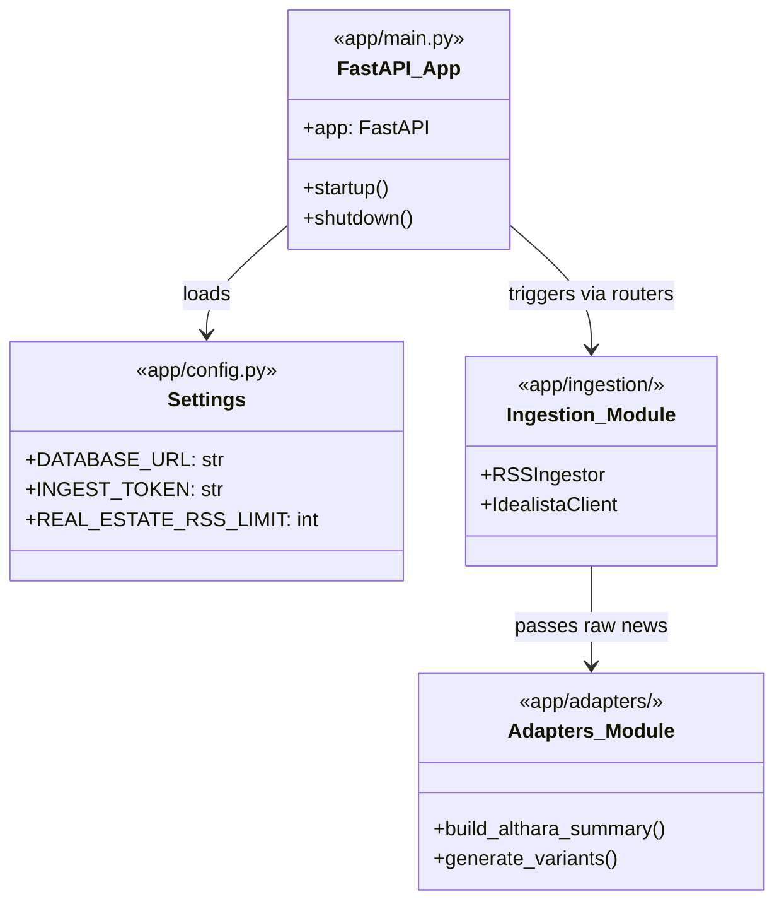

# Project Structure

This page provides a technical walkthrough of the `news-service` codebase directory layout. It describes how the application is organized, the purpose of each top-level directory, and how data flows between the various modules.

## High-Level Directory Overview

The project follows a standard FastAPI structure, separating the core application logic from database migrations, utility scripts, and testing suites.

| Directory | Purpose |
| :--- | :--- |
| `app/` | The core FastAPI application, containing business logic, models, and routes. |
| `alembic/` | Database migration scripts and configuration using SQLAlchemy/Alembic. |
| `scripts/` | Standalone Python and Shell scripts for maintenance and automation. |
| `tests/` | Pytest suite for unit and integration testing. |
| `static/` | Frontend assets (CSS, JS) for the News Studio UI. |

---

## The `app/` Directory

The `app/` directory is the heart of the service. It is structured into functional modules that separate concerns between data ingestion, content transformation, and API delivery.

### Core Modules and Initialization
*   **`main.py`**: The entry point of the application. It initializes the `FastAPI` instance [app/main.py:11](), configures CORS [app/main.py:14-20](), attaches `RateLimitMiddleware` [app/main.py:23](), and registers all API and UI routers [app/main.py:25-32]().
*   **`config.py`**: Defines the `Settings` class using Pydantic, which manages environment variables like `DATABASE_URL` and ingestion limits [app/config.py:10-45]().
*   **`database.py`**: Manages the SQLAlchemy async engine and session factory.
*   **`models/`**: Contains SQLAlchemy ORM models (e.g., `News`, `IGDraft`) that define the database schema.

### Feature Modules
*   **`ingestion/`**: Contains logic for fetching data from external sources. It includes specific ingestors for RSS feeds and the Idealista API [app/ingestion/__init__.py:1-7]().
*   **`adapters/`**: Responsible for transforming raw news into brand-aligned content. This includes the Althara narrative reconstruction and Instagram draft generation [app/adapters/__init__.py:1-3]().
*   **`routers/`**: Grouped API endpoints.
    *   `news.py`: Public-facing news consumption.
    *   `admin.py` / `tech_admin.py`: Ingestion and maintenance triggers.
    *   `ig_drafts.py`: Management of social media drafts.
    *   `ui.py`: Routes serving the Jinja2 templates for the News Studio.

### Data Flow Diagram

The following diagram illustrates how a piece of news moves from an external source through the system to the database and eventually the UI.

**Content Pipeline Flow**

**Sources:** [app/main.py:1-47](), [app/ingestion/__init__.py:1-16](), [app/adapters/__init__.py:1-12]()

---

## Infrastructure and Automation

### `alembic/`
This directory manages the evolution of the database schema.
*   **`env.py`**: Configures the migration environment to use the async engine from the `app` module.
*   **`versions/`**: Contains the individual migration scripts (e.g., adding the `domain` or `althara_content` fields).
*   **`script.py.mako`**: The template used for generating new migration files [alembic/script.py.mako:1-26]().

### `scripts/`
Standalone utilities used for maintenance and scheduled tasks.
*   **Ingestion Wrappers**: Scripts like `ingest_news.py` allow running the pipeline via cron jobs without going through the HTTP layer.
*   **Cleanup**: `remove_irrelevant_news.py` uses the system's guardrails to prune the database.

### `tests/`
The testing suite ensures the reliability of the transformation logic.
*   **`conftest.py`**: Provides shared fixtures like `sample_tech_news`.
*   **`test_ig_adapter.py`**: Validates the complex logic of Instagram carousel generation.

---

## Code Entity Mapping

This section bridges the conceptual folders to the specific code entities defined within them.

**Module to Class/Function Mapping**

**Sources:** [app/main.py:11-45](), [app/config.py:10-37](), [app/ingestion/__init__.py:1-7](), [app/adapters/__init__.py:1-3]()

---
