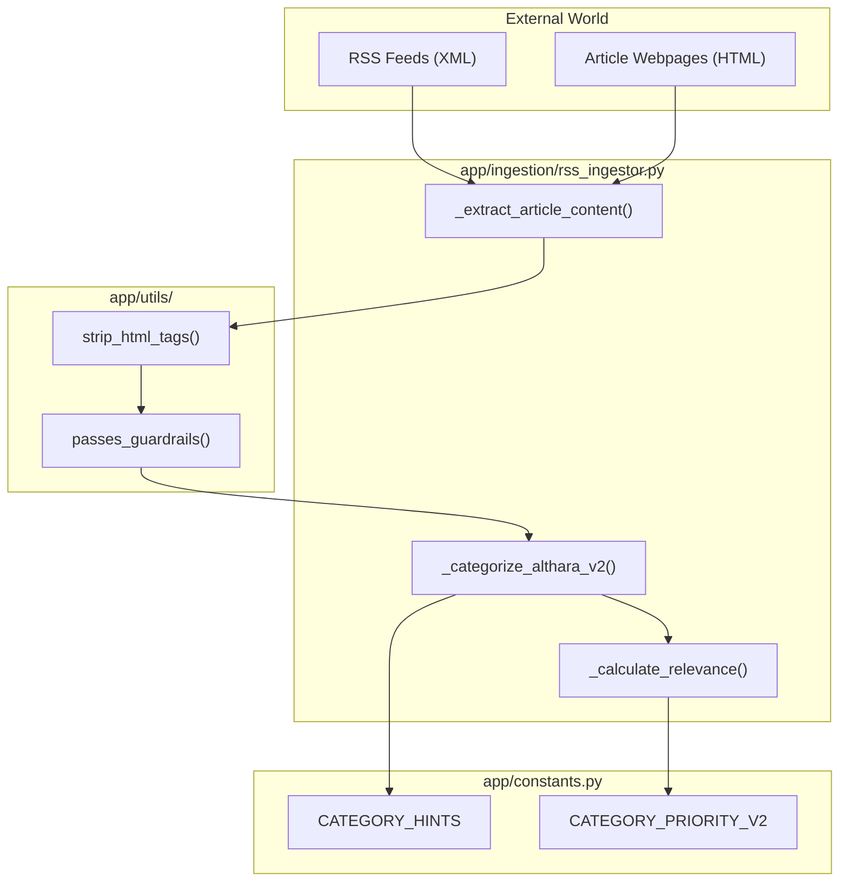
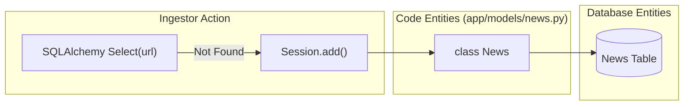

# Real Estate RSS Ingestor

The Real Estate RSS Ingestor is the primary entry point for market news within the Althara domain. It is responsible for monitoring a curated list of industry sources, extracting high-fidelity content through web scraping, and applying specialized classification and scoring logic to ensure the feed remains focused on professional real estate investment and market trends.

### Data Flow Overview

The ingestion process follows a linear pipeline from discovery to persistence:
1.  **Discovery**: Iterates through `RSS_SOURCES` defined in [app/ingestion/rss_ingestor.py:29-51]().
2.  **Fetch**: Uses `feedparser` to retrieve entry metadata and `httpx` for full-page scraping [app/ingestion/rss_ingestor.py:67-71]().
3.  **Refinement**: Cleans HTML and extracts the core article body using `BeautifulSoup` [app/ingestion/rss_ingestor.py:78-119]().
4.  **Validation**: Filters content against `DENY_KEYWORDS` and `ALLOW_KEYWORDS` [app/ingestion/rss_ingestor.py:18-26]().
5.  **Classification**: Assigns an `AltharaCategoryV2` based on keyword density [app/ingestion/rss_ingestor.py:125-135]().
6.  **Scoring**: Calculates a `relevance_score` (0-100) based on editorial priorities [app/ingestion/rss_ingestor.py:142-160]().
7.  **Deduplication**: Checks for existing URLs in the `News` table before committing [app/ingestion/rss_ingestor.py:13-15]().

### RSS Sources and Configuration

The system tracks a variety of sources ranging from economic press to official government bulletins. Each source is assigned a `default_category` to provide a fallback classification.

| Source Type | Examples | Default Category |
| :--- | :--- | :--- |
| **Economic Press** | Expansion, Cinco Días | `SECTOR_INMOBILIARIO` |
| **Real Estate Portals** | Idealista, Fotocasa | `PRECIOS_VIVIENDA` |
| **Professional Investment** | Brainsre, EjePrime | `INVERSION_INSTITUCIONAL` |
| **Official Bulletins** | BOE Subastas | `BOE_SUBASTAS` |
| **Appraisal Firms** | Tinsa, Sociedad de Tasación | `PRECIOS_VIVIENDA` |

**Sources:** [app/ingestion/rss_ingestor.py:29-51]()

### Content Extraction and Scraping

Unlike standard RSS readers that only ingest the provided snippet, this ingestor performs a "Deep Fetch" to retrieve the full article text. This is critical for subsequent NLP tasks and summary generation.

#### The `_extract_article_content` Function
This asynchronous function [app/ingestion/rss_ingestor.py:56-123]() performs the following:
*   **User-Agent Spoofing**: Mimics a modern browser to avoid blocks [app/ingestion/rss_ingestor.py:69-70]().
*   **Encoding Correction**: Attempts UTF-8 decoding with a Latin-1 fallback [app/ingestion/rss_ingestor.py:74-77]().
*   **Boilerplate Removal**: Decomposes `<script>`, `<style>`, `<nav>`, and `<footer>` tags [app/ingestion/rss_ingestor.py:80-81]().
*   **Heuristic Selection**: Searches for the article body using a prioritized list of CSS selectors (e.g., `.article-body`, `.post-content`) [app/ingestion/rss_ingestor.py:85-100]().
*   **Fallback Logic**: If no selectors match, it looks for `
` elements with high text density (>300 chars) [app/ingestion/rss_ingestor.py:103-106]().

**Sources:** [app/ingestion/rss_ingestor.py:56-123](), [app/utils/html_utils.py:18-40]()

### Logic and Classification Pipeline

The diagram below bridges the relationship between the raw data ingestion and the code entities responsible for refining it.

**RSS Ingestion Logic Map**

**Sources:** [app/ingestion/rss_ingestor.py:56-160](), [app/utils/guardrails.py:10-31](), [app/constants.py:124-147]()

### Guardrails and Filtering

The `passes_guardrails` utility [app/utils/guardrails.py:10-31]() ensures that irrelevant content (e.g., lifestyle, interior design, or ads) is discarded.
*   **Deny List**: If any keyword from `DENY_KEYWORDS` appears in the title or summary, the news is rejected [app/utils/guardrails.py:25-27]().
*   **Strict Mode**: When `STRICT_REQUIRE_ALLOW` is enabled, the news must contain at least one keyword from `ALLOW_KEYWORDS` to be persisted [app/utils/guardrails.py:28-30]().

**Sources:** [app/utils/guardrails.py:10-31](), [app/ingestion/rss_ingestor.py:18-26]()

### Classification and Relevance Scoring

#### AltharaCategoryV2 Classification
The function `_categorize_althara_v2` [app/ingestion/rss_ingestor.py:125-135]() performs a keyword frequency analysis against `CATEGORY_HINTS` [app/constants.py:24](). It selects the category with the highest match count, defaulting to `SECTOR_INMOBILIARIO` if no specific matches are found.

#### Relevance Scoring
Relevance is a numerical value (0-100) used to sort news in the UI. It is calculated by combining:
1.  **Base Priority**: Derived from `CATEGORY_PRIORITY_V2` (e.g., `PRECIOS_VIVIENDA` = 90, `SECTOR_INMOBILIARIO` = 30) [app/constants.py:124-147]().
2.  **Keyword Boost**: High-value terms like "récord", "sube", or "inversión" add weight [app/ingestion/rss_ingestor.py:142-160]().

**Sources:** [app/ingestion/rss_ingestor.py:125-160](), [app/constants.py:61-87](), [app/constants.py:124-147]()

### Persistence and Deduplication

Before a news item is saved as a `News` ORM entity, the ingestor checks for URL collisions to prevent duplicate entries in the database.

**Entity Persistence Flow**

**Sources:** [app/ingestion/rss_ingestor.py:12-15](), [app/models/news.py:1-20]()

---
