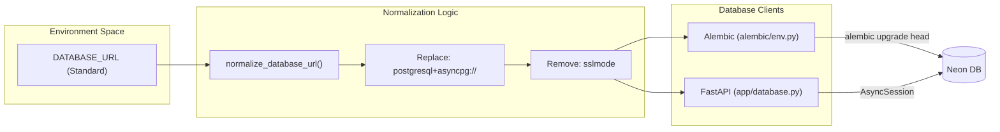

# Render Deployment

This page details the infrastructure configuration and deployment lifecycle for the Althara News Service on the **Render** platform. The service is architected as a Python web service utilizing a managed **Neon PostgreSQL** database, with automated schema management via Alembic.

## Infrastructure Configuration

The deployment is managed through a `render.yaml` Blueprint specification. This file defines the service type, environment, and the essential commands required to build and execute the application.

### Service Definition
The service is defined as a `web` type, which Render uses to expose the FastAPI application to the internet [render.yaml:1-4]().

| Parameter | Value | Description |
| :--- | :--- | :--- |
| **Type** | `web` | Public-facing web service. |
| **Name** | `althara-news-service` | The identifier in the Render dashboard. |
| **Environment** | `python` | Native Python runtime environment. |
| **Build Command** | `pip install... && alembic upgrade head` | Prepares the environment and migrates the DB. |
| **Start Command** | `uvicorn app.main:app...` | Launches the FastAPI ASGI server. |

### Environment Variables
The primary requirement for the service is the `DATABASE_URL` [render.yaml:8-9](). This variable is typically provided by a Neon PostgreSQL instance. Because the application uses `asyncpg` for asynchronous database operations, the URL is automatically normalized by the application logic [app/database.py:12-49]() and the migration engine [alembic/env.py:24-61]().

**Sources:** [render.yaml:1-10](), [app/database.py:52-57](), [alembic/env.py:64-68]()

---

## Build and Deployment Lifecycle

The deployment process follows a specific sequence to ensure the database schema is synchronized with the code before the web server starts handling requests.

### 1. Build Phase
The `buildCommand` executes two critical tasks:
1.  **Dependency Installation**: It upgrades `pip` and installs requirements from `requirements.txt` [render.yaml:5]().
2.  **Schema Migration**: It runs `alembic upgrade head` [render.yaml:5](). This ensures that any new tables or column changes (such as the `althara_content` or `domain` fields) are applied to the Neon database before the new code version goes live.

A `build.sh` script is also available to handle more complex environments, ensuring only precompiled binary wheels are used to speed up the process [build.sh:1-14]().

### 2. Runtime Phase
The `startCommand` initializes the server using `uvicorn` [render.yaml:6]().
*   **Host**: `0.0.0.0` to allow external traffic.
*   **Port**: Dynamically assigned by Render via the `$PORT` environment variable.
*   **App Entrypoint**: `app.main:app`, pointing to the FastAPI instance.

### Deployment Flow Diagram
The following diagram illustrates the relationship between the Render environment, the build commands, and the database synchronization.

**Render Deployment Architecture**
```mermaid
graph TD
    subgraph "Render Platform"
        [render.yaml] --> |"Defines"| WS["Web Service: althara-news-service"]
        WS --> |"1. buildCommand"| BC["pip install & alembic upgrade head"]
        WS --> |"2. startCommand"| SC["uvicorn app.main:app"]
    end

    subgraph "External Infrastructure"
        BC --> |"Apply Migrations"| DB[("Neon PostgreSQL")]
        SC --> |"Connect (asyncpg)"| DB
    end

    subgraph "Code Entity Space"
        BC -.-> |"Executes"| AL["alembic/env.py"]
        SC -.-> |"Loads"| MA["app/main:app"]
        MA -.-> |"Uses"| ADB["app/database.py"]
    end
```
**Sources:** [render.yaml:1-6](), [build.sh:1-16](), [alembic/env.py:101-121](), [app/database.py:68-81]()

---

## Automated Database Migrations

A key feature of the Render deployment is the automatic execution of Alembic migrations. This prevents "out-of-sync" errors where the application code expects a schema that the database does not yet have.

### Database URL Normalization
Since Render and Neon often provide standard `postgresql://` URLs, the service includes a normalization utility to make them compatible with `sqlalchemy.ext.asyncio`.

1.  **Protocol Conversion**: Changes `postgresql://` to `postgresql+asyncpg://` [app/database.py:35-36]().
2.  **Parameter Stripping**: Removes `sslmode` and `channel_binding` parameters because `asyncpg` handles SSL automatically and may fail if these standard Postgres parameters are present [app/database.py:31-33]().

### Async Migration Execution
The `alembic/env.py` script is configured to run migrations asynchronously to match the application's database driver.

*   **`get_url()`**: Retrieves and normalizes the `DATABASE_URL` [alembic/env.py:64-68]().
*   **`run_async_migrations()`**: Creates an `async_engine_from_config` and runs the migration context within an async connection [alembic/env.py:101-121]().

**Database Connection Flow**

**Sources:** [app/database.py:12-49](), [alembic/env.py:24-61](), [alembic/env.py:101-121]()

## Summary of Deployment Requirements
*   **Runtime**: Python 3.11.9 (as specified in `build.sh` context) [build.sh:3]().
*   **Database**: PostgreSQL (Neon recommended).
*   **Key Dependencies**: `uvicorn`, `fastapi`, `sqlalchemy`, `alembic`, `asyncpg`.
*   **Secrets**: `DATABASE_URL` must be set in the Render dashboard [render.yaml:8-9]().

---
