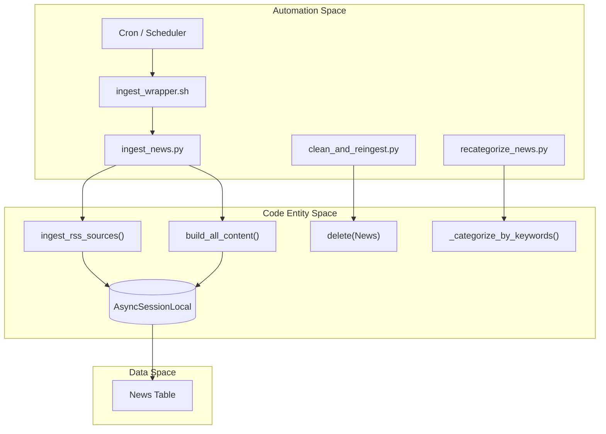

# Scripts and Automation

The `scripts/` directory contains a collection of standalone Python utilities and shell wrappers designed to manage the news service outside of the standard FastAPI request-response lifecycle. These tools are used for scheduled tasks (via cron), bulk data maintenance, and developer debugging.

### System Automation Architecture

The following diagram illustrates how the automation scripts interact with the core application logic and the database.

**Automation Logic Flow**

Sources: [scripts/ingest_news.py:22-81](), [scripts/clean_and_reingest.py:22-93](), [scripts/recategorize_news.py:22-74]()

---

## 8.1 Ingestion and Regeneration Scripts
These scripts facilitate the ingestion of news from external RSS sources and the subsequent transformation of that news into brand-aligned content. They are primarily used to automate the pipeline without manual intervention via the Admin API.

*   **`ingest_news.py`**: The primary entry point for automated ingestion. It calls `ingest_rss_sources` to fetch new items and then iterates through pending records to run `build_all_content`, which generates summaries and Instagram posts [scripts/ingest_news.py:22-67]().
*   **`ingest_wrapper.sh`**: A shell utility that activates the local virtual environment and executes the Python ingestion script, redirecting output to logs [scripts/ingest_wrapper.sh:1-7]().
*   **`recategorize_news.py`**: A maintenance utility that re-runs the keyword-based classification logic (`_categorize_by_keywords`) on existing database records to fix historical categorization errors [scripts/recategorize_news.py:41-53]().
*   **`clean_and_reingest.py`**: A destructive script used in development to wipe the `News` table and restart the ingestion process from scratch [scripts/clean_and_reingest.py:34-48]().

For details on configuration and execution, see [Ingestion and Regeneration Scripts](#8.1).

Sources: [scripts/ingest_news.py:1-92](), [scripts/ingest_wrapper.sh:1-13](), [scripts/recategorize_news.py:1-82](), [scripts/clean_and_reingest.py:1-116]()

---

## 8.2 Maintenance and Cleanup Scripts
These utilities are focused on database hygiene and data auditing. They allow developers to prune irrelevant content or verify the integrity of structured JSON data stored in the database.

*   **`remove_irrelevant_news.py`**: Performs bulk pruning of the database. It typically applies the same guardrails logic used during ingestion to identify and remove news that no longer meets quality standards.
*   **`clean_all_news.py`**: A simple utility to truncate the news table.
*   **`check_structured_content.py`**: Audits the `althara_content` JSONB field across the database to ensure it conforms to the expected schema (hecho, lectura, implicaciones, senales_a_vigilar).

For details on database maintenance, see [Maintenance and Cleanup Scripts](#8.2).

Sources: [scripts/clean_and_reingest.py:36-40]()

---

## 8.3 Debugging and Validation Scripts
These scripts are intended for developer use to test specific components of the pipeline in isolation, such as the LLM-based adapters or the RSS filtering logic.

*   **`test_filter.py`**: A unit testing script for the guardrails system, checking if specific titles/summaries are correctly blocked by `DENY_KEYWORDS`.
*   **`test_api_response.py`**: Simulates the serialization logic of the `GET /api/news` endpoint to verify that Pydantic models are correctly handling the database output.
*   **`debug_ingestion.py`**: Provides verbose logging for the RSS fetching process to troubleshoot network or parsing issues with specific feeds.

For details on validation tools, see [Debugging and Validation Scripts](#8.3).

---

### Script-to-Module Mapping

The scripts serve as wrappers around core application logic defined in `app/`.

| Script | Core Function Called | Module |
| :--- | :--- | :--- |
| `ingest_news.py` | `ingest_rss_sources` | `app.ingestion.rss_ingestor` |
| `ingest_news.py` | `build_all_content` | `app.adapters.news_adapter` |
| `recategorize_news.py` | `_categorize_by_keywords` | `app.ingestion.rss_ingestor` |
| `clean_and_reingest.py` | `build_althara_summary` | `app.adapters.news_adapter` |

Sources: [scripts/ingest_news.py:14-19](), [scripts/recategorize_news.py:15-19](), [scripts/clean_and_reingest.py:14-19]()

---
