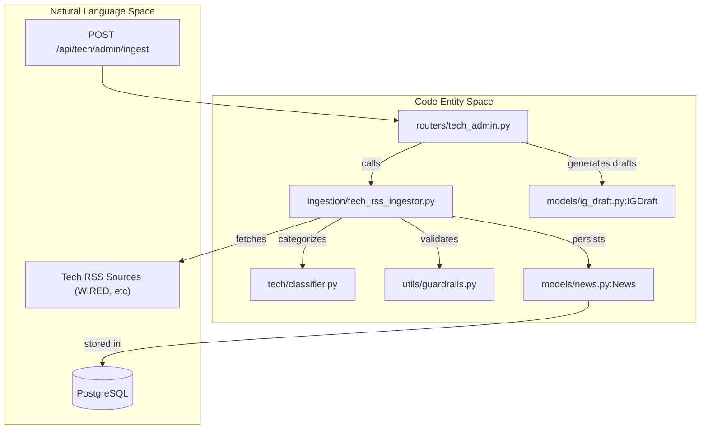
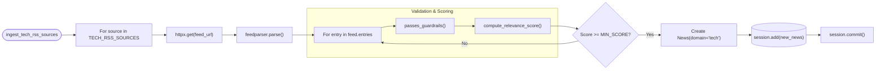

# Tech Admin API (Oxono)

The Tech Admin API provides administrative endpoints specifically for the **Oxono** brand (tech domain). These endpoints mirror the real-estate ingestion flow but utilize tech-specific configurations, guardrails, and classification logic to populate the news service with technology-related content.

## Purpose and Scope

The `tech_admin` router handles the automated discovery and processing of tech news. It serves as the entry point for cron jobs or manual triggers to:
1.  Fetch news from tech-focused RSS feeds.
2.  Filter content using tech-specific guardrails.
3.  Classify news into tech categories and calculate relevance scores.
4.  Optionally trigger the automated generation of Instagram drafts using the Oxono brand voice.

---

## Data Flow and Implementation

The ingestion process is orchestrated by the `app.routers.tech_admin` module, which delegates the heavy lifting to the `tech_rss_ingestor`.

### Ingestion Logic Flow
When an ingestion request is received, the system follows a structured pipeline:

1.  **Source Retrieval**: Iterates through `TECH_RSS_SOURCES` defined in `constants_tech.py`.
2.  **HTTP Fetching**: Uses `httpx.AsyncClient` to retrieve the XML feed.
3.  **Guardrails**: Applies `passes_guardrails()` using tech-specific `DENY_KEYWORDS` and `ALLOW_KEYWORDS`.
4.  **Deduplication**: Checks the database for existing URLs to prevent duplicate entries.
5.  **Classification**: Calls `infer_category()` and `compute_relevance_score()` to determine the value of the news item.
6.  **Persistence**: Saves the record with `domain="tech"`.

### Technical Architecture Diagram

The following diagram illustrates the relationship between the API router, the ingestor service, and the supporting tech-specific logic.

**Tech Ingestion Architecture**

**Sources:** [app/routers/tech_admin.py:1-76](), [app/ingestion/tech_rss_ingestor.py:25-121]()

---

## API Endpoints

### POST `/api/tech/admin/ingest`
Triggers the ingestion of tech news from RSS sources. It uses the `TECH_RSS_LIMIT_PER_SOURCE` setting to limit the number of items processed per feed.

*   **Function**: `ingest_tech` [app/routers/tech_admin.py:18-24]()
*   **Key Internal Call**: `ingest_tech_rss_sources(db, max_items_per_source=...)` [app/ingestion/tech_rss_ingestor.py:25-121]()

### POST `/api/tech/admin/ingest-and-generate`
A compound endpoint that performs ingestion and then automatically generates Instagram drafts for the most relevant news items that do not yet have a draft.

*   **Function**: `ingest_and_generate` [app/routers/tech_admin.py:27-75]()
*   **Logic**:
    1.  Runs the standard ingestion flow. [app/routers/tech_admin.py:32-34]()
    2.  Queries for tech news without drafts, ordered by `relevance_score` DESC. [app/routers/tech_admin.py:46-55]()
    3.  Calls `generate_ig_draft()` with `brand="oxono"`. [app/routers/tech_admin.py:60]()
    4.  Commits new `IGDraft` records to the database. [app/routers/tech_admin.py:68]()

**Sources:** [app/routers/tech_admin.py:18-76]()

---

## Ingestion Pipeline Detail

The `ingest_tech_rss_sources` function is the core of the tech domain's data acquisition. Unlike the real estate ingestor, it is tailored for the Oxono brand's requirements.

### Process Logic
| Step | Logic / Function | File Reference |
| :--- | :--- | :--- |
| **Source Loop** | Iterates over `TECH_RSS_SOURCES` | [app/ingestion/tech_rss_ingestor.py:35]() |
| **Guardrails** | `passes_guardrails(title, DENY_KEYWORDS, ...)` | [app/ingestion/tech_rss_ingestor.py:74-78]() |
| **Deduplication** | `select(News).where(News.url == link)` | [app/ingestion/tech_rss_ingestor.py:81-84]() |
| **Classification** | `infer_category(title, summary)` | [app/ingestion/tech_rss_ingestor.py:87]() |
| **Scoring** | `compute_relevance_score(...)` | [app/ingestion/tech_rss_ingestor.py:89-91]() |
| **Minimum Quality** | Filters if `relevance_score < MIN_SCORE` | [app/ingestion/tech_rss_ingestor.py:93-94]() |

### Code Mapping: Ingestion to Persistence

This diagram bridges the functional steps of the `ingest_tech_rss_sources` function to the specific code entities and data models involved.

**Ingestion Function Internal Flow**

**Sources:** [app/ingestion/tech_rss_ingestor.py:25-121](), [app/constants_tech.py:12-18]()

---

## Key Configuration Constants

The behavior of these endpoints is heavily influenced by constants and settings:

*   **`TECH_RSS_SOURCES`**: A list of dictionaries containing `name`, `url`, `source` (label), and `default_category`. [app/constants_tech.py:13]()
*   **`TECH_RSS_LIMIT_PER_SOURCE`**: Configurable via environment variables, determines how many items to pull per source. [app/routers/tech_admin.py:22]()
*   **`AUTO_GENERATE_IG_AFTER_INGEST`**: A boolean flag in `settings`. If false, the `ingest-and-generate` endpoint skips the draft creation phase. [app/routers/tech_admin.py:37]()
*   **`MIN_SCORE`**: The threshold for relevance; items scoring lower are discarded during ingestion. [app/ingestion/tech_rss_ingestor.py:93]()

**Sources:** [app/ingestion/tech_rss_ingestor.py:12-18](), [app/routers/tech_admin.py:22-37]()

---
