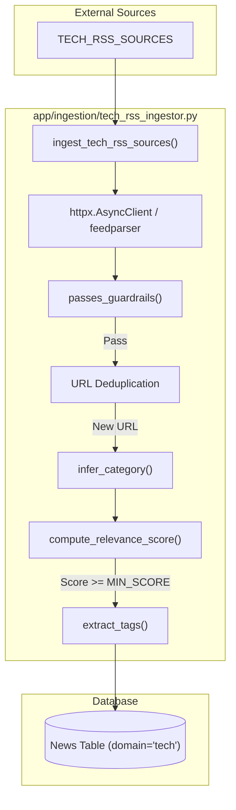

# Tech RSS Ingestor (Oxono)

The **Tech RSS Ingestor** is the specialized ingestion engine for the **Oxono** brand. It is responsible for fetching, filtering, and classifying technology-related news to populate the platform's tech domain. Unlike the real estate ingestor, this component uses a distinct set of guardrails, a dedicated category taxonomy, and a specialized relevance scoring algorithm tailored for the tech industry.

## Overview and Data Flow

The ingestor operates as an asynchronous pipeline that transforms raw RSS entries into structured `News` records with `domain='tech'`. The process is orchestrated by `ingest_tech_rss_sources` in [app/ingestion/tech_rss_ingestor.py:25-121]().

### Tech Ingestion Pipeline

The following diagram illustrates the flow from external RSS feeds to the persistence layer:

**Tech Ingestion Logic Flow**

Sources: [app/ingestion/tech_rss_ingestor.py:25-121](), [app/utils/guardrails.py:10-31](), [app/tech/classifier.py:11-137]()

## Implementation Details

### Configuration and Constants
The ingestor relies on `app.constants_tech` for its operational parameters:
*   **TECH_RSS_SOURCES**: A list of dictionaries containing the `name`, `url`, `source` label, and `default_category` for feeds like WIRED ES or Genbeta [app/ingestion/tech_rss_ingestor.py:35-39]().
*   **Guardrail Keywords**: `DENY_KEYWORDS`, `ALLOW_KEYWORDS`, and the `STRICT_REQUIRE_ALLOW` boolean flag used to filter out irrelevant content [app/ingestion/tech_rss_ingestor.py:74-78]().
*   **Thresholds**: `MIN_SCORE` (typically 50) defines the minimum relevance required for a news item to be saved [app/ingestion/tech_rss_ingestor.py:93-94]().

### Classification and Scoring
The logic for processing tech content resides in `app/tech/classifier.py`.

| Function | Responsibility | Logic Summary |
| :--- | :--- | :--- |
| `infer_category` | Assigns a `TechNewsCategory` | Keyword matching for AI/ML, Big Tech, Startups, Security, etc. [app/tech/classifier.py:11-82]() |
| `extract_tags` | Generates comma-separated tags | Identifies tech terms (e.g., "llm", "saas") and company names [app/tech/classifier.py:85-107]() |
| `compute_relevance_score` | Returns an integer (0-100) | Baseline of 50; boosts for AI/ML (+25) and specific keywords (+15) [app/tech/classifier.py:110-136]() |

### Core Components Association

This diagram maps the functional steps of the ingestor to the specific code entities that implement them.

**Code Entity Mapping**
```mermaid
classDiagram
    class TechIngestor {
        +ingest_tech_rss_sources(session, max_items)
    }
    class Guardrails {
        +passes_guardrails(title, deny, allow, strict)
    }
    class TechClassifier {
        +infer_category(title, summary)
        +compute_relevance_score(title, summary, cat, source)
        +extract_tags(title, summary)
    }
    class NewsModel {
        +domain: "tech"
        +relevance_score: int
        +category: str
    }

    TechIngestor ..> Guardrails : "Uses [app/ingestion/tech_rss_ingestor.py:74]"
    TechIngestor ..> TechClassifier : "Uses [app/ingestion/tech_rss_ingestor.py:87-89]"
    TechIngestor ..> NewsModel : "Persists [app/ingestion/tech_rss_ingestor.py:98-110]"
```
Sources: [app/ingestion/tech_rss_ingestor.py:1-121](), [app/tech/classifier.py:1-137](), [app/models/news.py:1-110]()

## Execution Logic

1.  **Fetching**: The ingestor uses `httpx` to fetch the XML feed and `feedparser` to parse the structure [app/ingestion/tech_rss_ingestor.py:44-52]().
2.  **Cleaning**: HTML tags are stripped from the summary or description using `strip_html_tags` [app/ingestion/tech_rss_ingestor.py:69-72]().
3.  **Filtering**: 
    *   **Guardrails**: Checks if the title/summary contains forbidden keywords or meets strict requirements [app/ingestion/tech_rss_ingestor.py:74-78]().
    *   **Deduplication**: Queries the database by URL to ensure the item hasn't been processed previously [app/ingestion/tech_rss_ingestor.py:81-84]().
4.  **Enrichment**:
    *   `published_at` is normalized using `parse_published_date` [app/ingestion/tech_rss_ingestor.py:86]().
    *   `category` and `relevance_score` are computed based on tech-specific logic [app/ingestion/tech_rss_ingestor.py:87-91]().
5.  **Persistence**: Items meeting the `MIN_SCORE` are instantiated as `News` objects with `domain="tech"` and committed to the database [app/ingestion/tech_rss_ingestor.py:98-119]().

Sources: [app/ingestion/tech_rss_ingestor.py:25-121](), [app/tech/classifier.py:110-136](), [app/utils/guardrails.py:10-31]()

---
