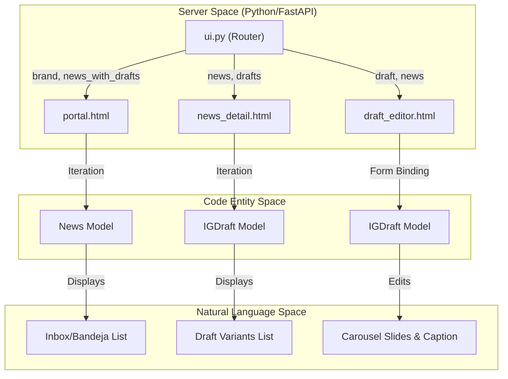
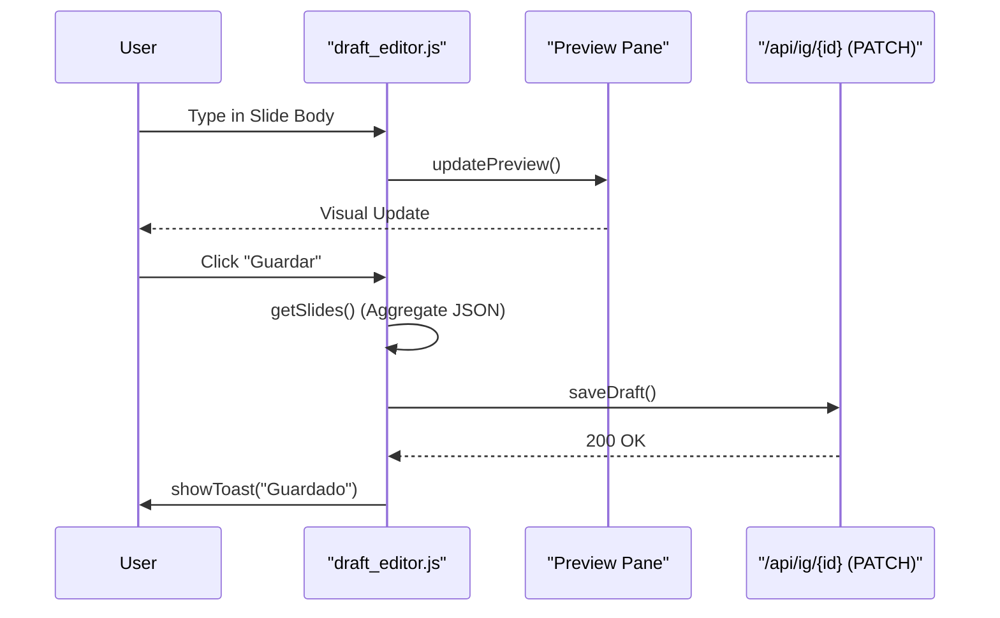

# Templates and Frontend Logic

The News Studio UI is a server-side rendered (SSR) web interface built with **Jinja2** templates and vanilla **JavaScript**. It provides the marketing team with a specialized environment to manage news ingestion, review AI-generated summaries, and edit Instagram carousel drafts before publication.

## Overview of the Template System

The frontend architecture follows a standard inheritance pattern using a base layout. Each page is brand-aware, dynamically adjusting its theme and content based on the `brand` context variable (e.g., "althara" or "oxono").

| Template | Role | Key Features |
| :--- | :--- | :--- |
| `base.html` | Root Layout | Imports `studio.css`, defines global HTML structure [app/templates/base.html:1-13](). |
| `selector.html` | Brand Entry | Displays brand cards for Althara and Oxono [app/templates/selector.html:7-13](). |
| `portal.html` | Main Dashboard | Tabbed inbox/drafts/approved views with filtering [app/templates/portal.html:59-64](). |
| `news_detail.html` | News Review | Shows raw content, AI summary, and draft variants [app/templates/news_detail.html:22-54](). |
| `draft_editor.html` | IG Editor | Real-time preview, slide management, and copy-to-clipboard [app/templates/draft_editor.html:29-135](). |

### Template Data Flow
The following diagram illustrates how the FastAPI `ui.py` router populates these templates with data from the SQLAlchemy models.

**UI Data Flow Diagram**

**Sources:** [app/templates/portal.html:72-82](), [app/templates/news_detail.html:45-51](), [app/templates/draft_editor.html:34-84]()

---

## Portal Logic and State Management

The `portal.html` template serves as the primary command center. It manages three distinct states via the `tab` URL parameter: `inbox`, `drafts`, and `approved`.

### Search and Filtering
Filtering is handled via a hidden drawer that modifies URL query parameters.
- **Search:** Updates the `q` parameter [app/templates/portal.html:16-22]().
- **Category Filter:** Populated dynamically from the brand's category list [app/templates/portal.html:33-38]().
- **Relevance Sorting:** Allows ordering by `relevance_score` or `published_at` [app/templates/portal.html:42-46]().

### Ingestion Trigger
The "Generar más noticias" button triggers a modal [app/templates/portal.html:101-110](). Upon confirmation, it executes an asynchronous `POST` request to either `/api/admin/ingest-and-adapt` (Althara) or `/api/tech/admin/ingest-and-generate` (Oxono) [app/templates/portal.html:122-129]().

**Sources:** [app/templates/portal.html:16-64](), [app/templates/portal.html:122-129]()

---

## Instagram Draft Editor

The `draft_editor.html` is the most complex frontend component, featuring a split-pane layout with an editor on the left and a live Instagram preview on the right.

### Real-time Preview Engine
The preview pane simulates the Instagram mobile UI. It uses JavaScript event listeners on the `textarea` and `input` fields to update the preview DOM elements immediately.

- **Slide Navigation:** The carousel is managed via `activeSlideIdx`. Switching tabs updates both the editor visibility and the preview text [app/templates/draft_editor.html:158-167]().
- **Character Counters:** Dynamic counters warn users when text exceeds Instagram's recommended limits (e.g., 110 chars for slides, 900 for captions) [app/templates/draft_editor.html:52-60]().

### Hashtag Chips
Hashtags are managed as an array of strings. The UI provides a "chip" interface where users can add new tags or remove existing ones [app/templates/draft_editor.html:65-71]().
- `renderHashtags()`: Iterates the `hashtags` array and generates HTML spans [app/templates/draft_editor.html:183-193]().
- `addHashtag()`: Parses the input, removes the `#` prefix if present, and pushes to the state [app/templates/draft_editor.html:195-202]().

### Save Logic (PATCH)
Changes are persisted via the `saveDraft()` function, which performs a `PATCH` call to `/api/ig/{draftId}`. It gathers all slide data using `getSlides()` and synchronizes the JSON structure with the backend `IGDraft` model [app/templates/draft_editor.html:147-156](), [app/templates/draft_editor.html:220-234]().

**Editor Logic Diagram**

**Sources:** [app/templates/draft_editor.html:147-156](), [app/templates/draft_editor.html:158-181](), [app/templates/draft_editor.html:220-234]()

---

## Content Utilities

The frontend leverages backend utilities for content presentation, particularly when displaying news summaries.

### HTML Cleaning and Formatting
The `html_utils.py` module provides logic to ensure ingested content is readable in the UI:
- **`strip_html_tags`**: Used to clean raw RSS content and fix encoding issues (mojibake) using `ftfy` [app/utils/html_utils.py:18-40]().
- **`format_paragraphs`**: A Jinja2 filter that converts block text into `
` tags by splitting sentences every N lines, ensuring long summaries don't break the UI layout [app/utils/html_utils.py:43-71]().

### Copy-to-Clipboard Engine
In the `draft_editor.html`, a multi-option copy menu allows users to extract content for manual posting:
- **Caption:** Copies the main text block.
- **Carousel:** Aggregates all slide titles and bodies into a single formatted string [app/templates/draft_editor.html:90-96]().

**Sources:** [app/utils/html_utils.py:18-71](), [app/templates/draft_editor.html:90-96](), [app/templates/news_detail.html:33]()

---
