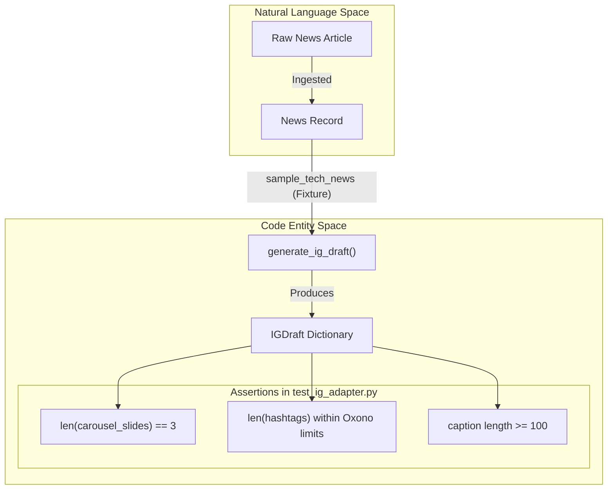
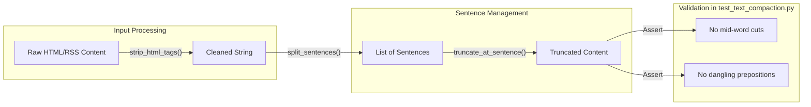

# Test Suite Reference

The Althara News Service utilizes a comprehensive test suite powered by `pytest` to ensure the reliability of the news ingestion pipeline, content transformation logic, and API integrity. The suite covers unit tests for text utilities, domain-specific classification logic, and integration tests for the FastAPI endpoints.

## Core Configuration and Fixtures

The testing environment is configured via `tests/conftest.py` [tests/conftest.py:1-5](), which provides shared fixtures representing the two primary domains: `tech` (Oxono) and `real_estate` (Althara). These fixtures simulate the `News` ORM model structure to test adapters and classifiers without requiring a live database connection.

### Available Fixtures
*   `sample_tech_news`: Simulates a tech-domain news object with fields like `AI_ML` category and a relevance score [tests/conftest.py:8-20]().
*   `sample_real_estate_news`: Simulates a real estate news object with `althara_summary` and domain-specific categories [tests/conftest.py:24-36]().

Sources: [tests/conftest.py:1-37]()

---

## API Integration Tests (`test_api.py`)

The `test_api.py` module performs integration testing on the FastAPI application using an `AsyncClient` with `ASGITransport` [tests/test_api.py:3-15](). This ensures that tests run within the same event loop as the application.

### Key Test Scenarios
*   **Health Check**: Validates the `/api/health` endpoint returns a `200 OK` status [tests/test_api.py:18-21]().
*   **Domain Filtering**: Verifies that the `GET /api/news` endpoint correctly respects the `domain` query parameter for both `tech` and `real_estate` [tests/test_api.py:24-38]().

Sources: [tests/test_api.py:1-38]()

---

## Instagram Adapter Tests (`test_ig_adapter.py`)

This module validates the logic in `ig_adapter.py` for generating Instagram drafts. It ensures that the transformation from a `News` object to an `IGDraft` schema adheres to brand-specific constraints.

### Logic Validation
*   **Slide Composition**: Asserts that exactly `SLIDES_COUNT` (3) slides are generated, each containing a title and a body within `BODY_MAX` characters [tests/test_ig_adapter.py:14-19]().
*   **Oxono (Tech) Specifics**: Validates that tech drafts include the correct hashtag count (between `OXONO_HASHTAGS_MIN` and `OXONO_HASHTAGS_MAX`) and a sufficiently long caption [tests/test_ig_adapter.py:14-23]().
*   **Variant Generation**: Ensures that the `generate_variants` function produces the requested number of unique draft objects [tests/test_ig_adapter.py:34-39]().

### Data Flow: News to IG Draft
The following diagram illustrates how the test suite verifies the transformation from a `News` entity to an `IGDraft` entity.

**Diagram: IG Adapter Entity Transformation**

Sources: [tests/test_ig_adapter.py:1-39](), [app/adapters/ig_adapter.py:3-10]()

---

## Tech Classifier Tests (`test_tech_classifier.py`)

These tests focus on the `Oxono` domain's automated categorization and scoring logic defined in `app/tech/classifier.py`.

### Functional Coverage
*   **Category Inference**: Validates that `infer_category` maps titles to `TechNewsCategory` enums (e.g., "GPT-5" → `AI_ML`, "Beta" → `RELEASE_UPDATE`, "Startup" → `STARTUPS`) [tests/test_tech_classifier.py:7-22]().
*   **Tag Extraction**: Ensures `extract_tags` identifies relevant keywords like "ai" or "ia" from titles [tests/test_tech_classifier.py:24-27]().
*   **Relevance Scoring**: Checks that `compute_relevance_score` produces values within the 0-100 range, prioritizing high-value categories like `AI_ML` over `OTHER_TECH` [tests/test_tech_classifier.py:29-37]().

Sources: [tests/test_tech_classifier.py:1-37](), [app/tech/classifier.py:3-4]()

---

## Text Utilities and Compaction

Testing for shared utilities is split between `test_utils.py` and `test_text_compaction.py`.

### HTML and RSS Utilities (`test_utils.py`)
*   **`strip_html_tags`**: Tests the removal of tags, unescaping of entities, and repair of "mojibake" (encoding errors) using `ftfy` [tests/test_utils.py:11-32]().
*   **`parse_published_date`**: Verifies that dates are correctly extracted from RSS entry objects and converted to UTC `datetime` objects [tests/test_utils.py:41-59]().
*   **`passes_guardrails`**: Tests the keyword-based filtering logic, including `deny` lists and `strict_allow` requirements [tests/test_utils.py:61-78]().

### Compaction and Truncation (`test_text_compaction.py`)
*   **`extract_key_sentences`**: Asserts that only complete sentences (ending in `.!?`) that fit within `max_chars` are returned [tests/test_text_compaction.py:12-21]().
*   **`truncate_at_sentence`**: Ensures text is never cut mid-word and avoids leaving dangling prepositions (e.g., ending a sentence with "a") [tests/test_text_compaction.py:23-38]().
*   **`compose_caption_blocks`**: Validates the assembly of the final Instagram caption, ensuring it includes the source line and adheres to total length limits [tests/test_text_compaction.py:59-69]().

**Diagram: Text Utility Logic Flow**

Sources: [tests/test_utils.py:1-78](), [tests/test_text_compaction.py:1-69](), [app/utils/html_utils.py:18-40]()

---
