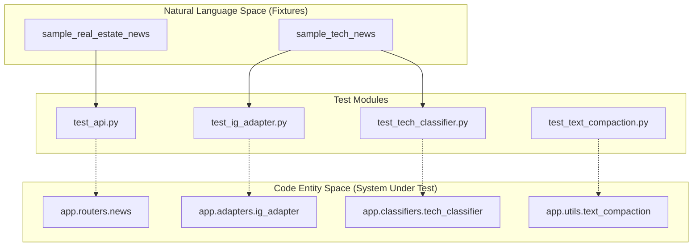
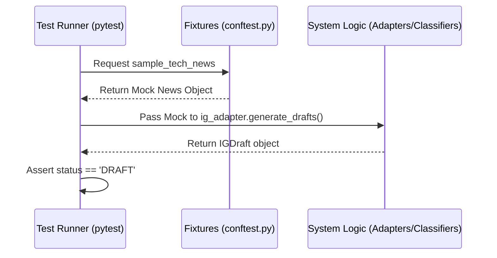

# Testing

This section provides an overview of the test suite for the Althara News Service. The testing architecture is built on `pytest` and utilizes asynchronous fixtures to validate the ingestion, classification, adaptation, and API layers.

The test suite is located in the `tests/` directory and is configured to run in asynchronous mode by default.

### Test Configuration

The project uses `pytest-asyncio` to handle the asynchronous nature of the FastAPI application and its database interactions. The configuration in `pytest.ini` ensures that the event loop scope is maintained across sessions for efficiency.

| Configuration Key | Value | Description |
| :--- | :--- | :--- |
| `asyncio_mode` | `auto` | Automatically detects async test functions. |
| `asyncio_default_test_loop_scope` | `session` | Reuses the event loop across the test session. |
| `testpaths` | `tests` | Defines the root directory for test discovery. |

**Sources:**
- [pytest.ini:1-5]()

### Testing Architecture

The testing suite bridges the gap between raw input data (RSS feeds/scraped HTML) and the final structured outputs (JSONB content/IG Drafts). The following diagram illustrates how the test fixtures and modules interact with the core system entities.

**Test Suite to Code Entity Mapping**

**Sources:**
- [tests/conftest.py:7-36]()
- [tests/pytest.ini:1-5]()

### Shared Fixtures

The `conftest.py` file provides reusable mock objects that simulate the `News` ORM model. These fixtures allow tests to verify logic without requiring a live database connection in every instance.

*   **`sample_tech_news`**: Simulates a news item for the Oxono brand, including `domain='tech'` and `relevance_score` [tests/conftest.py:7-20]().
*   **`sample_real_estate_news`**: Simulates a news item for the Althara brand, including `domain='real_estate'` and `althara_summary` [tests/conftest.py:23-36]().

**Sources:**
- [tests/conftest.py:7-36]()

### Test Coverage Overview

The test suite is divided into specialized modules targeting different layers of the application:

1.  **API Integration**: Validates FastAPI endpoints, request validation, and response serialization.
2.  **Adapter Logic**: Ensures the `ig_adapter.py` correctly transforms `News` records into `IGDraft` objects with the appropriate slides and captions.
3.  **Classification & Scoring**: Tests the `tech_classifier.py` for its ability to assign categories (e.g., `AI_ML`) and calculate relevance based on keyword density.
4.  **Utility Validation**: Unit tests for text processing, such as sentence splitting and HTML stripping.

**System Component Testing Flow**

**Sources:**
- [tests/conftest.py:1-37]()

## Child Pages

For detailed documentation on specific test modules and implementation details, see:

*   **[Test Suite Reference](#9.1)**: Detailed breakdown of `test_api.py`, `test_ig_adapter.py`, `test_tech_classifier.py`, `test_text_compaction.py`, and `test_utils.py`.

---
