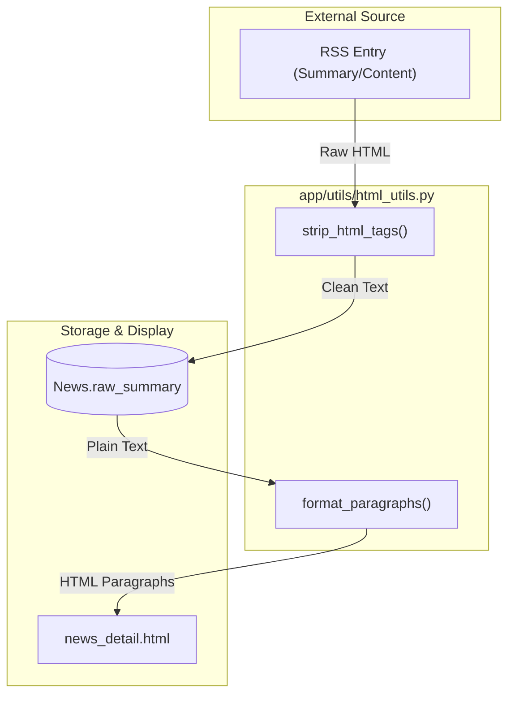
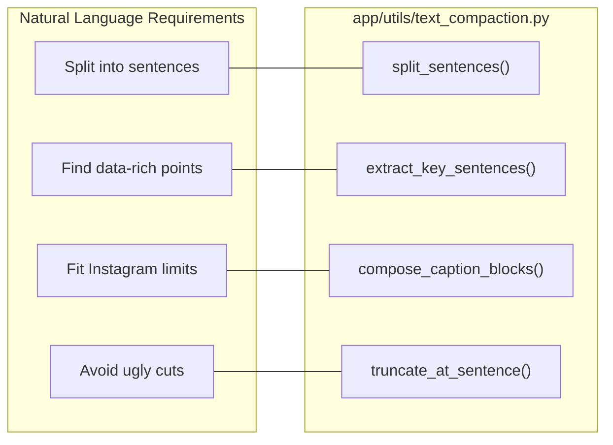

# Text Utilities

Text utilities provide the foundational logic for cleaning, parsing, and compacting content across the news service. These modules ensure that raw data from RSS feeds is sanitized for the database and subsequently transformed into concise, brand-aligned formats for social media and web display.

## HTML and Text Cleaning

The system uses `app/utils/html_utils.py` to sanitize incoming content. This is critical for both the ingestion pipeline (removing boilerplate from RSS feeds) and the UI (formatting raw text for readability).

### Key Functions
- **`strip_html_tags(text)`**: Removes all HTML tags and entities while collapsing multiple whitespaces into a single space [app/utils/html_utils.py:18-40](). It utilizes `ftfy` to repair common encoding "mojibake" (e.g., converting `participación` back to `participación`) [app/utils/html_utils.py:38-40]().
- **`format_paragraphs(text, sentences_per_paragraph)`**: Converts plain block text into HTML `
` tags [app/utils/html_utils.py:43-71](). It preserves existing double-newline paragraph breaks but will automatically split long blocks of text every N sentences (default 4) to improve UI readability [app/utils/html_utils.py:63-70]().

### Data Flow: Ingestion to UI
The following diagram illustrates how `html_utils` processes data from external sources into the `News` model and eventually to the News Studio UI.

**Diagram: HTML Processing Pipeline**

Sources: [app/utils/html_utils.py:1-72](), [app/templates/news_detail.html:31-36]()

---

## Text Compaction and Extraction

The `app/utils/text_compaction.py` module provides logic for "semantic compression"—reducing text size without cutting mid-word or mid-sentence. This is primarily used by the `IGDraft` generator to fit content into Instagram's character limits.

### Implementation Details
- **Sentence Splitting**: `split_sentences` uses regex to break text on punctuation (`.`, `!`, `?`) followed by whitespace, ensuring trailing punctuation is preserved [app/utils/text_compaction.py:11-17]().
- **Safe Truncation**: `truncate_at_sentence` attempts to cut text at the last sentence boundary within a character limit. If no boundary exists, it falls back to a word boundary, specifically avoiding "dangling" prepositions like "de", "con", or "para" [app/utils/text_compaction.py:20-44]().
- **Key Sentence Extraction**: `extract_key_sentences` (and its alias `extract_bullets`) selects complete sentences that fit within a limit (usually 110 chars). It prioritizes sentences containing numbers (data points) and the news title [app/utils/text_compaction.py:47-95]().
- **Caption Composition**: `compose_caption_blocks` assembles various text segments (hook, bullets, CTA, source) into a final string. If the result exceeds the `max_total` (default 900), it iteratively shortens the middle sections (bullets and "lectura") using sentence-aware truncation [app/utils/text_compaction.py:109-146]().

### Logic Entity Mapping
This diagram maps natural language requirements (e.g., "Don't cut words") to the specific code entities implementing them.

**Diagram: Compaction Logic Mapping**

Sources: [app/utils/text_compaction.py:1-147]()

---

## RSS Parsing Utilities

The `app/utils/rss_utils.py` module contains specialized helpers for handling the `feedparser` objects used during news ingestion.

### `parse_published_date(entry)`
This function handles the inconsistency of date fields in RSS feeds [app/utils/rss_utils.py:11-26]().
1. Checks for `published_parsed`.
2. Falls back to `updated_parsed`.
3. If both are missing or invalid, it returns the current UTC time (`datetime.now(timezone.utc)`).
4. All returned dates are normalized to the UTC timezone [app/utils/rss_utils.py:18, 23, 26]().

Sources: [app/utils/rss_utils.py:1-27]()

---

## Utility Summary Table

| Module | Primary Function | Input Type | Use Case |
| :--- | :--- | :--- | :--- |
| `html_utils` | `strip_html_tags` | String (HTML) | Cleaning RSS content during ingestion. |
| `html_utils` | `format_paragraphs` | String (Text) | Displaying summaries in the News Studio UI. |
| `text_compaction` | `extract_bullets` | String (Text) | Identifying key facts for Instagram slides. |
| `text_compaction` | `truncate_at_sentence` | String (Text) | Shortening captions to meet character limits. |
| `rss_utils` | `parse_published_date` | `feedparser` Entry | Normalizing timestamps across different news sources. |

Sources: [app/utils/html_utils.py:1-72](), [app/utils/text_compaction.py:1-147](), [app/utils/rss_utils.py:1-27]()

---
