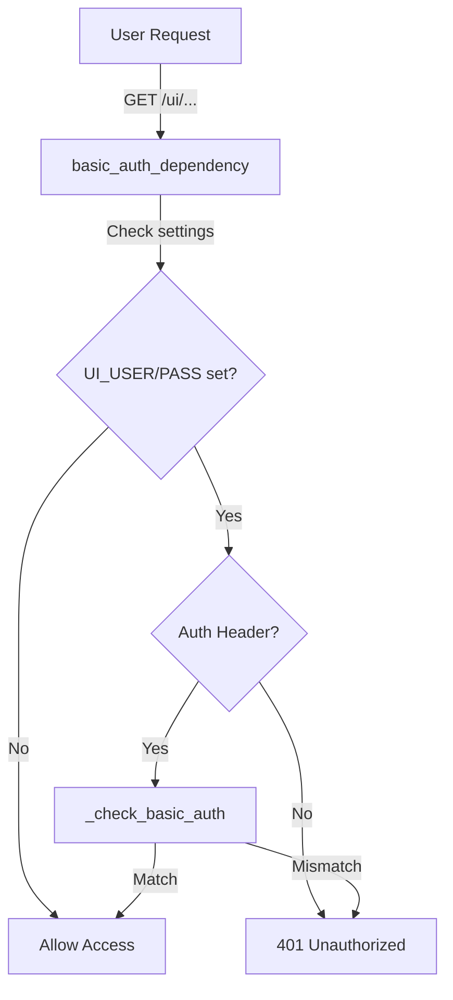
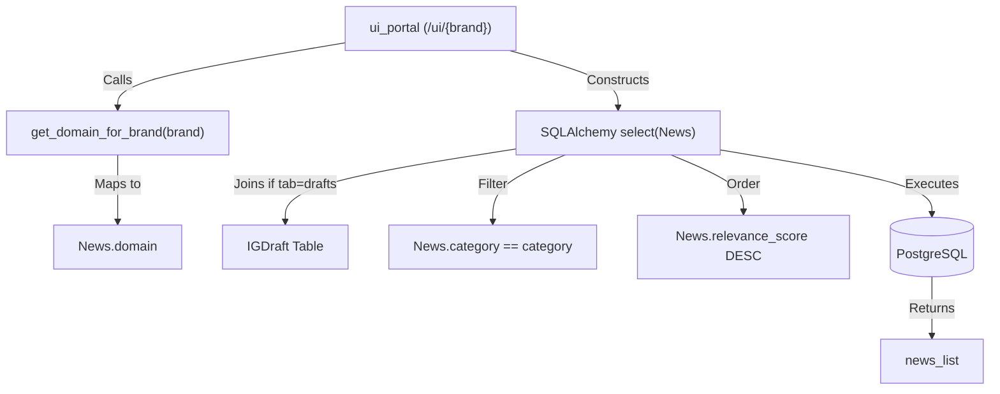
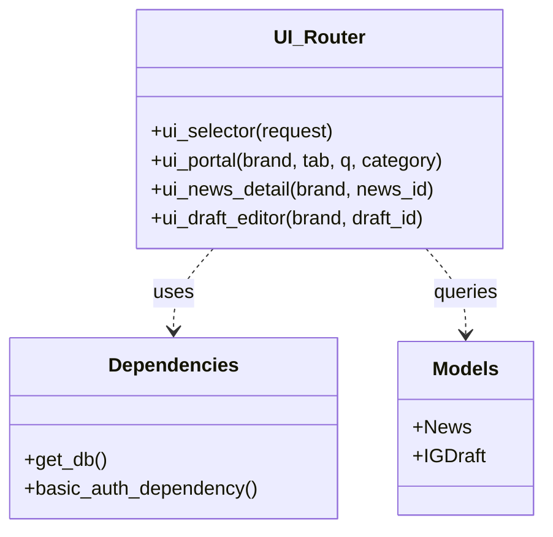

# UI Routing and Authentication

The News Studio UI is a server-side rendered (SSR) web interface built with FastAPI and Jinja2. It serves as the internal management portal for the marketing team to browse ingested news, review generated Instagram drafts, and edit content before publishing. Routing is handled by a dedicated `ui` router, and access is protected via a Basic Authentication mechanism.

## Authentication Mechanism

The system implements a simple `BasicAuth` strategy. It is controlled by the environment variables `UI_USER` and `UI_PASS` [app/config.py]().

### basic_auth_dependency
The `basic_auth_dependency` function [app/auth.py:26-37]() acts as a FastAPI dependency for all UI routes.
- **Bypass:** If `UI_USER` or `UI_PASS` are not set in the environment, the dependency returns immediately, allowing unauthenticated access [app/auth.py:28-29]().
- **Validation:** It extracts the `Authorization` header and uses `_check_basic_auth` [app/auth.py:11-23]() to decode the Base64 credentials and compare them against the settings [app/auth.py:31]().
- **Failure:** If credentials are missing or incorrect, it raises an `HTTP_401_UNAUTHORIZED` exception with a `WWW-Authenticate: Basic` header to trigger the browser's login prompt [app/auth.py:32-36]().

### Data Flow: Authentication Logic
Title: Authentication Flow for UI Routes

Sources: [app/auth.py:11-37](), [app/routers/ui.py:36]()

---

## UI Router and Brand Selection

The UI router [app/routers/ui.py:24]() manages four primary views. It utilizes `Jinja2Templates` [app/routers/ui.py:26]() and a custom filter `format_paragraphs` [app/routers/ui.py:27]() for content rendering.

### Brand Selector (`/ui`)
The entry point is the brand selector [app/routers/ui.py:35-40](). It displays the available brands defined in the `BRANDS` registry (Althara and Oxono) [app/brands.py:14-25](). This allows users to choose the domain context (Real Estate vs. Tech) they wish to manage.

### Brand Portal (`/ui/{brand}`)
The portal view [app/routers/ui.py:43-118]() is the main dashboard for a specific brand. It supports several query parameters for filtering:
- `tab`: Switches between `inbox` (all news), `drafts` (news with pending IG drafts), and `approved` (news with approved/published drafts) [app/routers/ui.py:61-65]().
- `q`: Full-text search on news titles using SQLAlchemy `ilike` [app/routers/ui.py:68-69]().
- `category`: Filters by domain-specific categories [app/routers/ui.py:70-71]().
- `order_by`: Toggles between `published_at` and `relevance_score` [app/routers/ui.py:76-79]().

The portal logic automatically maps the URL `{brand}` to the internal `domain` (e.g., `althara` -> `real_estate`) using `get_domain_for_brand` [app/routers/ui.py:59]().

### Code-to-Entity Mapping: Portal Query Logic
Title: UI Portal Data Retrieval

Sources: [app/routers/ui.py:43-82](), [app/brands.py:28-31]()

---

## News Detail and Draft Editor

### News Detail (`/ui/{brand}/news/{news_id}`)
This view [app/routers/ui.py:121-146]() provides a deep dive into a specific `News` record.
- It fetches the `News` object and all associated `IGDraft` records [app/routers/ui.py:133-141]().
- It displays the full content, including the structured Althara content or raw summaries.
- It provides action buttons to trigger the generation of new Instagram drafts.

### Draft Editor (`/ui/{brand}/draft/{draft_id}`)
The editor [app/routers/ui.py:149-181]() is the final step in the content pipeline.
- It loads a specific `IGDraft` and its parent `News` record [app/routers/ui.py:161-169]().
- The template `draft_editor.html` renders the carousel slides, caption, and hashtags for manual refinement.
- It allows the user to approve or publish the draft, interacting with the `/api/ig` endpoints via client-side JavaScript.

---

## Data Flow: UI Routing

The following table summarizes the data requirements and behavior for each UI route:

| Route | Function | Key Models | Logic / Filters |
| :--- | :--- | :--- | :--- |
| `/ui` | `ui_selector` | N/A | Lists `BRANDS` from `brands.py`. |
| `/ui/{brand}` | `ui_portal` | `News`, `IGDraft` | Filters by `domain`. Joins `IGDraft` for "drafts" and "approved" tabs. |
| `/ui/{brand}/news/{id}` | `ui_news_detail` | `News`, `IGDraft` | Fetches single `News` and `select(IGDraft).where(news_id==id)`. |
| `/ui/{brand}/draft/{id}` | `ui_draft_editor` | `IGDraft`, `News` | Fetches single `IGDraft` and its parent `News`. |

Sources: [app/routers/ui.py:35-181](), [app/brands.py:14-25]()

### Code-to-Entity Mapping: Routing Structure
Title: UI Router Code Structure

Sources: [app/routers/ui.py:24-181](), [app/auth.py:26-37]()

---
